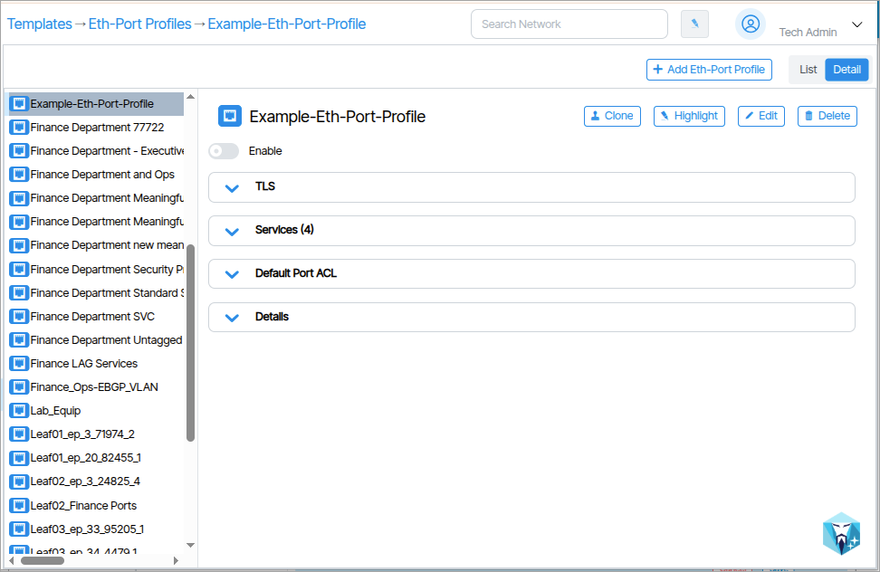
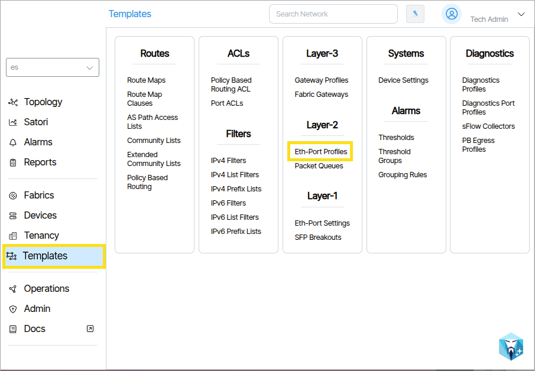
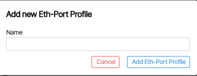
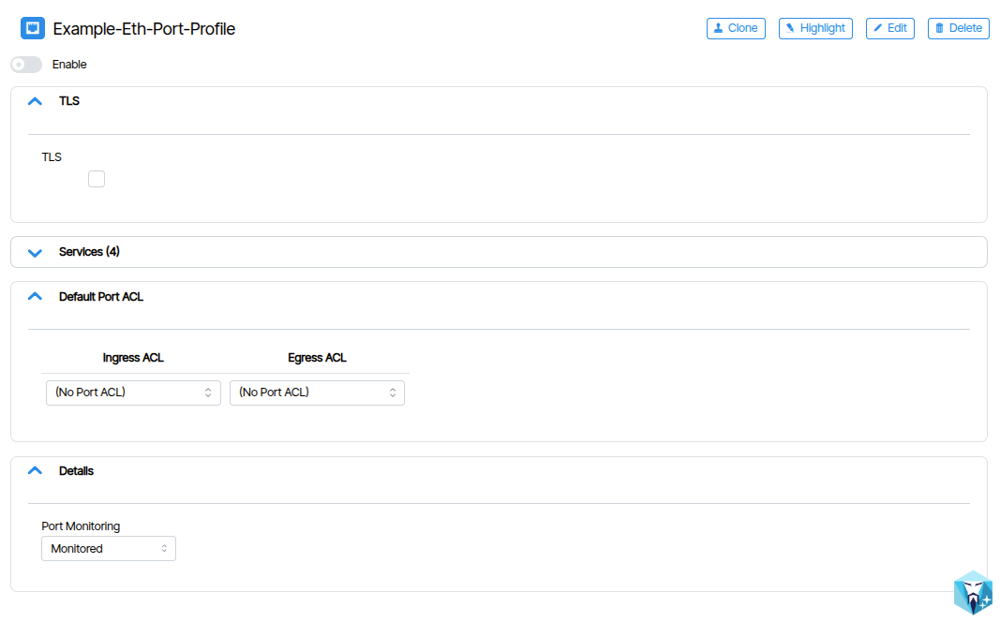
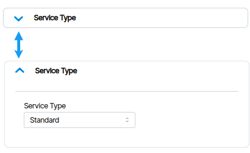
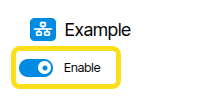
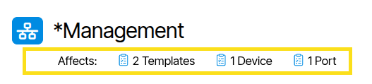

# Creating and Configuring Provisioning Objects 
Provisioning objects are created using special configuration forms to define and apply settings.
To create these objects, follow the steps below.

This is a general example that uses **Templates** and **Eth-Port-Profiles** for *demonstration*. Although the general creation and configuration process is the same, different provisioning objects will have their own unique parameters.

1. Click the link of the provisioning object you want to create. In this example {:class="pop"}, **Eth-Port-Profile** is the provisioning object and is selected from **Templates**.

1. In the window that opens, click the **Add Eth-Port Profile** button. Depending on your selection, this button will contain text specific to the provisioning object such as **Add Service** or **Add Threshold** ({:class="pop"}).
1. In the field that appears, name the object and click the **Add** button ({:class="pop"}).
1. Fill in the parameters and settings of the object ({:class="pop"}). Fields are grouped together via an accordion interface. You can toggle the accordion open and closed by clicking its heading ({:class="pop"}).
1. The **Enable** switch is used to enable or disable the object ({:class="pop"}).

### Affects:

**Affects:** Indicates whether other provisioning objects in the system are linked to this object.

### Enable / Disable
Objects can be enabled or disabled by toggling the **Enable** button.

### List / Detail
The window provides a visual choice between **Detail** and **List** view.

### Edit
To edit settings, click the **Edit** button.

### Delete
To delete the current object and all its settings, click the **Delete** button.

### Clone
To clone (copy) an object, click the **Clone** button. In the field that appears, type a new name for the clone and click **Create**. The name must be unique.

