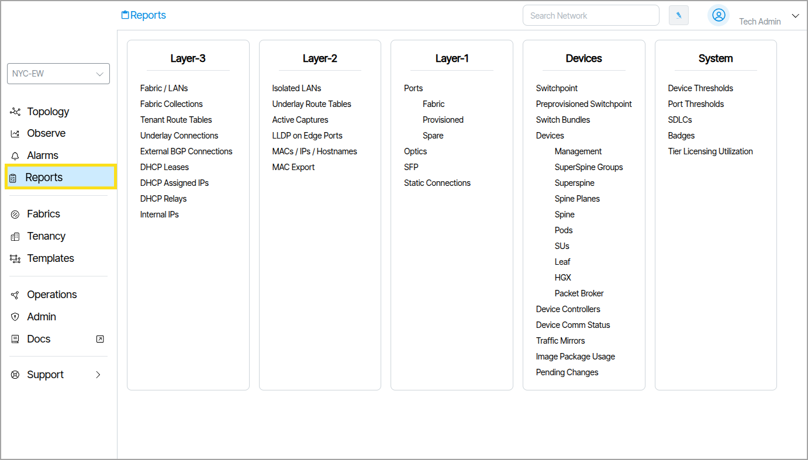
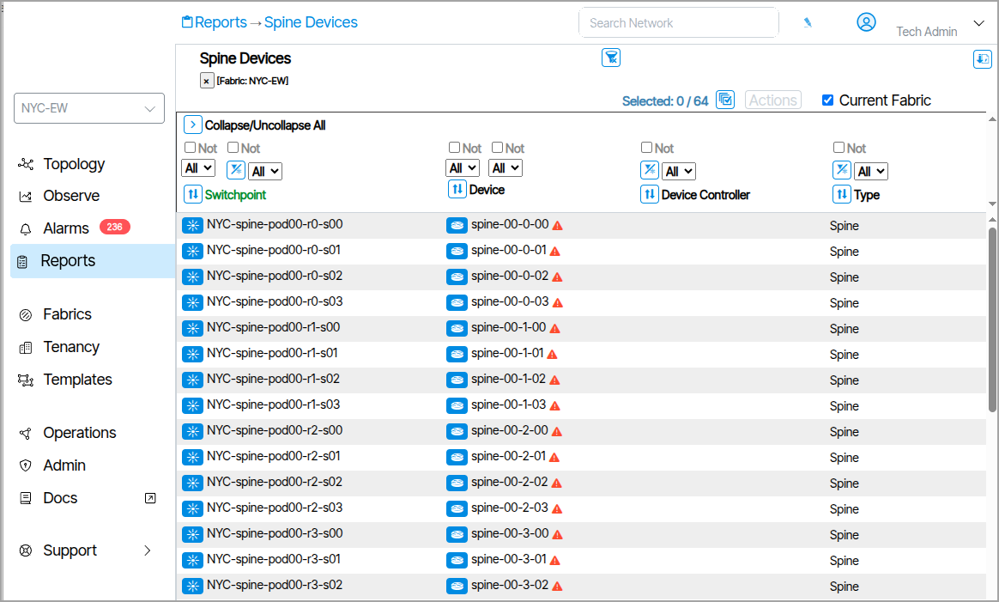
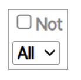
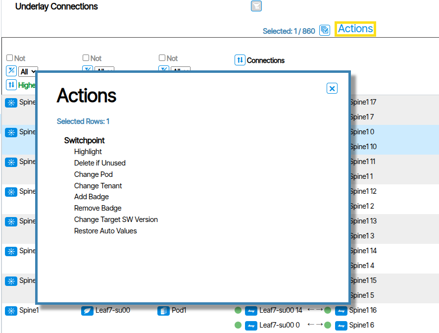
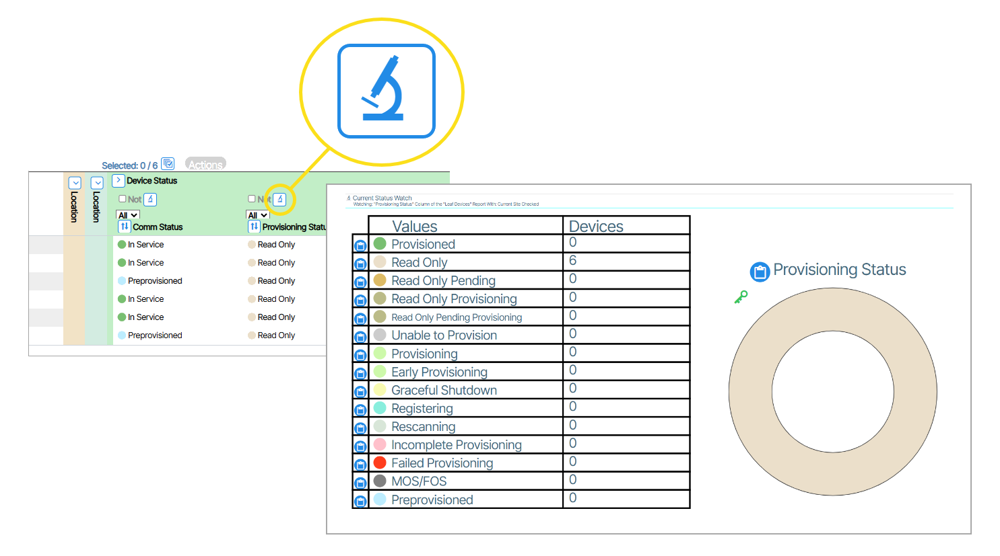
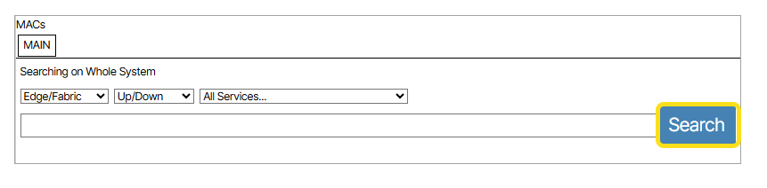
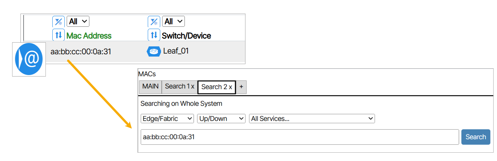

# Reports
The **Reports** section presents an organized overview of all available *Reports*. Reports are tabular views of provisioned objects and detected elements within the network.

<!-- Reports are accessed from the Main Menu **Reports** icon ({: class="btn"}).   -->

<!-- In addition, throughout all the navigation panes, usually on the top right of each sub panel, the UI displays a report icon ({: class="btn"}) .  -->

Selecting a Report opens a text-based list that can be sorted, highlighted, exported to CSV, and navigated from. In the example below, the Report titled **Spine Devices** is opened. 

Reports can be filtered and customized to create individual operator-specific reporting on any element in Verity.

## Filtering and Sorting

### Filter Column on Object Type

Filter objects using **Filter Column on Object Type** at the top of each column.

### Report Filtering using Regex

Click the icon shown below to apply [regular expressions ](https://developer.mozilla.org/en-US/docs/Web/JavaScript/Guide/Regular_expressions#using_regular_expressions_in_javascript) to report filters. Type the desired Regex command in the field that appears.

### Sort Columns

Sort columns using the column sort tool.

## Report Actions

To apply actions to **Report** items, select the item(s) you want to affect, click the **Actions** button, and choose the desired action. All selected Report items are affected by the change.

### Report Slice Views

**Report Slice View** displays a pie graph view of the column in the report. To view the graph click the slice button {: class="btn"}

## Layer-3

| Report Name | Content |
|-|-|
| **Tenant Route Tables** | Tenant Route Table displays the virtualized routing table (VRF) that's specific to a single tenant in a shared infrastructure.|
| **Underlay Connections** | An Underlay Connection is the physical network infrastructure that provides the foundation for packet transport between devices. The Underlay Connection Report provides a list of physical connections used for inter-switch Layer-2 & Layer-3 connections.|
| **External BGP Connection** | An external BGP (eBGP) connection is a Border Gateway Protocol link established between network routers. It allows separate organizations or network domains to exchange routing information and connect to each other while maintaining their independent routing policies and configurations. The External BGP Connection Report provides a list of the configured BGP neighbors as well as their current state. |
| **DHCP Lease** | A DHCP Lease is a temporary assignment of an IP address and related network configuration parameters to a device by a DHCP server. The DHCP Report is a tabular list of all DHCP leases provided by Verity on the management network. |
| **DHCP Assigned IPs** | DHCP Assigned IPs are IP addresses that have been dynamically allocated to devices on a network by the DHCP server. The DHCP Assigned IPs Report lists all of the IP addresses assigned by the Verity server. |
| **Internal IPs** | Internal IPs are private IP addresses assigned to devices within a local network that are not directly accessible from the public internet. |
| **DHCP Relays** | A DHCP Relay is a service running on a network device (typically a router) that forwards DHCP requests from clients to a DHCP server located in a different network segment or subnet. The DHCP Relay Report lists all of the configured DHCP relays in the managed network. |

## Layer-2

| Report Name | Content |
|-|-|
| **Isolated LANs** | An isolated LAN is a local area network that is intentionally disconnected from any other network, including the internet and any other internal networks. This means that devices on the isolated LAN can only communicate with each other, and cannot communicate with devices outside of that LAN.|
| **Underlay Route Tables** | An underlay route table is used by physical network devices to determine the best path for forwarding traffic within the underlying physical network infrastructure. Routing protocols like OSPF, IS-IS, and BGP populate these tables to ensure all devices in the underlay can reach each other, providing essential connectivity for overlay networks.|
| **Active Captures** | Refers to the process of intercepting and recording network traffic as it occurs. The Active Captures Report is a tabular list of actions, values, and settings for Capture processes that are still ongoing. |
| **LLDP on Edge Ports** | LLDP is a protocol that allows network devices to advertise information like their identity and capabilities to neighboring devices on a local network. On edge ports, LLDP can be used to auto-configure VoIP phones, inventory devices, and troubleshoot connectivity, but it may be disabled for security reasons to prevent unauthorized disclosure of network topology. |
| **MACs** |The **MAC Address Workbench** (MACs) lets you search device by mac address. Clicking the **Search** button without specifying a mac address displays all devices ({:class="pop"}). From within a list of devices, clicking ({:class="btn"}) opens a new tab to search on the corresponding mac address ({:class="pop"})|
| **MAC Export** | MAC Export provides a summary MAC report for all devices connected to the network's user facing ethernet ports. Administrators can automate this tool to generate a daily report or use it on a case-by-case basis as needed. To manually run a report, enable the checkbox for all services you want to include, click** Run Report Now**, and wait for the **Download Latest Report** icon to turn blue. Once it does, click the icon to download the CSV file. |

## Layer-1
| Report Name | Content |
|-|-|
| **Ports** | The Ports Report is a tabular list of actions, values, devices and settings for all Ports.|
| **Fabric** | The Fabric Report is a tabular list of actions, values, devices and settings for all Fabric Ports.|
| **Provisioned** | The Provisioned Report is a tabular list of actions, values, devices and settings for Provisioned Ports.|
| **Spare** | The Spare Report is a tabular list of actions, values, devices and settings for Spare Ports. |
| **Optics** | In networking, optics generally refers to the components and technologies that utilize light to transmit data over fiber optic cables. Instead of electrical signals used in traditional copper-based networking, optics leverages light pulses to carry information, enabling significantly higher bandwidth and longer transmission distances with less signal degradation. |
| **SFP** | SFP stands for Small Form-factor Pluggable, which is a type of transceiver used in networking equipment. It is a hot-swappable component that can be inserted into a switch to provide connectivity. |
| **Static Connections** | A Static Connection is a connection that is not dynamic. The Static Connections Report is a tabular list of actions, values, and settings for Static Connections. |

## Devices

| Report Name | Content |
|-|-|
| **Devices** | The Devices Report is a tabular view of values, settings and information for the following devices:   - **Management Devices**   - **Superspine Devices**   - **Spine Devices**   - **Leaf Devices**   - **Packet Broker Devices** |
| **Device Comm Status** | Device Comm Status is the state a device is in and is expressed by different colors that represent different states. The Device Comm Status Report is a tabular view of each device and their current state. |
| **Image Package Usage** |Image Package Usage Report lists the currently used SDLC image by name and version number. |
| **Pending Changes** | Pending Changes includes all switches that have .system.configuration.target-pending set to true (and are not read-only). |

## System
| Report Name | Content |
|-|-|
| **Device Thresholds** ||
| **Port Thresholds** ||
| **SDLCs** | The SDLCs Report is a tabular view of each SDLC and their current state. |
| **Badges** | Badges serve as a grouping mechanism for endpoints within the system. They allow you to categorize endpoints based on specific criteria—such as their function, vendor (e.g., Dell), or any other organizational preference. By assigning the same badge color and number to related endpoints, you can easily group and identify them according to these classifications. |
| **Tier Licensing Utilization** | The Tier Licensing Utilization Report is a tabular list of each device's licensing status. |