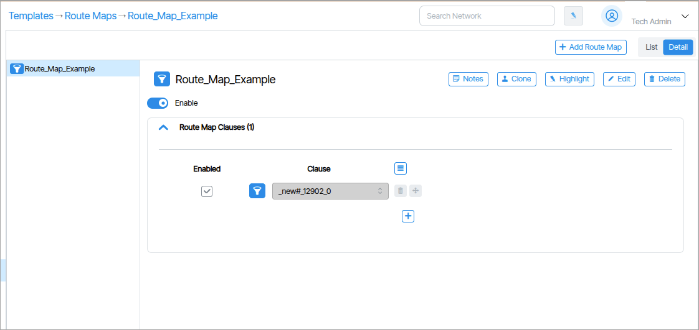
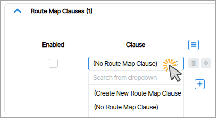

---

title: "Route Maps"
description: "How to create Route Maps"
tags: [Routing, ACL]
search:
boost: 2          
parent: Advanced Configuration
hide:
- toc
---
# Route Maps

!!! Note
    Route Maps is available at Templates →  Routes

 A **Route Map** is a policy tool that allows administrators to override automated path selections and force specific traffic flows to follow predetermined routes. The purpose of using route maps is to direct traffic toward paths that are faster, more efficient, and experience less packet loss than the automatically selected routes. 

**Route-maps** are used to filter or modify routes based on many possible criteria. Route-maps are composed of one or more **Route-map Clauses**.  Each clause uses a filter to select the relevant routes (match criteria). Once selected, parameters of the routes can be modified with Set commands.

!!! warning "Beware of Misconfigurations"
provisioning-object-forms
    It is important that network administrators are deeply familiar with BGP and Route Map concepts before manipulating settings.  Misconfiguration can lead to routing loops, traffic disruption, service outages, security vulnerabilities, and performance degradation. 

## Route Map Composition
**Route Maps** are composed of:

**Route Map Clause(s)** – This is a statement or rule within the route map that is composed of *permit* or *deny* *match conditions*, including matches to **Lists**.

**Access Control List(s)** – A collection of **Conditions** or criteria that define specific attributes to match against network traffic. (ACLs are used to match 5 tuple)

**Condition(s)** – These are individual factors such as IP addresses, destination IP addresses or protocol types.

### Creating Route Maps 

!!! note "Creating Objects"

    Step-by-step instructions for creating new provisioning objects: [Creating and Configuring Provisioning Objects](provisioning-object-forms.md). 

Double-click the input field that says **Choose a Route Map Clause** and select **Create New Route Map Clause** in the select box. {: class="pop"}

!!! note "Adding Multiple Clauses"

    To create and enable multiple Route Map Clauses, click the **Add Row** {: class="btn"} button.

## Route Maps Clauses

**Route Map Clauses** are composed of **permit** or **deny** match conditions, including matches to **Lists** in **Match Fields**. 

### Create a Route Map Clause
1. Click **Templates** and then click **Route Map Clauses**. 
1. Click the **Add Route Map Clause** button.
1. In the window that appears type the name of the Route Map Clause and click **Create Route Map Clause**. 

## Match Conditions in a Route Map Clause
1. Click **Templates** and click **Route Map Clauses**.
1. In the fields that appears create a new Match field by clicking the **Select a Match Field to Add**.
1. In the window that appears, select a choice from the drop down menu. 

## Access Control Lists
An access control list (ACL) is a collection of conditions to match specific attributes of network traffic. These conditions can include source IP addresses, destination IP addresses, protocol type and other data.

### Creating an Access Control List

## AS Path Lists
AS Path Lists allow a route map to select routes with a specific AS number in the path using regex.
### Creating an AS Path List
1. Click **Templates** and click **AS Path Access List**. 
1. Click the **Add AS Path Access List** button. 
1. Enter a name for the list and click **Create ne As Path Access List**.
1. Set the conditions for the list.  
1. In the **Edit Mode** prompt click the **Save** button. 

## Community Lists
Community Lists allow a route map to select routes originating from a specific community.
### Creating a Community List
1. Click **Templates** and click **Community List**. 
1. Click the **Add a New Community List** button.
1. Enter a name for the list and click **Create Community List**. 
1. Set the conditions for the list.
1. In the **Edit Mode** prompt click the **Save** button. 

## Extended Community Lists
An Extended Community List is a filter that controls how routes are shared between separate virtual networks (VRFs) on a router.

### Creating an Extended Community List

1. Click **Templates** and click **Extended Community List**. 
1. Click the **Add a New Extended Community List** button.
1. Enter a name for the list and click **Create Extended Community List**. 
1. Set the conditions for the list.
1. In the **Edit Mode** prompt click the **Save** button. 

<!-- 

THIS IS MOVED IN 6.5 to TEMPLATES -> FILTERS

### IP Prefix Lists
IP Prefix Lists allow a route map to select routes matching a specific prefix length.
#### Creating an IP Prefix List
1. Double-click **Templates** and click  **AS Path Access List** tile. 
1. Click the **Add a IP Prefix List** ({: class="btn"}) button.
1. Enter a name for the list.
1. Set the conditions for the list.
1. Click the **Save** button ({: class="btn"}).  -->