---
hide:
- toc
---

# SensAI

!!! Installation

    For information on installing or updating SensAI, see the section on [SensAI System Applications](admin.md#how-to-install-or-update-sensai).

**SensAI** is Verity's AI-powered messaging assistant designed to help network professionals monitor and configure their network architecture. Through its intuitive interface, the assistant enables administrators to quickly diagnose problems and identify solutions.

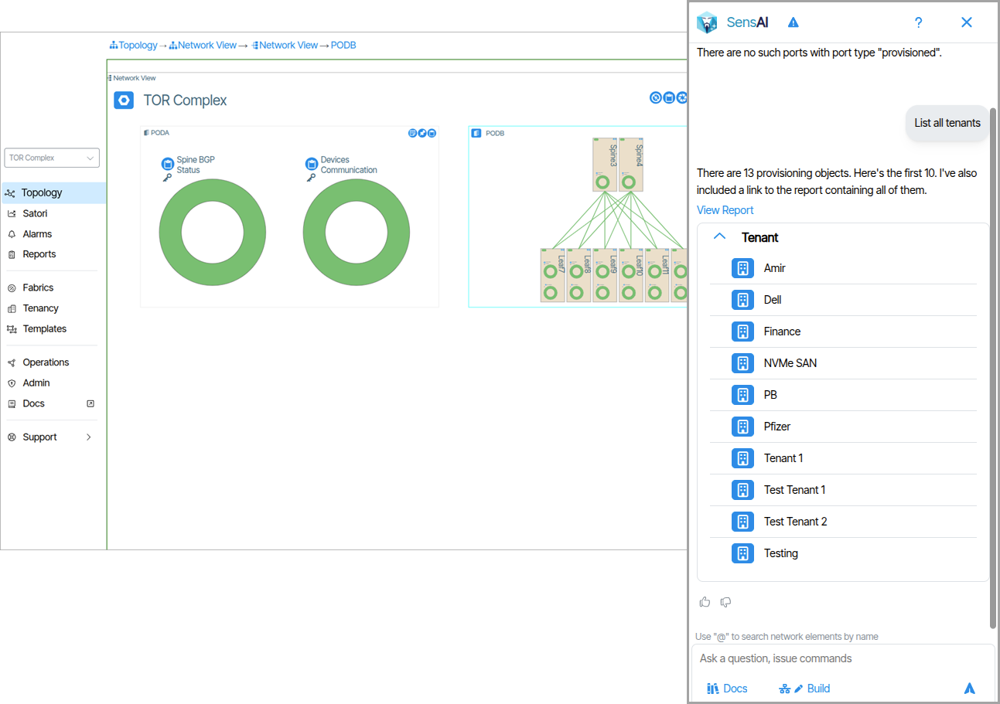

## Getting Started with SensAI

Click the **SensAI Panel** button to open SensAI.  

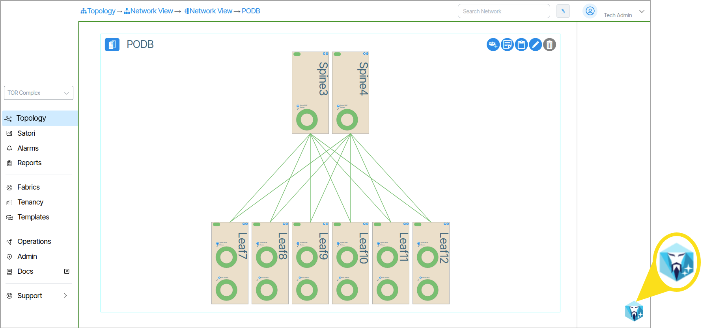

### Chat Message Interface
The chat message interface is where users interact with SensAI. 

1. SensAI Response Field
1. [Search Documents](#verity-documentation-reference)
1. [Build Button](#provisioning-actions)
1. User Submission Field
1. [Help Button](#help)
1. Prompt Submission Button
1. [Name Collision Warnings](#naming-collision-warnings)

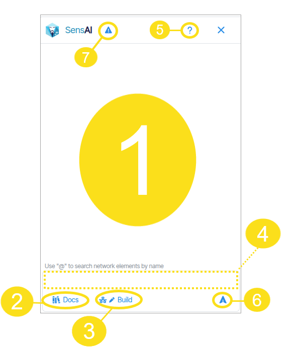

!!! Feedback

    **Thumbs Up/Thumbs Down** 

    Users of SensAI can help guide more accurate replies by clicking the thumbs-up or thumbs-down feedback icons after receiving a response. 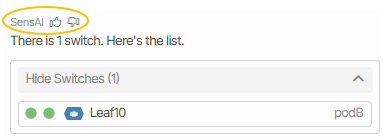{: class="pop"} 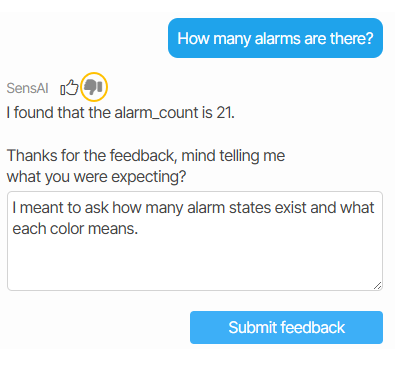{: class="pop"} 
    
### Fuzzy Matching

SensAI is designed to anticipate user intent when object names are queried. Since object names may occasionally differ slightly from what users type, SensAI employs a technique known as *fuzzy matching* to interpret and correct user input. For example, if a user searches for an object named "Spine-1" but enters "Spine 1" (omitting the hyphen), SensAI will attempt to identify and match the intended object. SensAI notifies the user of the change by posting the word "corrected" beneath the query. 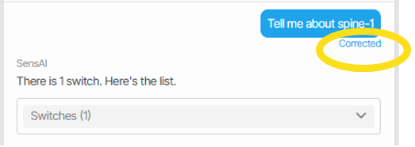{: class="pop"} 

If the current query results in multiple potential matches—creating naming collisions—fuzzy matching is temporarily disabled. In such cases, SensAI prompts the user to clarify their query.

### Help
SensAI provides a useful help menu with examples of its capabilities. To view **Help**, click the question mark icon in the upper right corner of the SensAI chat window.

!!! Note

    SensAI's scope is limited to specific objects and tasks. This documentation provides a general overview of its capabilities. For a detailed list of applicable objects and actions please view the **Help** option in the application. 

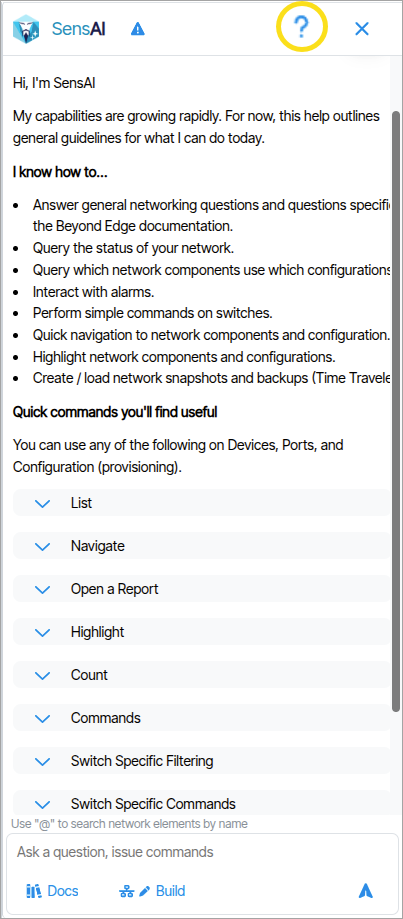   

## Behaviors

**SensAI** responds to user prompts in the chat message window by displaying data in various formats and visual styles. In addition to *displaying* data, SensAI can also respond to user queries by *executing site-wide commands* that impact overall system operations.
This distinction between *displaying* network information and *executing system-altering operations* is organized in the documentation under two categories: **Data Presentation Behaviors** and **System Change Behaviors**.
 
### Data Presentation Behaviors
**Data Presentation Behaviors** refer to the ways in which SensAI *presents data* to users.

#### Display Jumps

SensAI responds to navigation commands by performing a *jump* and quickly navigating to the referenced object. A command such as ***Navigate to Leaf 7*** will center the view window to Leaf 7, making the object the focal point.

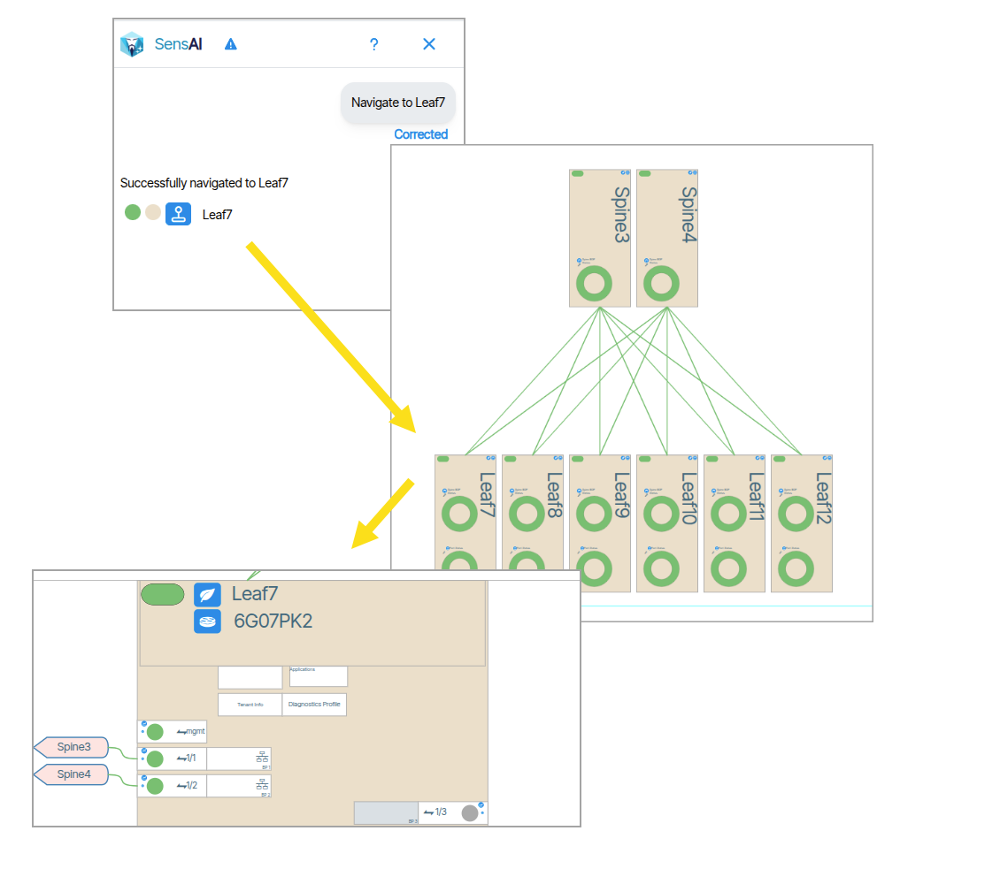 

#### Displaying Objects 

SensAI displays objects that match the query scope. The query scope can include a single object 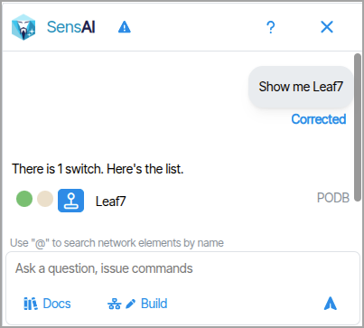{: class="pop"} or many objects.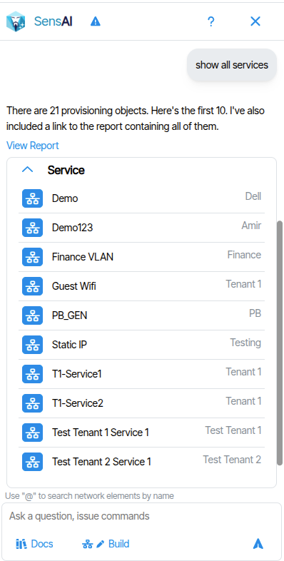{: class="pop"} 

 In the example below, a device named Leaf7 is returned from the query. 


##### Object Information

Objects are displayed with information about their status. Each information symbol is described in the diagram below.

1. **Status indicator**
1. **Provisioning indicator**
1. [**Alarm indicator**](alarms.md) (Alarms are notifications that inform the administrator about changes in the network state)
1. [**Object Button**](navigation/#object-icon-buttons) (The Object button behaves the same as it does throughout the rest of the application. Hover, left click and right click functionality is identical)
1. **Name**
1. **Context** (Describes the containing object or environment)

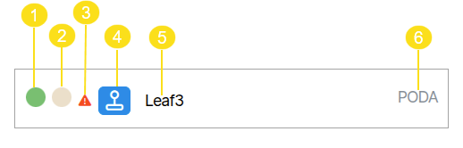

##### Show/Hide Lists
Lists have a **Hide/Show** feature that allows users to collapse (hide) and expand (show) lists in the chat.

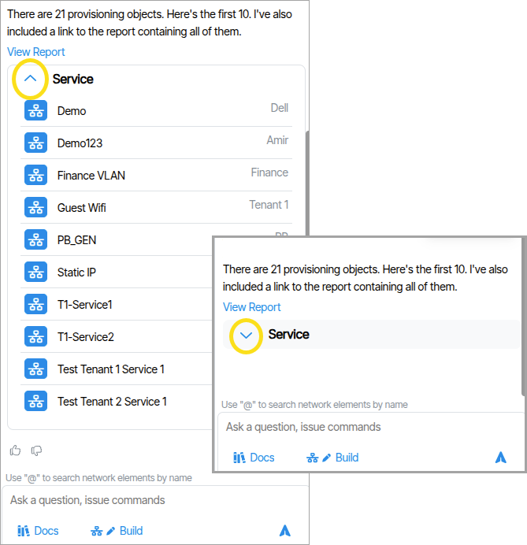   

#### Verity Documentation Reference

When prompting SensAI, material from the [official documentation](https://docs.be-net.com/latest/) may be presented and/or requested by the user. This information is usually presented in aggregate form from different sections of the documentation, with individual reference links to the source material included. Responses may include documentation content as part of a larger reply, or users can directly request official documentation by enabling the **Docs** (Search Documents) button 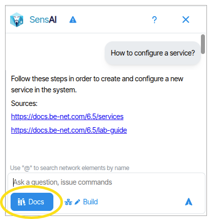{: class="pop"} .

#### Reports
Report data is presented directly in the chat window with hyperlinks to the source Report(s).

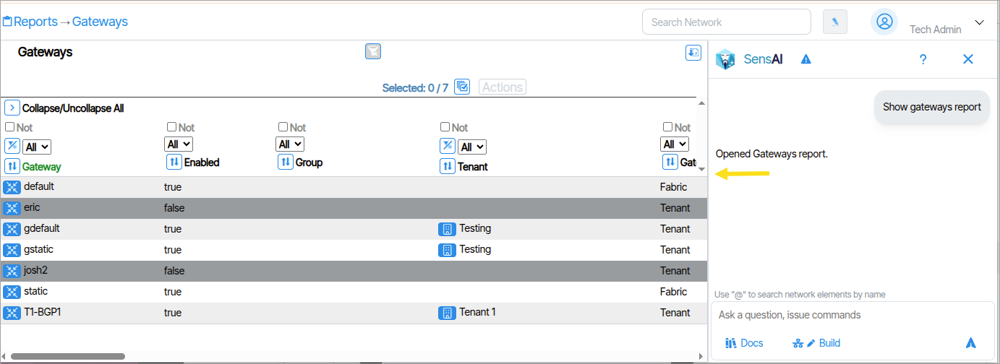

#### Highlighting
Highlighter is a powerful tool for tracing an object usage anywhere in the UI.
When prompting SensAI to use the [highlighter feature](ui-navigation.md/#highlighter), the selected object and any trace objects associated with it are highlighted in purple.

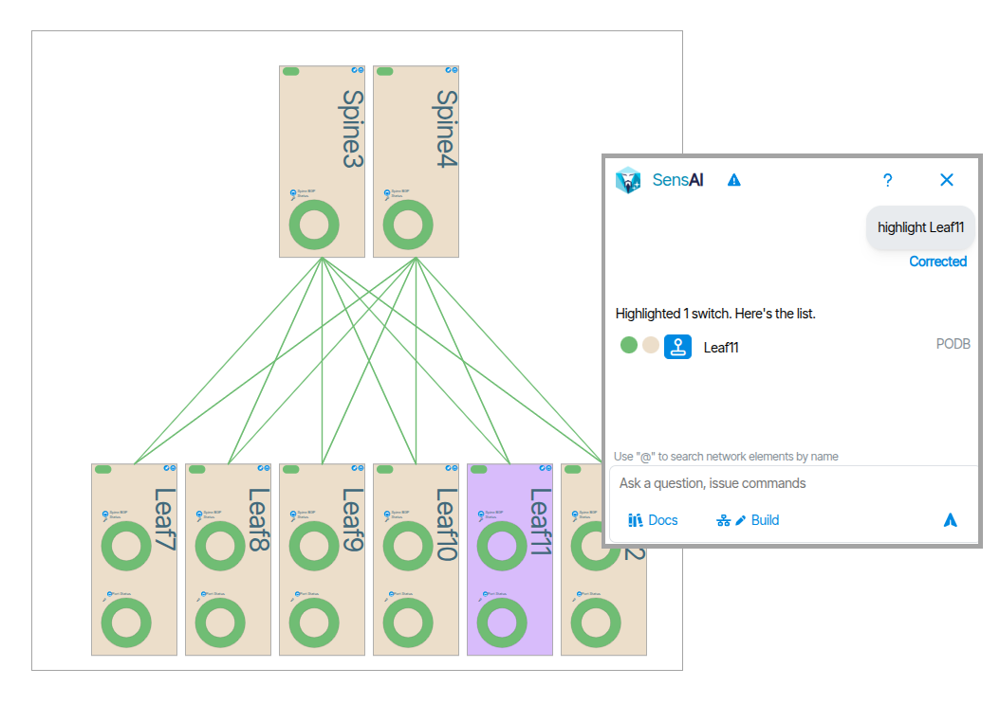

#### Instant Search
The instant search allows users to quickly find objects by name. To use this feature, preface the search with the @ symbol and type the name of the object or device you are searching for. Use the up and down arrows to choose from the presented items, and press **Tab** to auto-populate the selection in the submission field.

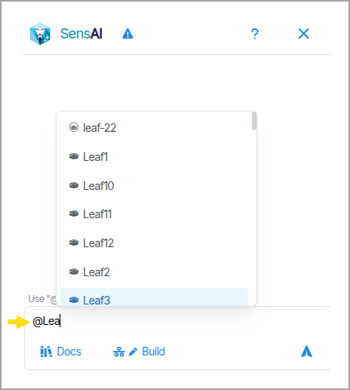

#### Instant Search for Statistics

Instant search lets you quickly view different statistical descriptors for devices and provisioning objects using this format:   `@stat:{stat name}`.

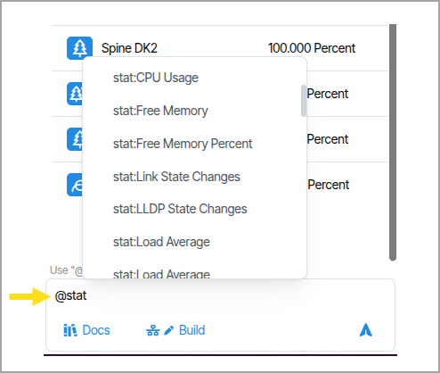 

In this example, all switches with a CPU usage of less than 80 percent are listed.

 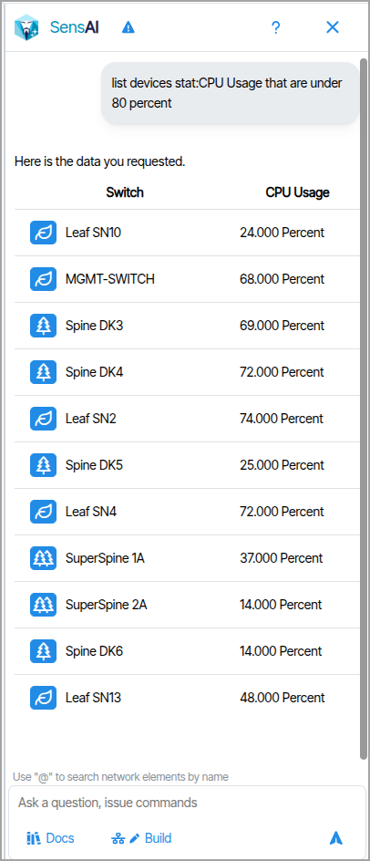


### System Change  Behaviors
**System Change Behaviors** are actions that *change the system state*. There are two forms of System Change Behaviors:

- **Device Operations**: These are system changes made using SensAI that *do not require* **Build** mode to be enabled.
- **Provisioning Actions**: These are CRUD (create, read, update**,** and delete) actions applied to provisioning objects that *require* **Build** mode to be enabled.

####  Device Operations

The current version of SensAI supports the following **Device Operations**.

* [Read Only Clear](icon-reference.md/#toggle-read-only-mode ) 
* [MOS (Mark Device Out of Service)](icon-reference.md/#mark-device-out-of-service)
* [MIS (Mark Device In Service)](icon-reference.md/#mark-device-out-of-service) 
* [Enable Ports](device-management.md/#enable-or-disable-individual-device-port) 
* [Disable Ports](device-management.md/#enable-or-disable-individual-device-port) 
* [Reboot Device](icon-reference.md/#reboot-device) 
* [Network Time Traveler Load Backup](time-traveler.md)

#### Confirmation Dialog

All **Device Operations** return a validation message that users must approve in order to commit the change(s).
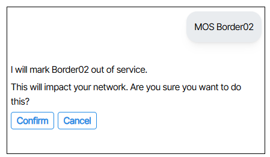

#### Load Network Time Traveler Backup
Prompting "list time travelers" lists Time Traveler instances (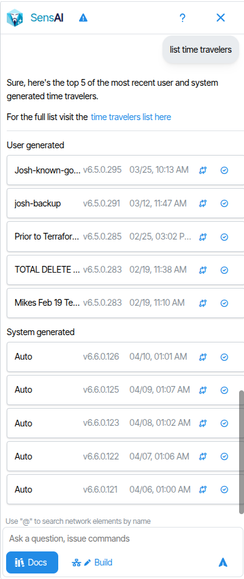{:class="pop"}). Click the restore button [to revert to a previous state by loading a selected instance](time-traveler.md/#revert-state-using-time-traveler).


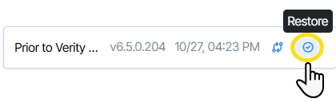

A validation message is presented asking the user to apply the changes or cancel.


### Provisioning Actions

To create, remove, update or delete provisioning objects the **Build** button must be enabled. Prompt commands that require the Build option to be enabled are called **Provisioning Actions**.


To commit **Provisioning Actions** you must submit the text "Apply changes".

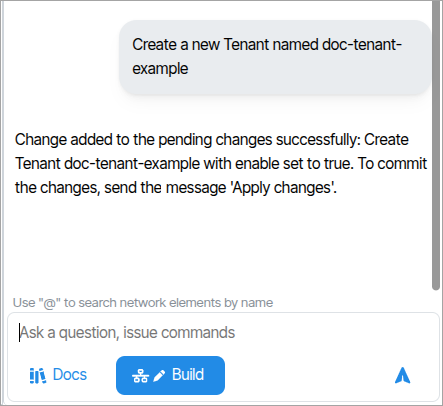


### Naming Collision Warnings
Provisioning objects with duplicate names (using the same name more than once), name collisions (names that are too similar), or common words (such as naming objects with generic terms like 'a') will trigger a notification icon with a red dot at the top of the sensAI messaging window. Clicking this icon opens a notification window that describes the naming issue.


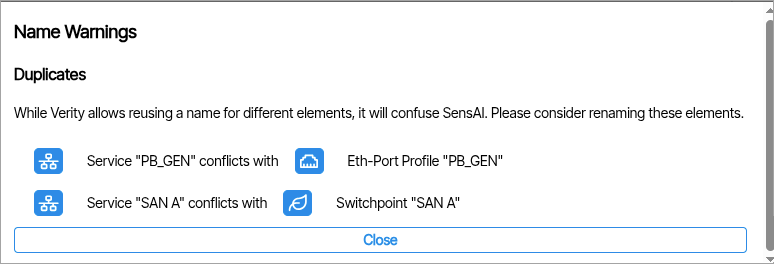

## Using a Local LLM

!!! Warning

    Using a local LLM is not currently supported.  These instructions are provided for the purposes of running demos of SensAI where internet access is not available.

 
### Step 1 - Edit the SensAI config file
Open `/app/sensai/configs/sensai.ini` on the Satori host (inside the container) and update the `[AI-SETTINGS]` section with your local server details:

```ini
LLM_MODEL = "your-model-name"
LLM_MODEL_LARGE = "your-model-name"
LLM_SERVING_FRAMEWORK = "openai"
LLM_SERVING_FRAMEWORK_URL = "http://<your-local-llm-host>:<port>/v1"
LLM_MODEL_MAX_TOKENS = 4000
```

Replace `<your-local-llm-host>` and `<port>` with the IP/hostname and port of your local LLM server. For example, if running Ollama on the same machine: `http://localhost:11434/v1`
Set `LLM_MODEL` to the model name your server recognizes (e.g. `llama3:70b` for Ollama, or `mistral-small` for vLLM).

### Step 2 - Set the API key environment variable
Even though most local servers don't require authentication, Satori requires the `LLM_API_KEY` variable to be set. Add it to the `.env` file on the host:

```ini
LLM_API_KEY=local
```

Any non-empty value will work.
### Step 3 - docker restart sensai-prompt-service
**Notes:**

- **LLM_SERVING_FRAMEWORK** must be set to `"openai"` for any local server — this tells DSPy to use the OpenAI-compatible API format.
- **LLM_MODEL_MAX_TOKENS** controls max output tokens. Lower this if your model has a smaller context window (e.g. 4000 for 8K-context models).
- **DocRAG features** (document ingestion/search) also require a local embedding model. If your server doesn't serve embeddings, update `DOCRAG_LLM_MODEL` and `DOCRAG_EMBED_MODEL` in the same config section to point at models your server supports, or those features will be unavailable.
