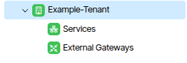
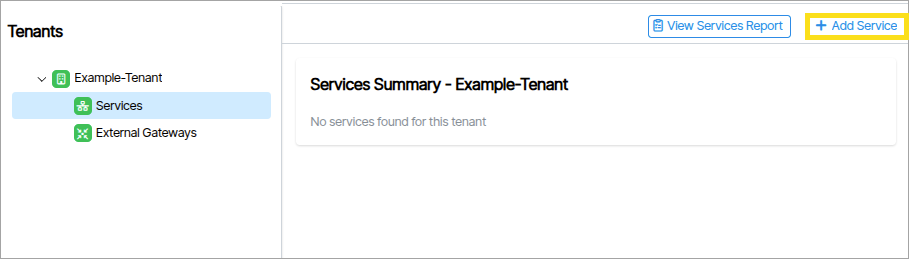
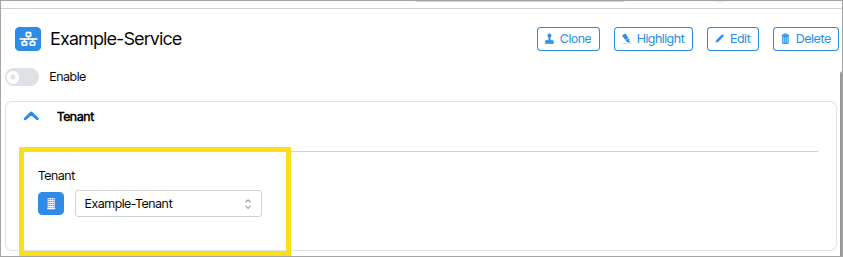
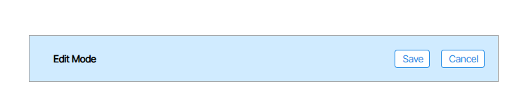
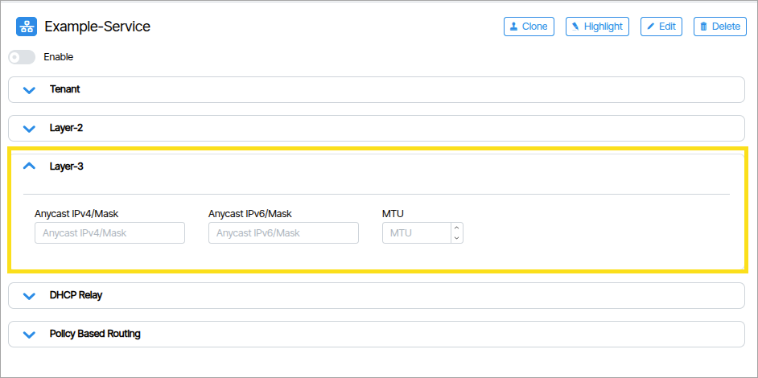

# Services
**Services** are Layer-2 broadcast domains (VLANs) that are optionally routed through the Layer-3 fabric as VXLAN frames. Services enable devices connected to different parts of the network to appear to be in the same local segment.  Layer-3 addressing and routing can be optionally enabled for each service to support IP packet forwarding as well as DHCP relay services.  A service is linked to a tenant for further isolation of network reachability.

## Creating a Service
1. From the Main Navigation select Tenancy. Under the Tenants tree select the desired Tenant and unfold it to reveal the Services option beneath it. {: class="pop"}
2. Select Services. Click the **Add** a new Service button {: class="pop"}. Type a name in the field that appears and click **Create Service** 
3. The Service Enable switch defaults to *off*. The Tenant field shows which tenant the Service is assigned to {: class="pop"}

| Setting      | Value |Description                          |
| ----------- | ------ | ------------------------------------ |
| **Layer-2 VLAN** | Required | The 802.1q VLAN tag to be used on the provisioned switch ports.
| **Layer-2 VNI** | (Autoassigned) | Specifies the VXLAN VNID number if the user wishes to override the automatic assignment.  |
| **Anycast Address** | Optional| Comma-separated lists of anycast gateway addresses for IPv4 and IPv6 subnets. Each anycast address serves as the default gateway for a different subnet within the same VLAN, enabling Layer-3 routing and reachability across multiple subnets.|
| **DHCP Relay** | Optional |Enables DHCP packet forwarding to a central DHCP server(s) for address requests. |
| **MTU** | Optional |Maximum Transmission Unit for the Layer-2 segment.  This is either *automatically generated* or *not* required. |

!!! note  

    You must set the DHCP source address range in the Tenant Layer 3 section described below in order to support DHCP Relay. The DHCP Source address range is used by Verity to create loopback addresses within each Leaf switch to serve as the source address for the DHCP requests for the tenant when it is configured on the switch)

6. Click **Enable** to enable the Service. This will place the Service into **Edit Mode**.  {:class="pop"} 
7. Fill out any required fields. 
8. Click Save. {:class="pop"} 

## Enable Layer-3 Anycast IP/Mask on a Service

!!! note

    Prior to enabling Tenant-to-Tenant routing your chosen Tenant must have a Service with a Layer-3 Anycast IP/Mask field set. 

 

1. Select a Service.
1. In the **Anycast IP/Mask** form field type the static anycast gateway address for this service.
1. Click Save. {:class="pop"} 

**Anycast IPv4/Mask**
A comma-separated list of static IPv4 anycast gateway addresses assigned to this service. 

**Anycast IPv6/Mask**
A comma-separated list of static IPv6 anycast gateway addresses assigned to this service. 

**MTU**
The Maximum Transmission Unit defines the largest packet size the switch will forward without fragmentation on this service. Mismatched MTU values within the same VLAN can cause silent packet drops, particularly for larger frames common in storage or virtualization traffic.

**IP Attach Host Advertise**
Redistributes dynamically learned /32 host routes from attached ports into BGP, making locally discovered hosts reachable across the fabric. Enter a value between 0–250 to set the admin distance for these redistributed routes, where lower values give them higher priority; leave blank to disable the feature.