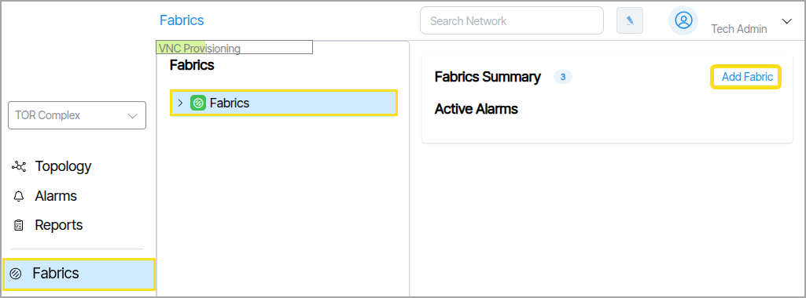
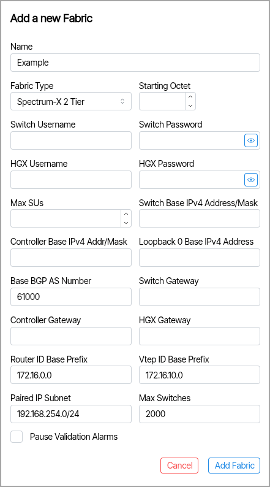
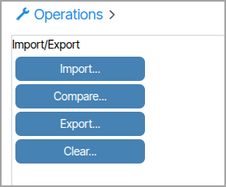

# Spectrum X Fabric Device Import

Create the Fabric before importing device information. If you have already created the Fabric, jump to the section below titled **Import Device Information**.

## Create the Fabric

To create a new fabric, go to Fabrics → Fabrics → **Add Fabric**. This will launch a form to select the Fabric type and enter details.

The **Fabric Type **needs to be set to a Spectrum X Tier Fabric. All other fields are required. When completed click **Add Fabric**.

## Import Device Information

After creating the Fabric, use the import file to bring in device information. The image below shows a sample device import file. The site name is PGA-Complex — in a real-world system, the fabric importing this file would share the same name.

A example of this file titled **FCA Verity Import Example File HGX** is available in  [Downloads](downloads.md)

To import the file go to **Operations**  →  **Import/Export** ({: class="pop"}). Click **Import** and select the file.

