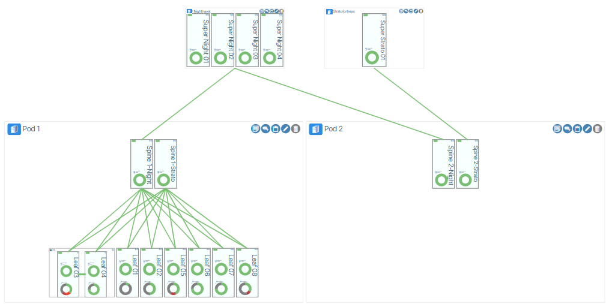
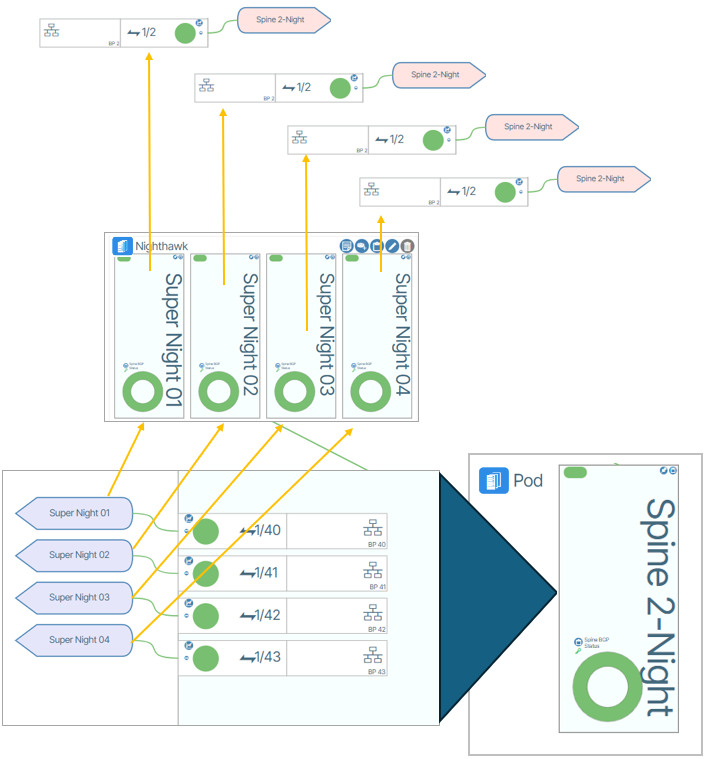
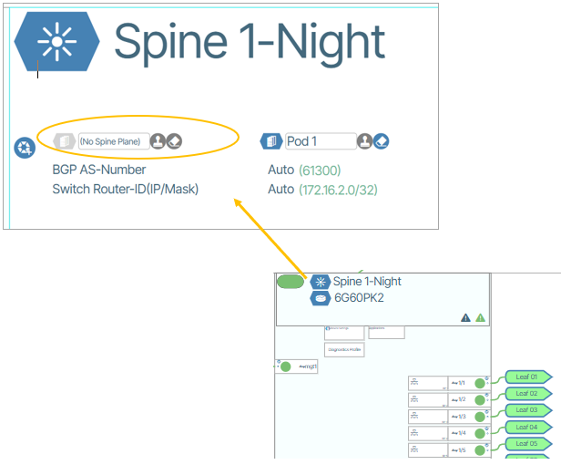
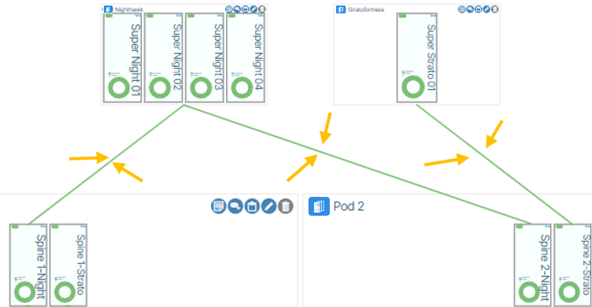

---
hide:
- toc
---

# Spine Plane Architecture

Spine plane architecture enables large data centers to grow by dramatically increasing available switch ports. This form of architecture is built specifically for heavy server-to-server traffic patterns found in cloud computing, AI/ML applications, and virtualized systems where most data flows horizontally between servers rather than in and out of the data center.

## Spine Plane Integration

In Verity, switch devices are organized according to their role in the system. Spine and leaf devices are grouped into collections called Pods, while Superspines are grouped into collections called Spine Planes.
A Spine Plane integrates into the network architecture by connecting its containing Superspines to a spine switch within a POD, forming a dedicated inter-layer fabric. Each POD contains a single spine switch that establishes physical links to all Superspines in its assigned Spine Plane. This design creates a clear hierarchy, with the Spine Plane layer positioned above the POD layer to enable scalable, centralized interconnection between PODs.

### Summary

* PODs are composed of Spine and Leaf switches
* Spine Planes are composed of Superspines
* One Spine per POD connects upward to all Superspines in its assigned Spine Plane
* Multiple PODs can connect to the same Spine Plane, enabling inter-POD communication

## Creating a Spine Plane

Before creating a Spine Plane, the Superspine(s) and Spine hardware must be physically connected. The image below is a graphical representation of these physical connections.

1. Go to **Topology / Network View** and click the **Add a New Spine Plane** button. When prompted, enter a name.
1. From within the Spine Plane tile click the **Add a New Preprovisioned Switch** button and fill out the form and submit the changes.
1. Repeat steps 1 and 2 to create the total number of Superspines needed for your Spine Plane.
1. Determine the Pod and a Spine from that Pod to connect to the Spine Plane. 
1. Zoom into the top of the Spine and set the Spine Plane name to the Spine Plane field. {class="pop"}
1. When the configuration is complete, Verity will display virtual cables between the Spine Plane(s) and Spine(s) representing the relationship between the devices. 

