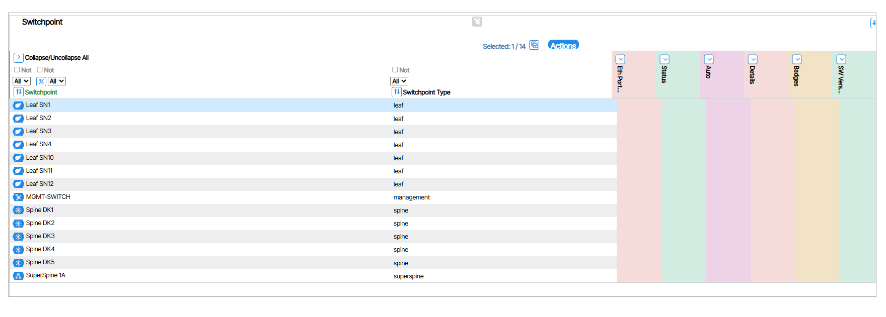
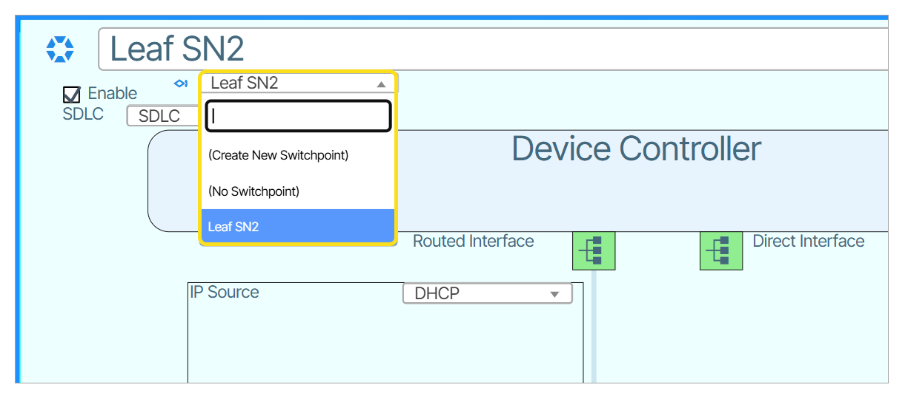

# Switchpoint 

A **Switchpoint** represents a logical location for a device in the network and defines a connection point—such as where leaf 1 connects to spine 3. By designing a network using Switchpoints, operators keep the logical design independent of specific devices, allowing them to insert a device into the switchpoint by referring to either its serial number or a chassis id.

The **Device &rarr; Switchpoint** window provides a Report of all **Switchpoints**.

 

## How to Assign a Switchpoint

1. Select the **Switchpoint** field and assign the Switchpoint.

