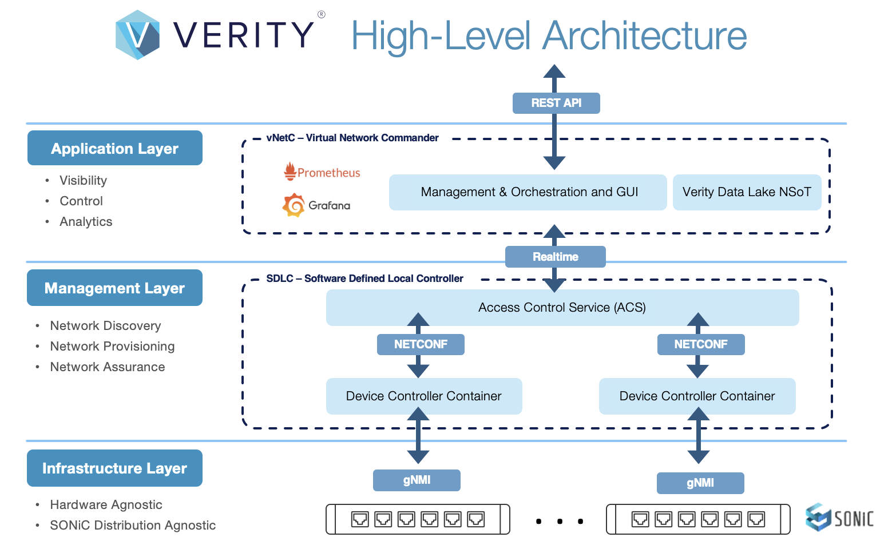

---
hide:
- toc
---
# Verity Components

## Software Defined Local Controller (SDLC)
The SDLC hosts the various containers used for device communications and other system functions. This is a Linux Virtual Machine that is installed during the initial deployment of Verity. This VM hosts the following containers:

- **ACS** (**Access Communication Server**) provides a scalable message interface between vNETC and all managed devices. ACS controls how the devices are programmed from the UI to the Device Controllers.

- **GuiA** (**UI Acceleration**) is a system application that increases UI performance. Only one GuiA can be used per SDLC. This is the UI backend that takes the inputs from the user through the UI and codes it so that the ACS can translate to the Device Controllers and manage the devices.

- **Device Controllers** are used to create the interface between the Verity application and the switch device. Based on the LLDP capabilities of the switch, it can be automatically discovered in the network topology, or it can be statically located.

{: class="clean"}

---
## Virtual Network Commander
The vNETc hosts database services, a UI HTTPS server, the optional DHCP server, and the BizD application which translates user intent to actual network state. The Web Server also works with the GuiA services on the SDLC's to be able to draw and reflect in real-time what is happening to the devices and configurations.

---
## Satori (Observability Suite)
The Satori VM hosts multiple containers to provide network and compute observability to Verity. The Satori VM gathers telemetry, log, and other metric data for the managed devices in Verity.

---
## Hardware Devices
Verity distinquishes between managed devices and unmanaged devices. Managed Devices are known to Verity and mapped to SDLC Device Controllers and can be automatically configured. Unmanaged Devices are devices connected to managed devices but are not configured by Verity, including servers and/or switches.

[Supported Devices](https://be-net.com/hardware){ .md-button .md-button--primary }

---
## Management Network
Verity automates the configuration of network devices via the out-of-band ethernet ports connected to a dedicated management network. Verity uses SSH, gNMI, SNMP and other protocols to manage devices in this OOB management network. During initial deployment, Verity can deploy and program the management network and automatically configure the attached switches, as well as inventory and detail how and where they are connected to the management Switch(es).