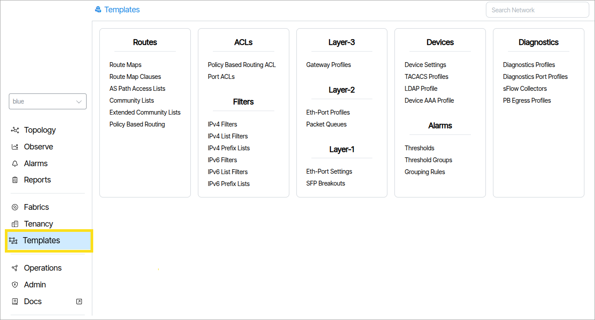
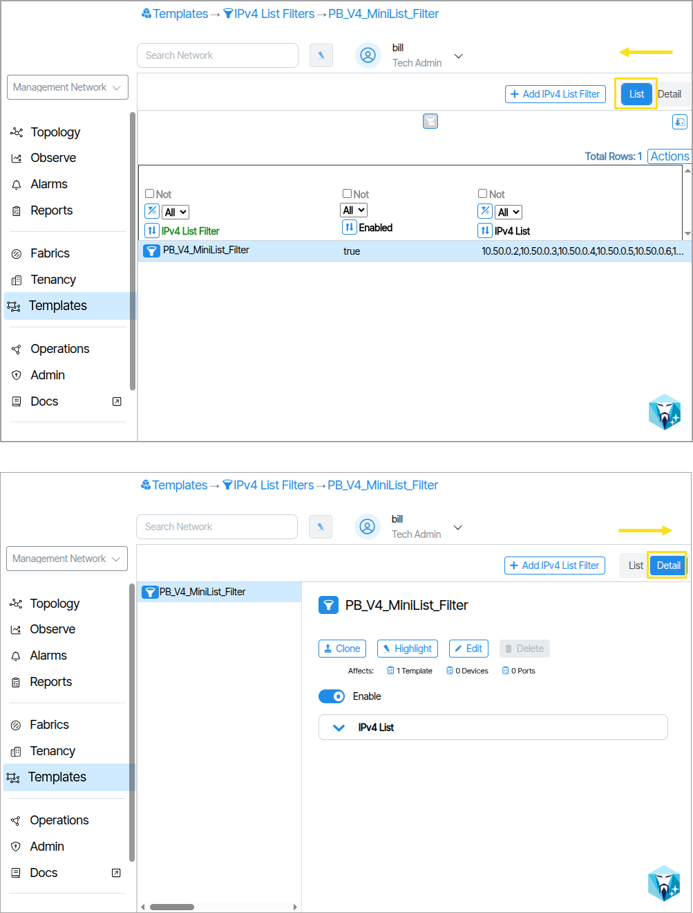

# Templates

The **Templates** section is composed of tools used to configure and create reusable network device settings and policies. The reusable collections are called **Template Objects**. Templates and Template Objects are organized into functional categories based on network layers and operational domains. 

## How to Create a Template Object

Read: [Create Provisioning Objects Through Forms: ](provisioning-object-forms.md)

## Categories

**Routes**

Templates for controlling routing behavior, including route maps for policy-based routing decisions, AS path filtering for BGP route selection, and community-based route tagging and filtering policies.

**ACLs** 

Access control list templates for policy-based routing decisions and port-level traffic filtering, defining which traffic flows are permitted or denied based on specified criteria.

**Filters** 

Network prefix and address filtering templates for both IPv4 and IPv6, used to control route advertisements, traffic matching, and network access at the IP layer.

**Layer-3**  

Network layer templates defining gateway configurations and site-level routing policies that control how traffic is forwarded between network segments.

**Layer-2** 

Data link layer templates for Ethernet port configurations and quality-of-service packet queue management, controlling how frames are processed and prioritized.

**Layer-1** 

Physical layer templates defining Ethernet port physical characteristics and SFP module breakout configurations for high-speed interfaces.

**Systems** 

Device-level configuration templates that define system-wide settings applicable across network devices.

**Alarms**

Monitoring and alerting templates that establish threshold values, organize thresholds into logical groups, and define rules for classifying alarm conditions.

**Diagnostics**

Network troubleshooting and monitoring templates for diagnostic operations, port-level diagnostics, sFlow traffic sampling configurations, and packet broker egress policies.

## List / Detail

The List and Detail tabs display the same information in two distinct styles: **List** provides a report view, while **Detail** offers a layout better suited to direct editing.

