---
hide:
- toc
---

# Tenants
**Tenants** are the fundamental building block of data center overlay traffic. A Tenant is composed of several elements, including Services, a Layer 3 instance, and a BGP gateway to enable communication outside the data center. Proper configuration of Tenants is crucial to setting up a data center instance. This document offers general instructions on how to create and configure Tenants.

For detailed options and further configurations, the user should be experienced in data center architecture and configuration and refer to Dell SONiC documentation to understand the capabilities and complex features.

## Creating Tenants

1. Navigate to **Tenancy &rarr; Tenants**
1. Click the **Add Tenant** button (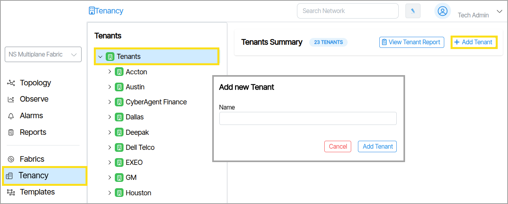{: class="pop"}). Type the name of the Tenant and save it by clicking the **Create Tenant** button .
1. Explore the parameters.  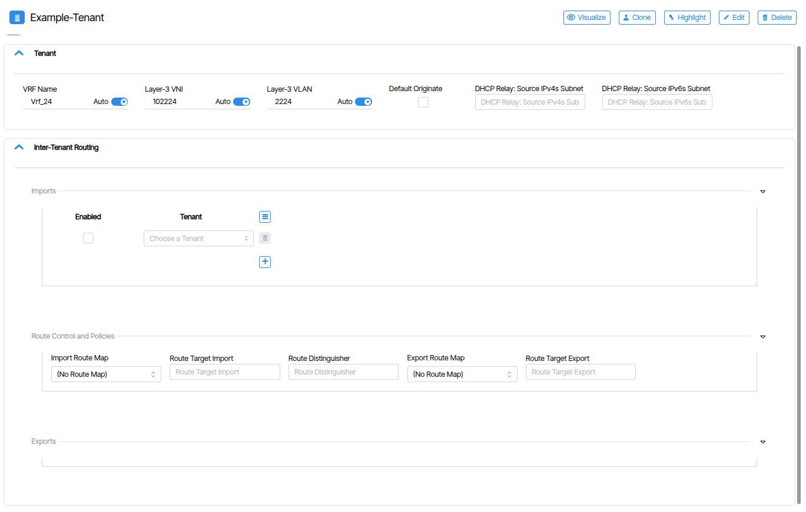{: class="pop"}
1. The primary **Layer-3** parameters are auto-generated. This includes **VRF Name**, **Layer-3 VNI**, **Layer-3 VLAN**.
1. Optionally configure the **DHCP Relay Source IPs Subnet** which is used to allocate IP addresses to connected devices within the Tenant (additionally controlled within the **Services** object).

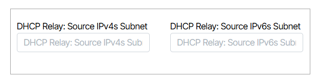

## Visualization

The Visualize button opens a visual interface called **Tenant Slice**.

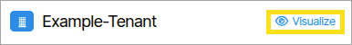

The **Tenant Slice** window offers a visual interface to assign services and Tenant BGP Gateways to Leaf ports.
 However, when assigning a Service to a Leaf port, the Service is not directly assigned to the port itself. Instead, the Service is assigned to an **Eth-port-profile** that is *automatically generated* and assigned to the Leaf port. Eth Port Profiles are collections of one or more Services that you assign to Leaf ports or external LAGs. To summarize, Services are assigned to Eth Port Profiles and Eth Port Profiles are assigned to Leaf Ports/LAGs.

 When a Tenant has Services/BGP Gateways provisioned across switches from more than one POD, the data is condensed into visual boxes that encapsulate connections. To view encapsulated connections, double-click the boxes.

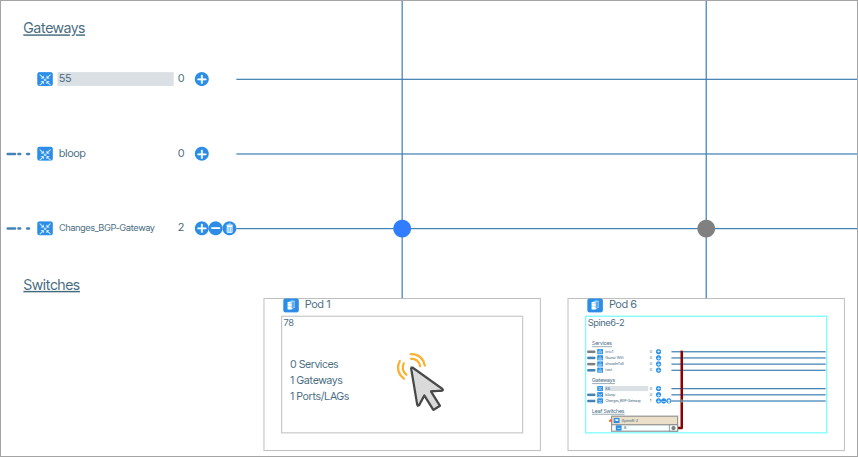

### Tenant Slice Operations

#### Assign Services to the LAG via Tenant Slice
The conventional way to assign Services to a LAG is via the Tenant Slice window.

1. Select a **Tenant** and click **Visualize**. 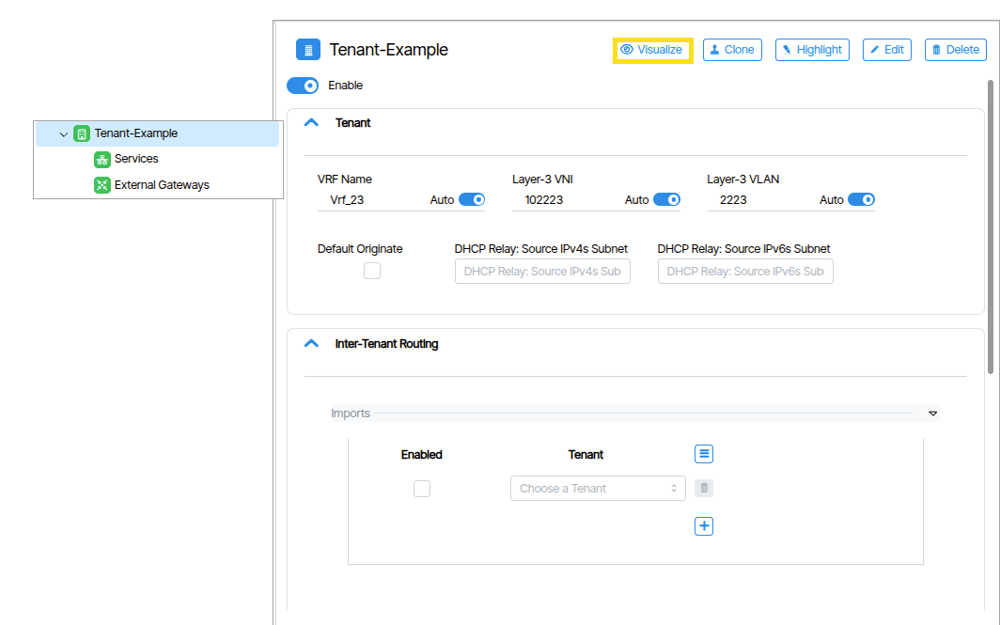{: class="pop"}
1. Zoom in and select the **Service** you want to assign and click the Add Service button 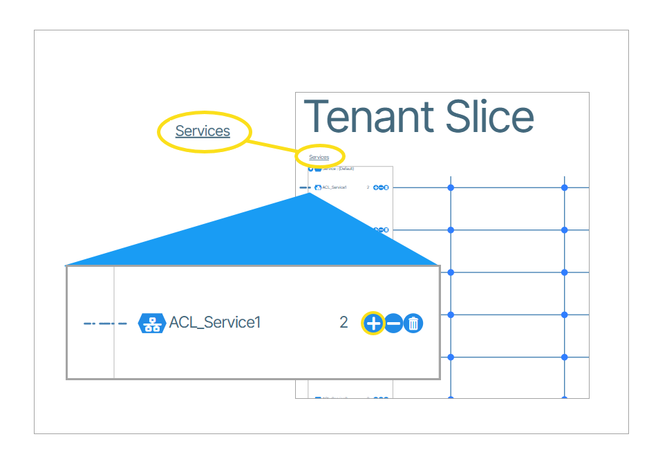{: class="pop"} .
1. In the drop-down menus, find the desired LAG and select it. Click the checkbox button to create the assignment. 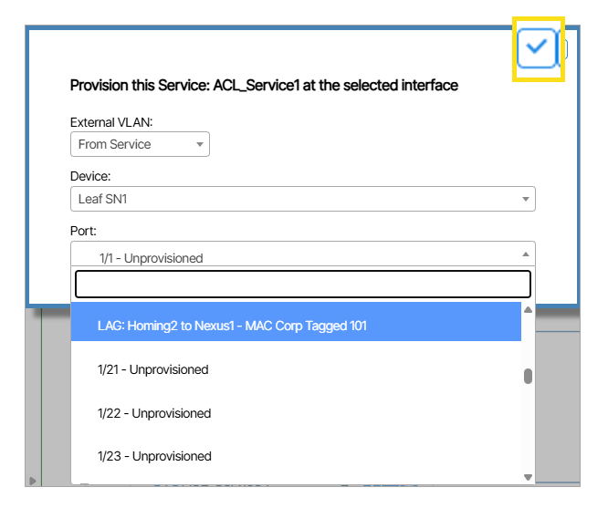{: class="pop"}
1.  When complete, a visual representation expressing the assignment appears. 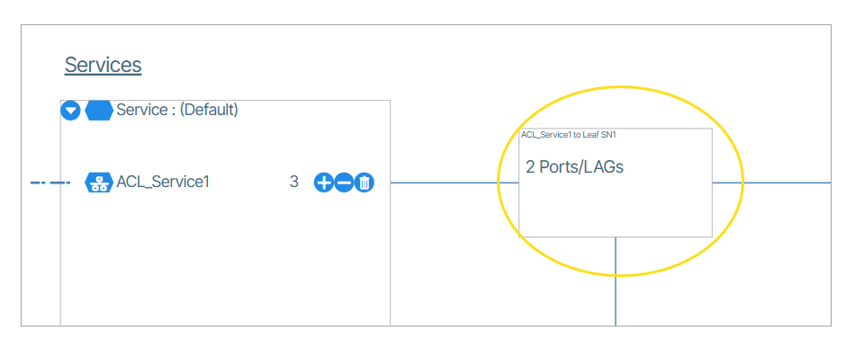{: class="pop"}

#### Assign a Service to a Leaf Port
The following is an example of assigning a **Service** to a **Leaf** port.

1. Click the **Add Service** button ({: class="btn"}).
1. While in **Tenant Slice**, select the **Service** you want to use and click its plus button 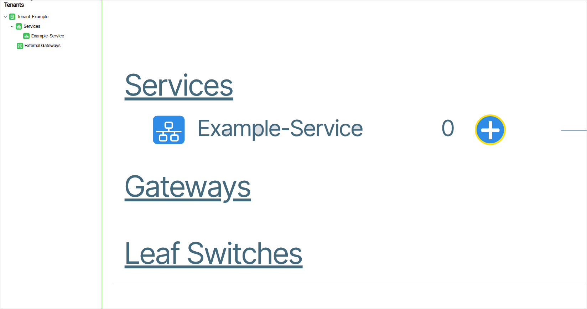{: class="pop"}. 
1. In the window that appears, use the drop-down menus to select the (switch and) port to assign the **Service** to. 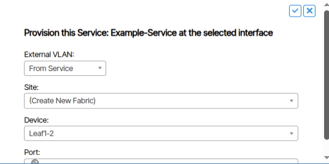{: class="pop"}
1. When the assignment is complete, the **Tenant Slice** window updates to reflect the new state. 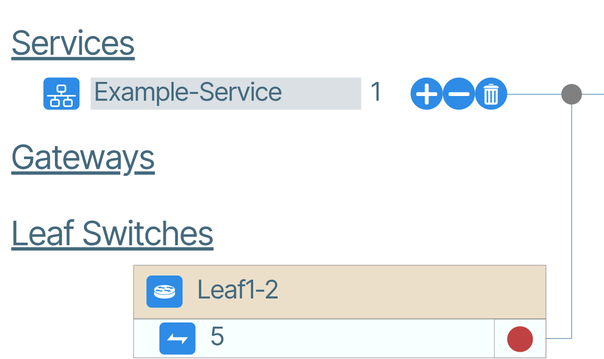{: class="pop"}

#### Removing an Assignment
Remove an assignment by clicking either the **Remove Service** ({: class="btn"}) icon or the node connection ({: class="btn"}) icon of the assignment you want to delete.

#### Assigning BGP Gateways
The mechanics of creating and managing BGP Gateway assignments in Tenant Slice are the same as the previously discussed Service creation and navigation. When creating a new BGP Gateway assignment, the user is prompted to provide an IP address and a subnet mask in the format of this *example*: 192.168.1.0/24

### Ports
The number of Leaf ports used by a collection of Tenant Services and Tenant BGP Gateways.

To manipulate port assignments, you use the add and remove buttons:

To assign port configurations to the Tenant Slice, the initial step involves identifying the **Service** or **BGP Gateway** to be routed. Then, proceed to click on the designated add or remove button ({: class="btn"}) and perform the necessary assignment or removal to the switch port displayed in the **Tenant Slice** window.

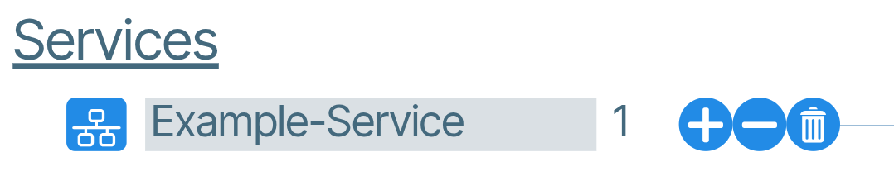

### Route Maps
To create Route Maps, refer to the main [Route-Maps](route-maps.md) section.

#### Apply Route-Maps to Tenant-to-Tenant Routing
To apply Route-Maps to your Tenant-to-Tenant routing click on the Route Map field and make your selection from the drop down menu.

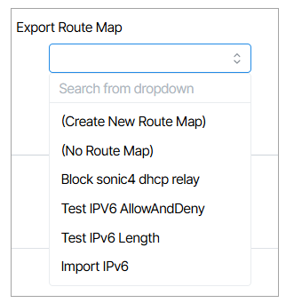

#### Route Target, Route Distinguisher

To set Route Target or Route Distinguisher values, select the respective field and type in the value.

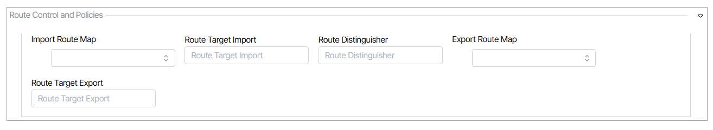

<!-- TO BE MOVED in 6.5
#### Route Maps

**Note:** To *create* Route Maps, refer to the table of contents for the main [Route-Maps](../route-maps)  section.

To apply [Route-Maps](../route-maps) to your Tenant-to-Tenant routing click on the Route Map field and make your selection from the drop down menu.

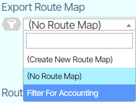

#### Route Target, Route Distinguisher
To set Route Target or Route Distinguisher values, select the respective field and type in the value.

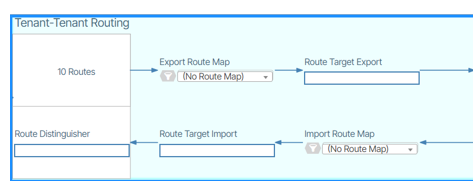 -->

## Additional Resources

- [Multitenancy](multitenancy.md)
