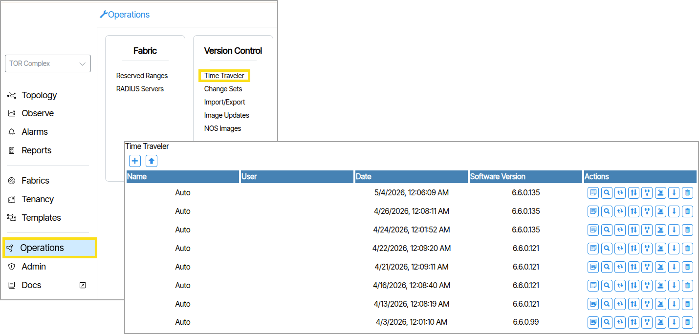
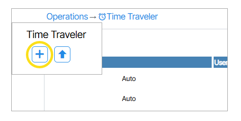

# Network Time Traveler

**Network Time Traveler** is a tool to create and restore the intended configured state of the network. Time Traveler exercises version control on the configured objects in Verity. Verity derives device configurations from these objects, therefore the system can recalculate the entire network configuration when administrators use the Time Traveler function. Verity does not backup the actual device configurations.

## Manually Create Backup

1. Navigate to  **Operations/Time Traveler**.
1. Click the **Create a New Network Time Traveler Backup** button to create a new backup. {: class="pop"}

## Revert State Using Time Traveler
1. Navigate to  **Operations/Time Traveler**.
1. Determine the the backup to revert to (Select by date).
1. Click the corresponding **Restore Network Time Traveler Backup** icon ({: class="btn"}). 

### Time Traveler Actions

1. Write and/or View Note of backup
1. Compare to Current
1. Compare to Previous Backup
1. View Changed Provisioning Objects Since Backup
1. View affect Ports Since Backup
1. Restore Network Time Traveler Backup
1. Download Network Time Traveler Backup
1. Delete Network Time Traveler Backup
