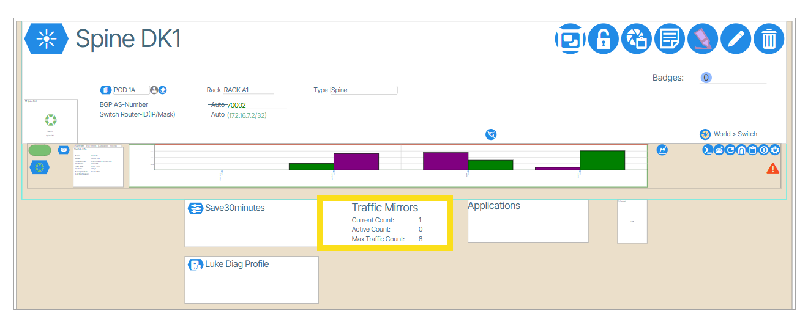
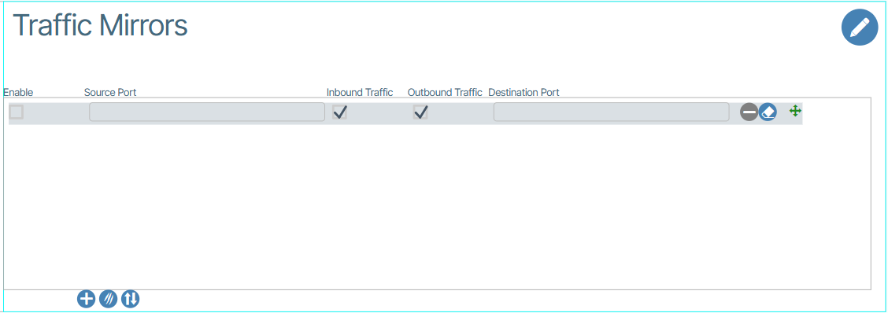
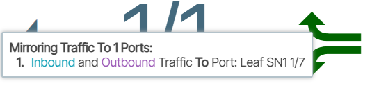

---
hide:
- toc
---

# Traffic Mirrors

**Traffic Mirror** is a network monitoring tool within Verity that copies traffic from a source port to a destination port. Administrators then connect a PC equipped with Wireshark or other monitoring device to the destination port to analyze the copied traffic.

The **Report &rarr; Traffic Mirrors** window provides a Report of all **Traffic Mirrors**.

## Creating a Traffic Mirror

In **Topology &rarr;  Newtwork View** double-click the **Traffic Mirrors** tile on the switch ({: class="pop"}). This opens the Traffic Mirror window.

To add a new Traffic Mirror, click the **Add row to this Switchpoint** button ({: class="btn"}) followed by entering the Source and Destination switch ports, selecting ingress and/or egress traffic, then enable row(s).  

## Port Traffic Mirroring Indicators
These indicators tell users if a port is used in a traffic mirroring configuration.

Hovering over the indicator provides more information.

