---
hide:
- toc

search:
  boost: 100
---

# Troubleshooting

## Topology
Verity displays a live map of the devices in the network and their connections. 

### Topology Detection and Behavior

1. Autodiscovery
1. Connection moves
1. Remove connections 

## Reports
Verity provides a comprehensive list of reports to identify current conditions in the network. Reports are viewed by navigating to the Reports window 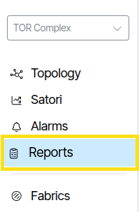{:class="pop"} or clicking the Reports icon of a device object 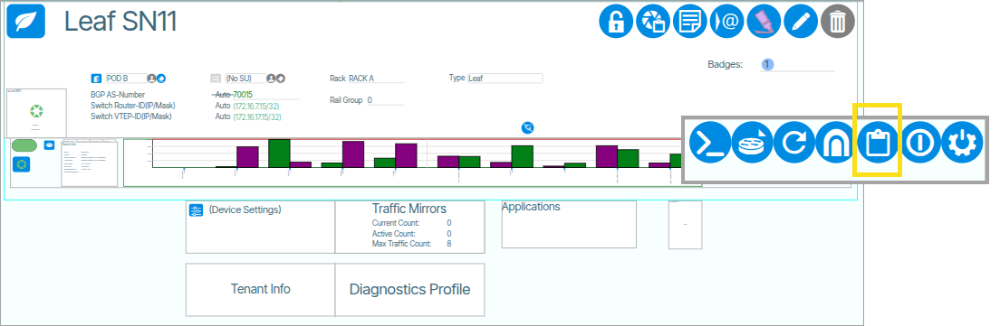{:class="pop"}. 


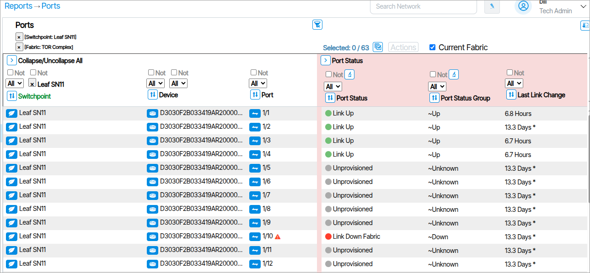

## MAC Address Workbench

Verity provides the ability to display MAC addresses across the entire system.
To use this feature navigate to **Reports/ MACs**.


The Mac Address Workbench lets you search device by *mac address*. Clicking the **Search** button without specifying a mac address displays all devices 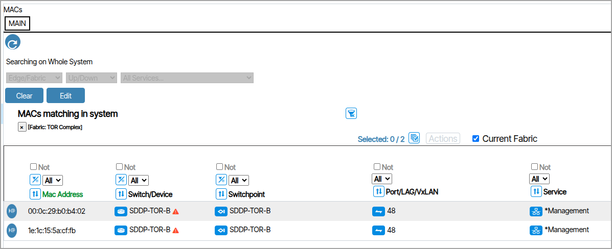{:class="pop"}.

From within a list of devices, clicking {:class="btn"}   opens a new tab to search on the corresponding mac address 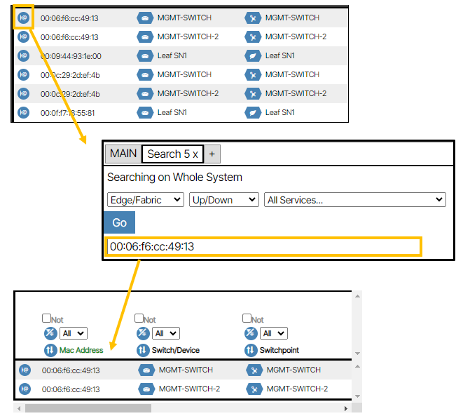{:class="pop"}.

## Mac Exports
Mac Exports provides a summary MAC report for all devices connected to the network's user facing ethernet ports. This tool can be automated to generate a daily report or used on a case-by-case basis as needed. To manually run a report, enable the checkbox for all services you want to include, click **Run Report Now**, and wait for the **Download Latest Report** icon to turn blue. Once it does, click the icon to download the CSV file.


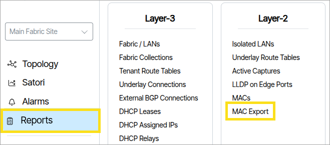


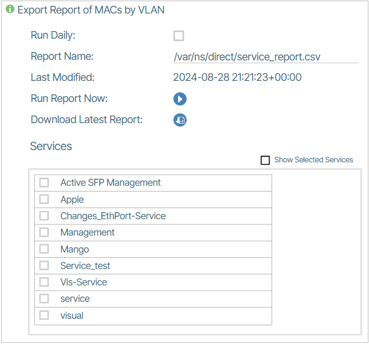

## Ping and Trace Route

Verity provides tools to troubleshoot Layer 3 issues for the underlay and Tenant connections for services configure for Layer 3. The **Ping and Trace Route** feature is a diagnostic tool that sends a ‘ping’ to and from a specified address and details the message path.

<!-- !!! warning "Beware of Misconfigurations"
    This feature is only applicable to systems using GNMI (gRPC Network Management Interface ).
    Before you use this feature, ensure the chosen device has its Device Controller/Managed Device **Comm Type** set to GNMI. 
    **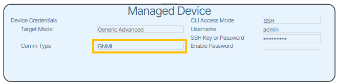** -->

### Controls
The **Ping and Trace Route** dialog box is opened by clicking **Open Ping/Traceroute Dialog** button {:class="btn"}.

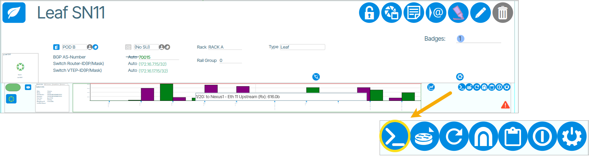

To use this feature you configure the following parameters and click the **Start** button 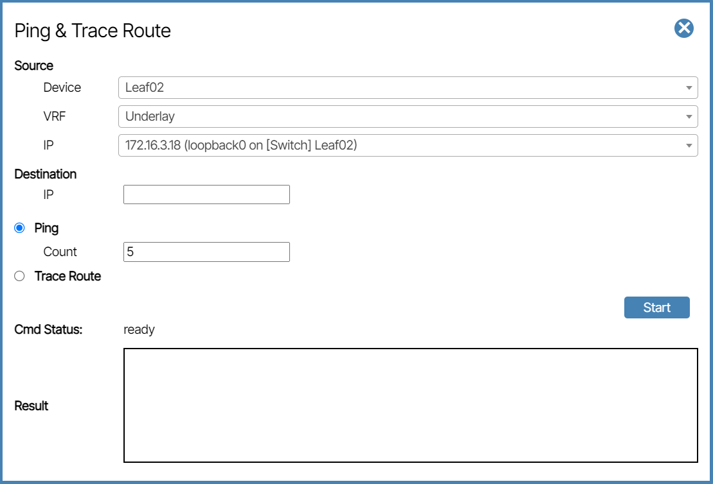{:class="pop"}.

### Source

-   **Device:** This is the source device of the ping.
-   **VRF:** This is where you select the VRF. The VRFs of Tenants, the Underlay (selected device), and Management (Device Controller) are all options.
-   **IP:** The targeted IP address to send the ping command from. The IP address changes depending on the VRF setting.

### Destination

-   **IP:** The targeted IP address to receive the ping command.

### Ping

-   **Count:** The number of ping events sent before the process is complete.

### Trace Route

When this option is selected, the trace route is included in the **Result** field.

### CMD Status

This is a progress indicator. When the feature is ready, CMD Status says **Ready**; when active, CMD Status says **In Progress**; and when the process is complete, it says **Done**.

## DHCP Snooping
Verity provides the location of connected L3 addresses detected by DHCP snooping functions in SONiC.

To enable DHCP snooping navigate to **Admin/Site Settings** and check the box next to **Enable DHCP Snooping** .


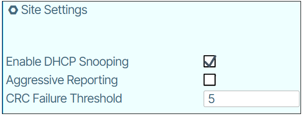

### Viewing DHCP Assigned IP's
To view DHCP assigned IP addresses go to **Reports/DHCP Assigned IPs** 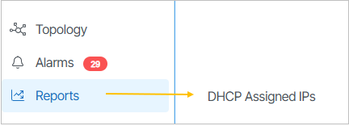{:class="pop"}.

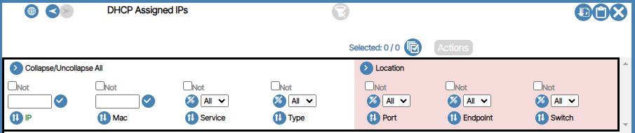


## View License
To view the license go to **Admin/Licensing**.


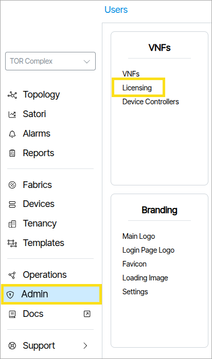

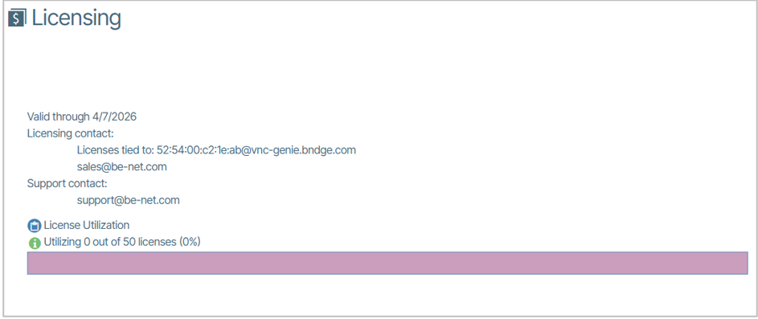


The Licensing object displays License Usage and Physical Port Usage bar graphs. While focused on the object, the user can see the date of licensing expiration, contact information for support, and reports of license.

By clicking on the report icons for License Utilization, License by Device Utilization, and Physical Port Utilization, a report for those lists will be shown. For a specific report on used, preprovisioned, stranded, or spare licenses, the user can click on each section of the bar graph. This can also be done with physical ports that are licensed, fabric or spare.

An example License Utilization report is shown below:

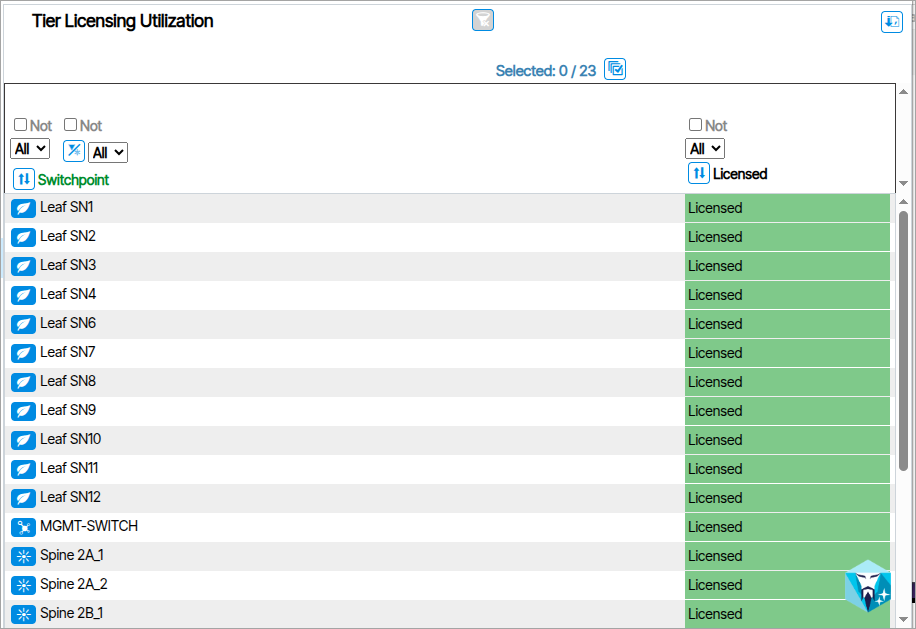

# Satori Troubleshooting 

## Overview

This troubleshooting script is a comprehensive diagnostic and maintenance tool for the Verity Satori System. It provides a menu-driven interface to check system status, perform maintenance tasks, and generate debug information for support purposes.

## Purpose

The script helps administrators:

**Diagnose Issues**: Check service status, connectivity, and configuration

**Perform Maintenance**: Adjust logging levels, restore backups, populate data

**Generate Support Data**: Create comprehensive debug snapshots for technical support

**Monitor Health**: Verify all Satori components are functioning correctly

## Prerequisites

### System Requirements

**Privileges**: Must run as root or with sudo access

**Dependencies**: 

  - Satori system previously installed via setup script
  - Active internet connection for API testing

## Running the Script

### Basic Execution
```
bash

sudo ./satori_admin.sh
```

You are presented with two options: 

1. Setup 
2. Troubleshooting

Select 2 **Troubleshooting**.


## Menu Options Reference

### **Option 1: Check Satori Services Status**
```
1. Check if the Satori services are running
```

**Purpose**: Verifies all Satori Docker containers are running properly

**What it checks**:

- ETL (verity-ml-python)
- Grafana
- Prometheus  
- Promtail
- Telegraf
- Neo4j-graph
- Loki
- Cadvisor
- Alertmanager
- Node-exporter
- Sensai-service
- Neo4j-vector

**Expected Output**:
```
ETL services are running.
Grafana services are running.
Prometheus services are running.
...
--------------------------------------------
Total Services Tested: 12
Currently Running: 12
Not Running: 0
--------------------------------------------
```

**If Services Are Down**:
```
run the command 'sudo docker compose -f /be_satori/docker-compose.yml up -d' and re-run this script
```

---

### **Option 2: Check Time Synchronization**
```
2. Check the status of the time synchronization
```

**Purpose**: Verifies system time is properly synchronized

**Expected Output**:
```
               Local time: Wed 2024-12-18 10:30:15 UTC
           Universal time: Wed 2024-12-18 10:30:15 UTC
                 RTC time: Wed 2024-12-18 10:30:15
                Time zone: UTC (UTC, +0000)
System clock synchronized: yes
              NTP service: active
          RTC in local TZ: no
```

**Key Indicators**:

- `System clock synchronized: yes` - Time is properly synced
- `NTP service: active` - Time synchronization service is running

---

### **Option 3: Report FQDN Setting**
```
3. Report the FQDN setting in the Satori.ini file
```

**Purpose**: Shows the configured vNetC host address

**Expected Output**:
```
FQDN setting: vnc-satori.company.com
```

**Uses**: Verify Satori knows where to connect to vNetC

---

### **Option 4: Report MAC Address Setting**
```
4. Report the VERITY_SATORI_VM_MAC_ADDRESS setting in the Monitoring.ini file
```

**Purpose**: Shows the configured MAC address for VM identification

**Expected Output**:
```
VERITY_MONITORING_VM_MAC_ADDRESS setting: aa:bb:cc:dd:ee:ff
```

**Uses**: Verify unique VM identification in the Satori system

---

### **Option 5: Report Package Version**
```
5. Report the version of the Satori package
```

**Purpose**: Shows the currently installed Satori software version

**Expected Output**:
```
Version: 2.1.64.108
```

**Uses**: Verify version for support purposes or update planning

---

### **Option 6: Perform Announcement Call**
```
6. Perform an announcement call to the FQDN setting
```

**Purpose**: Tests Satori's ability to announce itself to vNetC

**What it does**: Executes the announcement process to register with vNetC

**Expected Behavior**: Script runs the announcement process and reports any failures.


---

### **Option 7: Check vNetC API Status**
```
7. Check vNetC API calls are working and report the HTTP status code
```

**Purpose**: Tests API connectivity to the vNetC system

**Expected Output** (Success):
```
Verity vNetC API calls are working using the FQDN/ROOT_API_URL: vnc-satori.company.com
```

**Expected Output** (Failure):
```
Verity vNetC API calls are not working. FQDN/ROOT_API_URL: vnc-satori.company.com | HTTP status code: 404
```

**HTTP Status Codes**:

  - **200**: Success - API is working properly
  - **401**: Unauthorized - Check credentials
  - **404**: Not Found - Check URL/hostname
  - **500**: Server Error - vNetC system issue
  - **000**: Connection failed - Network/DNS issue

---

### **Option 8: Set Debug Logging**
```
8. Set logging level to DEBUG
```

**Purpose**: Enables detailed logging for troubleshooting

**Effect**: Changes `LOG_LEVEL=DEBUG` in satori.ini

**When to use**: 
- Investigating specific issues
- Before reproducing problems for support
- Detailed system analysis


!!!Warning 
    Debug logging generates large log files and may impact performance

---

### **Option 9: Populate Knowledge Graph**
```
9. Perform a ETL call to populate the knowledge graph
```

**Purpose**: Manually triggers data extraction, transformation, and loading

**What it does**: Executes the knowledge graph population process

**When to use**:

- After configuration changes
- To refresh Satori data
- Testing data pipeline functionality

**Expected Behavior**: Process runs and populates the knowledge graph with current data

---

### **Option 10: Set Error Logging**
```
10. Set logging level to ERROR
```

**Purpose**: Reduces logging to only error messages

**Effect**: Changes `LOG_LEVEL=ERROR` in satori.ini

**When to use**:

- After debugging is complete
- To reduce log file sizes
- For normal production operation

---

### **Option 11: Create Debug Snapshot**
```
11. Create Satori debug snapshot for Verity Support
```

**Purpose**: Generates comprehensive diagnostic package for technical support

**Prerequisites**: 

- Must attempt steps 1-9 first
- Specify which step failed

**What it includes**:

- Complete system status check
- All container logs (latest 10,000 lines)
- Error logs for each container
- System resource information
- Docker container status and stats
- Configuration settings
- Time synchronization status
- API connectivity results

**Output Files**:
- `satori_debug_package_YYYYMMDD_HHMMSS.tar` - Complete debug package

**Archive Contents**:
```
satori_service_status_results_YYYYMMDD_HHMMSS.txt
<container_name>_latest.log (for each container)
<container_name>_errors.log (for each container)
system_info.txt
```

**When to use**: When you need to provide comprehensive system information to Verity Support

---

### **Option 12: Restore Docker Volume** 
```
12. Restore Docker Volume
```

**Purpose**: Provides restoration of Docker volume. 

Choose your docker volume from the options provided. 

**Options:**

**12.1**. **Prometheus**: Restore Prometheus Volume from backup

**Purpose**: Restores the Prometheus Docker volume from a backup.

**What it does**:

- Prompts the user to select one of the existing Prometheus backups
- Performs a Docker Volume backup based on the selected backup

**When to use**: 

- After data corruption in Prometheus
- To revert Prometheus data to a previous state
- For disaster recovery


**12.2**. **Quit**


---

### **Option 13: Reinstall of Latest Satori Application Package**
```
13. Reinstall of Latest Satori Application Package
```
**What it does**: Reinstalls the latest Satori Application Package


### **Option 14: Create a Prometheus Backup**
```
14. Create a Prometheus Backup
```
**What it does**: Creates a Prometheus backup that can be imported via [Option 12: Restore Docker Volume](#option-12-restore-docker-volume). 
---

### **Option 15: Exit**
```
15. Exit
```
Exists the menu.

### **Daily Health Check**

1. Run Option 1 (Check services)
2. Run Option 2 (Check time sync)
3. Run Option 7 (Check API)

### **Troubleshooting Workflow**
1. Set debug logging (Option 8)
2. Check all services (Option 1)
3. Verify connectivity (Options 6, 7)
4. Perform ETL test (Option 9)
5. Create debug snapshot (Option 11)
6. Reset logging level (Option 10)

### **Pre-Support Contact**

1. Complete steps 1-9 in order
2. Note which step fails
3. Create debug snapshot (Option 11)
4. Provide the generated tar file to support

## Expected Output Examples

### **Healthy System Output**
```
Select:
    1. Check if the Satori services are running
    ...
Enter your choice: 1

ETL services are running.
Grafana services are running.
Prometheus services are running.
Promtail services are running.
Telegraf services are running.
Neo4j-graph services are running.
Loki services are running.
Cadvisor services are running.
Alertmanager services are running.
Node-exporter services are running.
Sensai-service services are running.
Neo4j-vector services are running.

--------------------------------------------
Total Services Tested: 12
Currently Running: 12
Not Running: 0
--------------------------------------------

Press Enter to continue...
```

### **Problem System Output**
```
ETL services are running.
Grafana services is not running.
Prometheus services are running.
...
--------------------------------------------
Total Services Tested: 12
Currently Running: 11
Not Running: 1
--------------------------------------------
run the command 'sudo docker compose -f /be_satori/docker-compose.yml up -d' and re-run this script
```

## Troubleshooting Common Issues

### **No Docker Containers Running**

**Symptoms**: All services show "not running"

**Solution**: 
```bash
sudo docker compose -f /be_satori/docker-compose.yml up -d
```

### **API Calls Failing (HTTP 401)**

**Symptoms**: Option 7 shows HTTP status code 401

**Cause**: Invalid API credentials

**Solution**: Check `/be_satori/.env` file for correct credentials

### **API Calls Failing (HTTP 000)**

**Symptoms**: Option 7 shows HTTP status code 000

**Cause**: Network connectivity issue

**Solution**: 
1. Check Option 3 for correct FQDN
2. Verify network connectivity: `ping <fqdn>`
3. Check DNS resolution: `nslookup <fqdn>`

### **Time Synchronization Issues**

**Symptoms**: Option 2 shows `System clock synchronized: no`

**Solution**:
```bash
sudo systemctl restart systemd-timesyncd
sudo timedatectl set-ntp true
```

### **Debug Snapshot Creation Fails**

**Symptoms**: Option 11 fails to create archive

**Cause**: Insufficient disk space or permissions

**Solution**:
```bash
# Check disk space
df -h
# Ensure proper permissions
sudo chown -R $USER:$USER ./
```

## Log File Locations

### **Script Outputs**
- Debug snapshots: `./satori_debug_package_YYYYMMDD_HHMMSS.tar`
- Container logs: `./satori_logs_snapshot/`

### **System Logs**
- Docker containers: `sudo docker logs <container_name>`
- System logs: `/var/log/syslog`
- Monitoring logs: `/be_satori/logs/` (if exists)

## Best Practices

### **Regular Maintenance**
1. Run daily health checks (Options 1, 2, 7)
2. Monitor log levels (keep at ERROR for production)
3. Perform periodic ETL operations (Option 9)

### **Before Support Contact**
1. Always run the complete diagnostic sequence (1-9)
2. Create debug snapshot (Option 11)
3. Note exact error messages and timing
4. Include system information and recent changes

### **Safety Guidelines**
1. Test changes in non-production first
2. Always create debug snapshots before major changes
3. Keep debug logging temporary (return to ERROR level)

## Recovery Procedures

### **Complete System Recovery**
If multiple services are down:
```bash
# Stop all containers
sudo docker compose -f /be_satori/docker-compose.yml down

# Start all containers
sudo docker compose -f /be_satori/docker-compose.yml up -d

# Wait 2 minutes, then check status
sleep 120
# Run troubleshooting script Option 1
```

### **Data Recovery**
If data appears corrupted:

1. Use **Option 12** to restore the Prometheus volume from backup.
2. Re-run setup script if necessary

## Support Information

### **When to Contact Support**
- Multiple services consistently failing
- API connectivity issues persist after basic troubleshooting
- Data corruption or loss
- Before using Option 999

### **Information to Provide**
- Debug snapshot tar file from Option 11
- Specific error messages
- Recent system changes
- Output from Options 1, 2, 3, 4, 5, 7

### **Self-Help Resources**
- Check Docker container logs: `sudo docker logs <container_name>`
- Verify system resources: `free -h` and `df -h`
- Check network connectivity to vNetC host
- Review satori.ini configuration file

This troubleshooting script is designed to be comprehensive and self-contained, providing both diagnostic capabilities and maintenance functions for Satori.