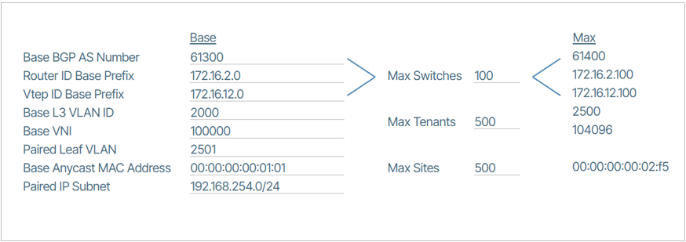
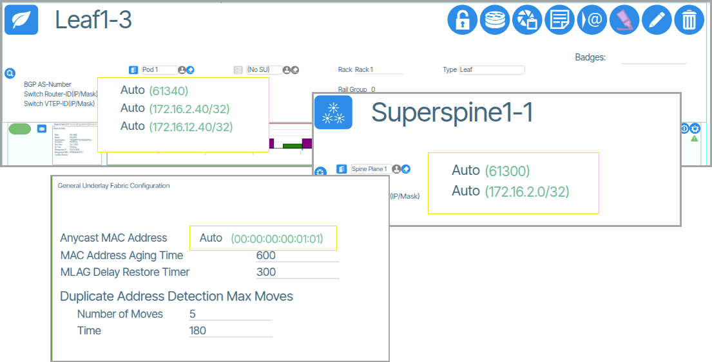

---
hide:
  - toc
---

# Underlay Provisioning

Underlay Provisioning is accomplished when the following two steps have been completed:

1. Underlay Settings
1. Provision Reserved Ranges

## Underlay Settings

**Underlay Settings** are available under the [Fabrics](/fabrics/#parameters) navigation tab and are configured on a per-fabric basis.Underlay Settings are used to manage the time and conditions under which network devices detect, respond to, and stabilize after changes in network topology or connection states. In technical networking terms, these could be broadly described as "Network Convergence Timing Controls" - the settings that determine how fast and how precisely a network can detect, communicate, and stabilize after any type of network state change.

### Underlay Configuration 

Manages fundamental network infrastructure settings, including a shared Anycast MAC address for redundancy and load balancing. It controls how network devices handle address aging and connection restoration, ensuring stable and efficient baseline network communication.

### Leaf Underlay Fabric Configuration

These settings control how leaf devices establish and maintain BGP connections, including timing for connection checks, routing updates, and connection establishment, ensuring stable and responsive network edge communications.

### Spine Underlay Fabric Configuration

Defines how spine devices maintain and establish BGP (Border Gateway Protocol) connections. These settings manage network behaviors such as connection keepalive intervals, connection timeout periods, and routing information exchange.

### Data Timer Configuration

Provides advanced timing controls that optimize connection stability and performance. These settings allow network administrators to fine-tune how devices handle interface state changes, link detection, and MAC address management. By adjusting Link State Timeout, Startup Delay, and MAC Holdtime, users can customize network resilience and reduce unnecessary connection disruptions.

## Reserved Ranges

!!! warning

    If your system's network identifiers require custom ranges, it is strongly recommended to configure these settings *immediately after* installing the Verity software and *before* beginning the preprovisioning process. The preprovisioning process involves adding devices using the system initialization file and/or manually adding devices. Changing the network identifier ranges later may require reprovisioning the entire network.

The **Reserved Ranges** section displays a set of editable value ranges for networking identifiers used in the provisioning process. On a new system, it populates with working default values, so the user doesn't need to perform any custom configuration to have a working system.

To tailor the network setup to specific requirements, you may need to customize the allocated ranges of network identifiers. Customizing these settings allows for more precise control over network configurations and ensures compatibility with your network environment. To view this section go to **Operations -> Reserved Ranges**. To change the values click the edit icon {:class="btn"} .

### Example of Reserved Range Values

Verity uses reserved range values across the system. Certain values are shown in specific windows with the **Auto** prefix, signaling that the user can change them if needed.

