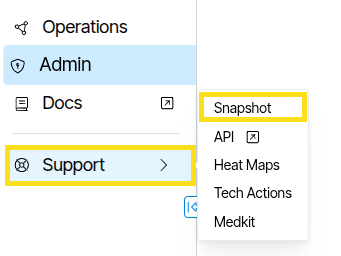
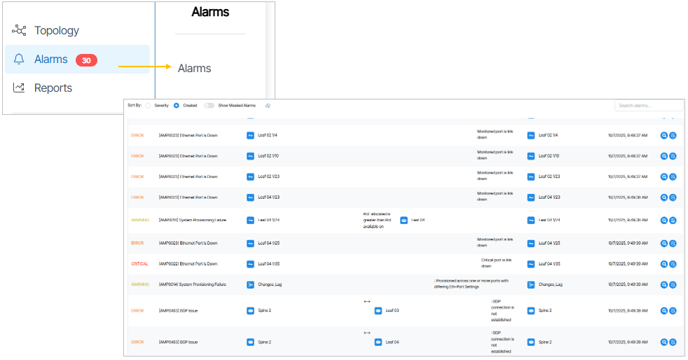
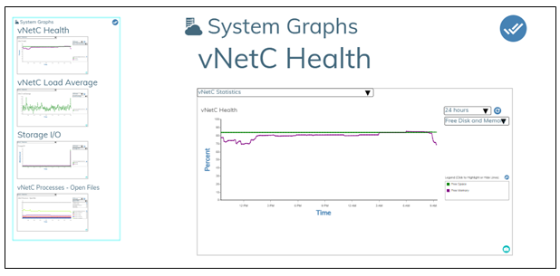

---
hide:
- toc
---
# Security Configuration

# Security Guidelines
This document serves as an overview of the security features integrated into Verity networking software and UI application.

## VNetC
The vNetC supports local authentication and remote authentication via RADIUS. In both cases users may be granted these access levels: admin, read-write, and read-only. An additional attribute "tech" can be granted which exposes expert-level options in the user interface.

## Passwords

- **Local Users**: Local user passwords are validated against a sha256-based one-way hash. Passwords are managed from the **Administration -> Users -> Accounts** panel or on the external RADIUS server.
- **System**: Because controllers, switches, and the RADIUS and SNMP agents must be able to recover the clear-text for passwords, it is not possible to use one-way hashes to these store passwords.  Instead, they are encrypted using a master key stored on the vNetC using salted AES-256-CBC cryptography with PBKDF2 ("Password-Based Key Derivation Function 2").

## Restricting console logic (ssh access requires authorization key)

Restricts access to all components to SSH key only, i.e., no username/password allowed. Enable it from the ns_admin menu.

### Exposed Ports
In normal operation the following ports are exposed on the vNetC:

**External (WAN) network:**

| **Port** | **Protocol** | **Service** | **Description** |
|-|-|-|-|
| 3,4,8,11 | ICMP       | ping  | Allows external sources to ping vNetC |
| 22       | TCP        | SSH   | Access allowed from private |
| 68       | UDP        | DHCP  | Receives DHCP answers from broadcast source 67 |
| 80       | TCP        | HTTP  | Used for one-time-password image download operations for upgrades. These can optionally be done over HTTPS |
| 161      | TCP or UDP | SNMP  | External SNMP access |
| 443      | TCP        | HTTPS | Used for:  Web access for users. Secure web socket (wss) user REST-based API access. Device access for discover and status. |

**Management Network (if configured):**

| **Port** | **Protocol** | **Service** | **Description**                             |
|----------|--------------|-------------|---------------------------------------------|
| 123      | UDP          | ntp         | Support NTP sync to devices                 |
| 1581     | TCP          | ACS         | Used by ACS system to query database        |
| 1582     | TCP          | ACS         | Used by ACS system to receive events        |
| 1958     | TCP          | MACs        | Receives MAC address table updates          |
| 8001     | TCP          | Stats       | Receives statistics and performance metrics |

If the vNetC is configured without a separate management network port, these ports are exposed on the WAN interface, restricted to private (RFC1918) addresses.

RFC1918 addresses are explicitly:

-   10.0.0.0/8
-   172.16.0.0/12
-   192.168.0.0/16
-   169.254.0.0/16

### Transport Encryption Standards
All encrypted transports (SSH, HTTPS, WSS) meet US FIPS-140-3 security requirements for cryptographic modules.

### HTTPS and Server Web Certificates
The vNetC HTTPS and WSS access terminates in an "haproxy" HTTPS process. This is configured with these cipher rules for TLSv1.2: EECDH+ECDSA+AESGCM:EECDH+aRSA+AESGCM:EECDH+ECDSA+SHA384:EECDH+ECDSA+SHA256:EECDH+aRSA+SHA384:EECDH+aRSA+SHA256:EECDH:EDH+aRSA:HIGH:!ECDHE-RSA-NULL-SHA:!ECDHE-ECDSA-NULL-SHA:!ADH:!aNULL:!eNULL:!RC4:!DSS:!MD5:!DES:!3DES

Additionally, it utilizes these cipher suites for TLSv1.3: TLS_AES_256_GCM_SHA384:TLS_CHACHA20_POLY1305_SHA256:TLS_AES_128_GCM_SHA256

These ensure a high level of encryption that is compatible with all modern browsers.

SSLv3, TLSv1.0 and TLSv1.1 are disabled.

It is recommended that vNetC's have FQDN and that administrators install a server certificate for the FQDN. When a valid certificate is provided. Strict-Transport-Security is active making SSL-stripping attacks improbable.

We test our TLSv1.3 configuration on an ongoing basis with a vNetC deployed on the public internet, using the Qualys SSL Labs system at SSL Server Test (Powered by Qualys SSL Labs) .  You can check our system using the hostname "vnc-sslcheck.beyondedgenetworks.com". Please let us know if this does not return an A+ rating.

## SDLC

### Exposed Ports
In normal operation the following ports are exposed on the SDLC:

| **Port** | **Protocol** | **Service** | **Description**                                         |
|----------|--------------|-------------|---------------------------------------------------------|
| 830      | TCP          | Netconf     | Allows provisioning and monitoring by the ACS and Vnetc |
| 443      | TCP          | HTTPS       | Allows limited debugging via webpage                    |
| 22       | TCP          | SSH         | Allows full debugging via CLI                           |
| 80       | TCP          | HTTP        | Not used                                                |
| 123      | UDP          | NTP         | Used to sync time                                       |
| 67       | UDP          | DHCP        | Used to assign IP addresses if DHCP server is enabled.  |

## ACS

### Exposed Ports
In normal operation the following ports are exposed on the ACS:

| **Port** | **Protocol** | **Service** | **Description**                                         |
|----------|--------------|-------------|---------------------------------------------------------|
| 5555     | TCP          | TR69/HTTPS  | Used for provisioning and monitoring ONTs over HTTPS    |
| 5554     | TCP          | TR69/HTTP   | Used for provisioning and monitoring ONTs over HTTP     |
| 830      | TCP          | netconf     | Allows provisioning and monitoring by the ACS and Vnetc |
| 514      | TCP/UDP      | syslog      | Used to receive system messages from devices.           |
| 8888     | TCP/UDP      | Vnetc       | Used by Vnetc to configure and query the ACS            |
| 443      | TCP          | HTTPS       | Allows limited debugging via cli                        |
| 22       | TCP          | ssh         | Allows full debugging via cli                           |
| 80       | TCP          | HTTP        | Not used                                                |
| 123      | UDP          | NTP         | Use to sync time                                        |
| 67       | UDP          | DHCP        | Used to assign IP addresses if DHCP server is enabled.  |

## GAIA

### Exposed Ports
In normal operation the following ports are exposed on GAIA:

| **Port** | **Protocol** | **Service** | **Description**                                         |
|----------|--------------|-------------|---------------------------------------------------------|
| 830      | TCP          | Netconf     | Allows provisioning and monitoring by the ACS and Vnetc |
| 514      | TCP/UDP      | syslog      | Used to receive system messages from devices            |
| 8080     | TCP/UDP      | Vnetc       | Used by Vnetc to configure and query GAIA               |
| 443      | TCP          | HTTP        | Allows limited debugging via webpage                    |
| 22       | TCP          | ssh         | Allows full debugging via cli                           |

## Device Controller

### Exposed Ports
In normal operation the following ports are exposed on the device controller:

| **Port** | **Protocol** | **Service** | **Description** |
|-|-|-|-|
| 830 | TCP     | Netconf | Allows provisioning and monitoring of the by ACS and Vnetc |
| 514 | TCP/UDP | syslog | Used to receive system messages from devices |
| 443 | TCP     | HTTPS | Allows limited debugging via webpage |
| 22  | TCP     | ssh | Allows full debugging via cli |
| 69  | UDP     | TFTP | Allows for transfer of configuration for some switches then SNMP protocol is selected for monitoring the switch |

#### Client Certificate Authentication
The system can be configured to support client certificate authentication. [This operates in a "lockdown" mode that meets US DoD requirements.](lockdown-mode.md)  It does impose strict access requirements on all transports in the systems and demands client certificates for all users, devices, and external application access. In "lockdown" mode, TLSv1.2 is disabled and the  available cipher rules are reduced to: TLS_AES_256_GCM_SHA384:TLS_AES_128_GCM_SHA256.

#### System Logs
The system performs extensive logging of internal and device operations. Logging can be viewed from the web-based user interface, and logs can be forwarded via the syslog protocol using UDP (port 514) or TLS/TCP (port 6514). Logging is explained further under the section titled *Admin Control Panel*.

#### Serviceability
The system allows download of the current system state across all management components from the web-based user interface. Nonprivileged users can collect this information in an opaque form that can only be accessed by BE engineers. Privileged users can examine the content without BE involvement.

#### Downloading a System Snapshot
Downloading system state is performed by clicking the Snapshot Button from the Verity Web Interface. Clicking this button reveals a window prompting you to choose the data you want to capture. After you make your selection, you click **Create File** and then **Download**. {:class="pop"}

## Admin Control Panel
**Admin** is the user control panel for the VNetC. The **Admin** panel contains tools useful for securing your system.

### Certificates
**Certificates** is a drag and drop control panel to import SSL Certificates.

!!! Information

    For more information see [Certificates](admin.md/#certificates)  

### Settings
**Settings** are available in Admin/Network/Settings. Settings lets you configure the following:
- vNetc Address on Management VLAN
- Permissible IP Address Ranges on Managed Devices
- Customized Download Address/FQDN

### External APIs
External APIs (Admin/External APIs) lets you configure status monitoring, backups, and loggings of the vNetc via SNMP, SFTP and SYSLOG.

### Alarms
Alarms are notifications that inform the administrator about current changes to the network state. Active alarm are listed in **Alarms/Alarms**.

#### System Graphs
The System Graphs display system wide information such as Service Port activity and virtual machine performance statistics on the UI. Graph types, subtypes and time ranges can be changed at any time. The user saves by clicking on the double check mark icon in the top right. The graph selections are saved per user.

