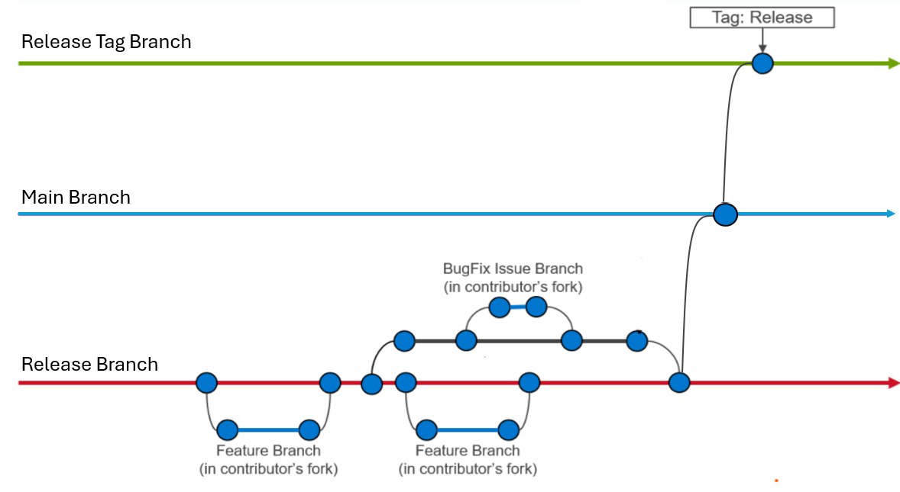

# Pull Request Guidelines

This guide describes how to submit a pull request (PR) to the Omnia project, what reviewers look for, and how the review process works.

## Before you start

1. **Check existing issues and PRs.** Search the [GitHub issues](https://github.com/dell/omnia/issues) and [open pull requests](https://github.com/dell/omnia/pulls) to ensure your change is not already being worked on.

2. **Open an issue first** for non-trivial changes. Discuss the approach with maintainers before investing significant effort. This prevents wasted work on changes that may not align with the project's direction.

3. **Read the architecture documentation.** Familiarize yourself with Omnia's [Architecture](../Overview/architecture.md) and [Overview](../Overview/index.md) to understand how components interact.

## Setting up your development environment



1. **Fork and clone** the repository:
   ```bash title="Run on: local machine"
   git clone https://github.com/<your_username>/omnia.git
   cd omnia
   ```

2. **Add the upstream remote:**
   ```bash title="Run on: local machine"
   git remote add upstream https://github.com/dell/omnia.git
   ```

3. **Keep your fork in sync:**
   ```bash title="Run on: local machine"
   git fetch upstream
   git checkout main
   git merge upstream/main
   ```

4. **Create a feature branch** from the latest `main`:
   ```bash title="Run on: local machine"
   git checkout -b feature/descriptive-branch-name
   ```

## Making changes

### Code style

- **Ansible playbooks and roles:** Follow [Ansible best practices](https://docs.ansible.com/ansible/latest/tips_tricks/ansible_tips_tricks.md). Use YAML syntax (not inline JSON), descriptive task names, and meaningful variable names.
- **Python scripts:** Follow [PEP 8](https://peps.python.org/pep-0008/). Use `black` for formatting and `flake8` for linting.
- **Shell scripts:** Use `shellcheck` to validate shell scripts.
- **RST documentation:** Follow the conventions in the existing documentation (section underlines, directive usage, cross-referencing).

### Commit messages

Write clear, descriptive commit messages:

**Example: commit message format**
```text title="Commit message format"
Short summary of the change (50 characters or less)

More detailed explanation of what changed and why. Wrap at 72 characters.
Reference related GitHub issues using #<issue_number>.

Fixes #123
```

**Good examples:**

**Example: good commit message**
```text title="Good commit message example"
Add GPU auto-detection for AMD ROCm nodes

Omnia now automatically detects AMD GPUs via lspci and installs the
appropriate ROCm drivers during the omnia.yml playbook execution.
Previously, AMD GPU support required manual driver installation.

Fixes #456
```

**Bad examples:**

**Example: bad commit message**
```text title="Bad commit message example"
fix stuff
updated files
WIP
```

### Writing tests

- **Ansible roles:** Add or update Molecule tests for any new or modified roles. Tests should validate both the default configuration and common edge cases.
- **Python code:** Write unit tests using `pytest`. Aim for meaningful coverage of new functionality.
- **Integration tests:** If your change affects provisioning or deployment, describe the manual test procedure in the PR description so reviewers can validate.

Run the existing test suite before submitting:

**Run on: local machine**
```bash title="Run on: local machine"
# Ansible lint
ansible-lint playbooks/

# Molecule tests (for a specific role)
cd roles/<role_name>
molecule test

# Python tests
pytest tests/
```

## Protect authenticity -- Developer Certificate of Origin (DCO)

Every GitHub push requires a sign-off and a moderator is required to approve pull requests. All contributions have to be certified using the Developer Certificate of Origin (DCO):

**Developer Certificate of Origin (DCO)**
```text title="Developer Certificate of Origin (DCO)"
Developer Certificate of Origin
Version 1.1

Copyright (C) 2004, 2006 The Linux Foundation and its contributors.
1 Letterman Drive
Suite D4700
San Francisco, CA, 94129

Everyone is permitted to copy and distribute verbatim copies of this
license document, but changing it is not allowed.


Developer's Certificate of Origin 1.1

By making a contribution to this project, I certify that:

(a) The contribution was created in whole or in part by me and I
have the right to submit it under the open source license
indicated in the file; or

(b) The contribution is based upon previous work that, to the best
of my knowledge, is covered under an appropriate open source
license and I have the right under that license to submit that
work with modifications, whether created in whole or in part
by me, under the same open source license (unless I am
permitted to submit under a different license), as indicated
in the file; or

(c) The contribution was provided directly to me by some other
person who certified (a), (b) or (c) and I have not modified
it.

(d) I understand and agree that this project and the contribution
are public and that a record of the contribution (including all
personal information I submit with it, including my sign-off) is
maintained indefinitely and may be redistributed consistent with
this project's or the open source license(s) involved.
```

Add the sign-off to every commit using the `-s` flag:

**Run on: local machine**
```bash title="Run on: local machine"
git commit -s -m "Add GPU auto-detection for AMD ROCm nodes"
```

## Submitting the pull request

1. **Push your branch** to your fork:
   ```bash title="Run on: local machine"
   git push origin feature/descriptive-branch-name
   ```

2. **Open a pull request** on GitHub:
   - Go to https://github.com/dell/omnia/pulls
   - Click **New pull request**
   - Select your fork and branch as the source
   - Select `dell/omnia:main` as the target

3. **Fill out the PR description** using this template:
   ```markdown title="PR description template"
   ## Summary
   Brief description of what this PR does.

   ## Related Issue
   Fixes #<issue_number> (or "Related to #<issue_number>")

   ## Changes
   - List of specific changes made
   - One item per line

   ## Testing
   Describe how you tested these changes:
   - Environment (OS, hardware)
   - Steps to reproduce/verify
   - Test results

   ## Checklist
   - [ ] Code follows the project's style guidelines
   - [ ] Tests added/updated for new functionality
   - [ ] Documentation updated (if applicable)
   - [ ] All existing tests pass
   - [ ] Commit messages are clear and descriptive
   ```

4. **Request a review** from one or more maintainers.

## Review process

After you submit a PR:

1. **Automated checks** run first. CI pipelines will execute linting, syntax checks, and any automated tests. All checks must pass before a human review.

2. **Maintainer review.** One or more project maintainers will review your PR. They may:
   - **Approve** the PR if it meets all criteria
   - **Request changes** with specific feedback on what to update
   - **Comment** with questions or suggestions

3. **Address feedback.** Push additional commits to your branch to address review comments. Do not force-push or squash commits during the review -- this makes it harder for reviewers to see incremental changes.

4. **Final approval and merge.** Once all reviewers approve and CI passes, a maintainer will merge the PR. Omnia uses **squash merges** to keep the `main` branch history clean.

### Review criteria

Reviewers evaluate PRs against these criteria:

| Criterion | What reviewers look for |
|-----------|------------------------|
| **Correctness** | Does the change do what it claims? Are edge cases handled? |
| **Style** | Does the code follow project conventions? |
| **Testing** | Are there adequate tests? Do existing tests still pass? |
| **Documentation** | Is the change documented? Are user-facing changes reflected in the docs? |
| **Security** | Does the change introduce security risks? Are credentials handled safely? |
| **Compatibility** | Does the change work across all supported OS versions and hardware? |

### Response time

Maintainers aim to provide an initial review within **5 business days**. For large PRs (100+ lines changed), reviews may take longer. You can help by:

- Keeping PRs focused and small (one logical change per PR)
- Providing a clear and thorough description
- Including test results in the PR description

!!! info
    See [Contributing](index.md) for an overview of contribution options.