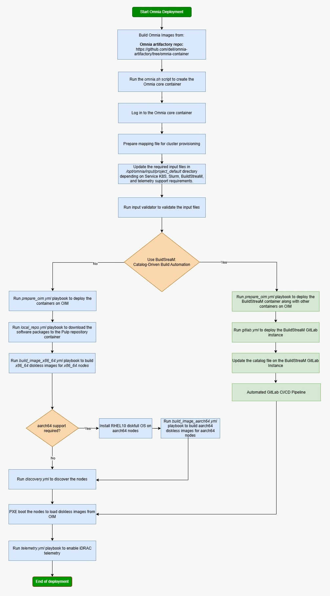

# Get Started

Choose your deployment path based on your cluster requirements, available hardware, and desired workload. Each path is a self-contained, end-to-end tutorial that takes you from a bare set of PowerEdge servers to a fully operational cluster.

!!! note
    Before selecting a path, complete the [Prerequisites Checklist](prerequisites_checklist.md) to ensure your hardware, networking, and software environment are ready.

## Deployment Paths at a Glance

Path | Name | Workload | Nodes | Time | Description 
---|---|---|---|---|--- 
**A** | [Slurm Quickstart](slurm_quickstart.md) | Traditional HPC (Slurm) | 4 | ~2 hrs | Fastest way to stand up a Slurm cluster. Deploys 1 OIM (management), 1 Slurm head node, 1 compute node, and 1 login node. No Kubernetes or telemetry. Ideal for first-time users and small-scale HPC workloads. 
**B** | [Full Deployment](full_deployment.md) | Slurm + Service K8s + Telemetry | 8 | ~4 hrs | Production-grade deployment with Slurm scheduling, a highly available 3-node Kubernetes service cluster, LDAP/FreeIPA authentication, and full telemetry (iDRAC, Grafana, VictoriaMetrics). Best for teams running mixed HPC/AI workloads with monitoring requirements. 
**C** | [K8S Telemetry Only](k8s_telemetry_only.md) | Kubernetes + Telemetry (no Slurm) | 5 | ~2 hrs | Deploys a 3-control-plane + 1-worker Kubernetes cluster with the complete telemetry pipeline (iDRAC metrics, LDMS, Kafka, VictoriaMetrics, Grafana). No Slurm. Use this when you need infrastructure monitoring without a job scheduler. 
**D** | [Buildstream Deployment](buildstream_deployment.md) | BuildStreaM (Catalog-Driven CI/CD) | 8+ | ~6 hrs | Automated, catalog-driven deployment using GitLab CI/CD pipelines. BuildStreaM reads a declarative catalog to provision and configure the entire cluster. Best for organizations with GitOps workflows or repeated, reproducible deployments at scale. 

## Which Path Should I Choose?

**"I just want Slurm running as fast as possible."** Start with [Slurm Quickstart](slurm_quickstart.md) (Path A). You can always add Kubernetes and telemetry later.

**"I need a production cluster with monitoring and authentication."** Go with [Full Deployment](full_deployment.md) (Path B). This is the canonical Omnia deployment that exercises every major subsystem.

**"I only need telemetry dashboards -- no job scheduler."** Choose [K8S Telemetry Only](k8s_telemetry_only.md) (Path C). This gives you iDRAC-to-Grafana visibility without the overhead of Slurm.

**"I want CI/CD-driven, repeatable infrastructure."** Use [Buildstream Deployment](buildstream_deployment.md) (Path D). BuildStreaM automates the entire lifecycle through GitLab pipelines and a declarative catalog.

## Before You Begin

Every path assumes you have completed the items in [Prerequisites Checklist](prerequisites_checklist.md). That page covers:

- Supported hardware and firmware versions
- OIM (management node) requirements (RAM, OS, Podman, NICs)
- Network switch configuration (admin + BMC VLANs)
- NFS / storage preparation
- BIOS and iDRAC settings on target nodes
- Required RHEL subscriptions and Docker credentials

!!! tip
    Print or bookmark the [Prerequisites Checklist](prerequisites_checklist.md) -- it doubles as a day-of-deployment runbook you can hand to a datacenter technician.