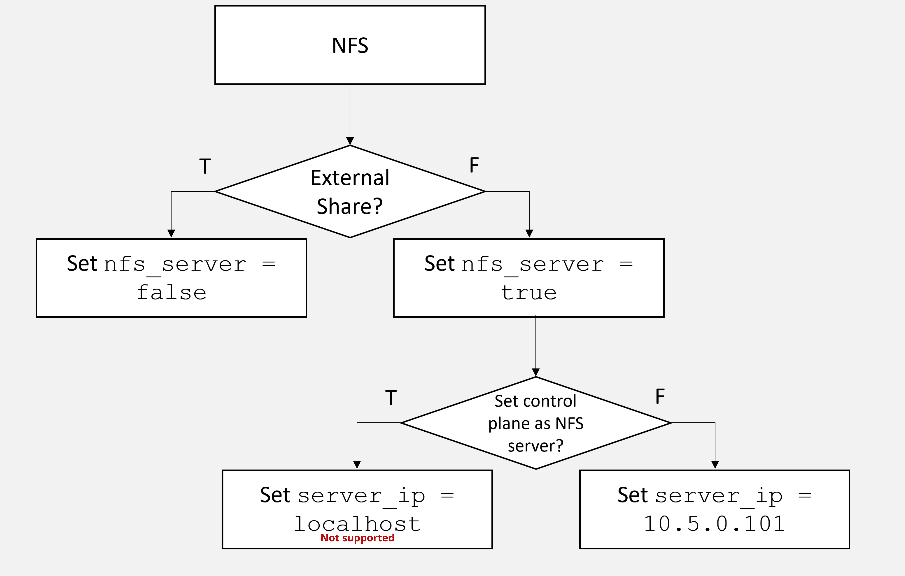

Configure NFS 

[ ](javascript:void\(0\) "Share")


 * [ Home ](../../index.md)

[  ](../../index.md "Dell Omnia") Dell Omnia 


 * [ Home ](../../index.md)

Overview 
 * [ Architecture ](../../Overview/architecture.md)

Get Started 
 * [ Prerequisites Checklist ](../../GetStarted/prerequisites_checklist.md)

How-to Guides 
 * Setup Setup 
 * [ Prepare OIM ](../Setup/prepare_oim.md)
 * Slurm Slurm 
 * [ Set Up Slurm ](../Slurm/setup_slurm.md)
 * Kubernetes Kubernetes 
 * [ Set Up Kubernetes ](../Kubernetes/setup_service_k8s.md)
 * Storage Storage 
 * Configure NFS [ Configure NFS ](configure_nfs.md) Table of contents 
 * [ Overview ](#overview)
 * Networking Networking 
 * [ Configure InfiniBand ](../Networking/configure_infiniband.md)
 * Authentication Authentication 
 * [ Set Up OpenLDAP ](../Authentication/setup_openldap.md)
 * Telemetry Telemetry 
 * [ Set Up Telemetry ](../Telemetry/setup_telemetry.md)
 * Containers Containers 
 * [ Use Apptainer ](../Containers/use_apptainer.md)
 * BuildStreaM BuildStreaM 
 * [ Deploy GitLab ](../BuildStreaM/deploy_gitlab.md)

Reference 
 * Support Matrix Support Matrix 
 * [ Servers ](../../Reference/SupportMatrix/servers.md)
 * Configuration Configuration 
 * [ Omnia Config ](../../Reference/Configuration/omnia_config.md)
 * Sample Files Sample Files 
 * [ PXE Mapping File ](../../Reference/SampleFiles/pxe_mapping_file.md)
 * Cluster Requirements Cluster Requirements 
 * [ Minimum Nodes ](../../Reference/ClusterRequirements/minimum_nodes.md)
 * Playbooks Playbooks 
 * [ Playbook Reference ](../../Reference/Playbooks/playbook_reference.md)
 * Metrics Metrics 
 * [ iDRAC Metrics ](../../Reference/Metrics/idrac_metrics.md)
 * Appendices Appendices 
 * [ Hostname Requirements ](../../Reference/Appendices/hostname_requirements.md)

Operations 
 * [ Add / Remove Nodes ](../../Operations/add_remove_nodes.md)

Troubleshooting 
 * [ General ](../../Troubleshooting/general.md)

Contributing 
 * [ Pull Requests ](../../Contributing/pull_requests.md)

Table of contents 

 * [ Overview ](#overview)

 1. [ Home ](../../index.md)
 2. [ How-to Guides ](../index.md)
 3. [ Storage ](configure_nfs.md)

# Configure NFS[¶](#configure-nfs "Permanent link")

Set up Network File System (NFS) shared storage for your Omnia cluster. NFS provides a common filesystem accessible by all compute and login nodes for home directories, job data, and shared applications.

## Overview[¶](#overview "Permanent link")

Omnia supports two NFS deployment models:

 1. **Internal NFS** (managed by Omnia) -- Omnia configures an NFS server on a designated node (typically the Slurm control node or a dedicated storage node) and auto-mounts it on all compute and login nodes.

 2. **External NFS** \-- You provide an existing NFS server (e.g., Dell PowerScale, NetApp, or a standalone NFS appliance), and Omnia configures the mount on all cluster nodes.



Both models use:

 * **NFSv3** protocol (for broad compatibility with HPC workloads).
 * **755 permissions** on shared directories.
 * `no_root_squash` option for root-level access from compute nodes.

## Prerequisites[¶](#prerequisites "Permanent link")

 * Cluster nodes are provisioned and reachable.
 * For **internal NFS** : the designated NFS server node has sufficient local disk space for the shared data.
 * For **external NFS** : the NFS server is configured and exporting the desired path, and the server IP is reachable from all cluster nodes.
 * `nfs-utils` package is available in the local repositories.

## Procedure[¶](#procedure "Permanent link")

### Internal NFS (Omnia-Managed)[¶](#internal-nfs-omnia-managed "Permanent link")

 1. **Configure NFS in omnia_config.yml** :

Run on: omnia_core container
 
 
 vi /opt/omnia/input/project_default/omnia_config.yml
 

Set the NFS parameters:

File: /opt/omnia/input/project_default/omnia_config.yml
 
 
 ---
 enable_omnia_nfs: true
 nfs_node_group: "slurm_control_node"
 omnia_nfs_path: "/home"
 omnia_nfs_opts: "rw,sync,no_root_squash,no_subtree_check"
 

 1. **Run the omnia.yml playbook** to deploy NFS:

Run on: omnia_core container
 
 
 cd /omnia
 ansible-playbook omnia.yml --ask-vault-pass
 

The playbook will:

 * Install `nfs-utils` on the NFS server node.
 * Create the shared directory with 755 permissions.
 * Configure `/etc/exports` with `no_root_squash`.
 * Start and enable the `nfs-server` service.
 * Mount the NFS share on all compute and login nodes.
 * Add the mount to `/etc/fstab` for persistence across reboots.

### External NFS[¶](#external-nfs "Permanent link")

 1. **Configure external NFS in omnia_config.yml** :

Run on: omnia_core container
 
 
 vi /opt/omnia/input/project_default/omnia_config.yml
 

File: /opt/omnia/input/project_default/omnia_config.yml
 
 
 ---
 enable_omnia_nfs: false
 external_nfs_server: "10.5.1.100"
 external_nfs_path: "/ifs/omnia/home"
 external_nfs_mount_point: "/home"
 external_nfs_opts: "rw,hard,intr,nfsvers=3"
 

 1. **Run the omnia.yml playbook** :

Run on: omnia_core container
 
 
 cd /omnia
 ansible-playbook omnia.yml --ask-vault-pass
 

 1. **(Alternative) Manual NFS mount** on a specific node:

Run on: compute node
 
 
 dnf install -y nfs-utils
 mkdir -p /home
 mount -t nfs -o rw,hard,intr,nfsvers=3 10.5.1.100:/ifs/omnia/home /home
 

Add to `/etc/fstab` for persistence:

Run on: compute node
 
 
 echo "10.5.1.100:/ifs/omnia/home /home nfs rw,hard,intr,nfsvers=3 0 0" >> /etc/fstab
 

## Verification[¶](#verification "Permanent link")

 1. **Verify the NFS server is exporting** (internal NFS):

Run on: NFS server node
 
 
 exportfs -v
 

Expected output:

Expected output on: NFS server node
 
 
 /home <network>(rw,sync,wdelay,no_root_squash,no_subtree_check,...)
 

 1. **Verify NFS is mounted on compute nodes** :

Run on: omnia_core container
 
 
 ansible slurm_node -m shell -a "df -h /home"
 

 1. **Test read/write from a compute node** :

Run on: compute node
 
 
 echo "NFS test $(date)" > /home/nfs_test.txt
 cat /home/nfs_test.txt
 rm /home/nfs_test.txt
 

 1. **Verify permissions** :

Run on: NFS server node
 
 
 ls -ld /home
 # Expected: drwxr-xr-x (755)
 

 1. **Verify mount persists across reboot** :

Run on: compute node
 
 
 grep "/home" /etc/fstab
 

## Next Steps[¶](#next-steps "Permanent link")

 * [Configure Powervault](configure_powervault.md) \-- Configure block storage for additional performance.
 * [Setup Slurm](../Slurm/setup_slurm.md) \-- Slurm uses NFS for shared job scripts and results.
 * [Use Apptainer](../Containers/use_apptainer.md) \-- Store SIF images on NFS for cluster-wide access.

## Troubleshooting[¶](#troubleshooting "Permanent link")

**Mount fails with "access denied"** Verify the NFS export allows the client IP:

Run on: NFS server node
 
 
 exportfs -v
 cat /etc/exports
 

Ensure the export includes the admin network range:

File: /etc/exports on NFS server node
 
 
 /home 10.5.0.0/24(rw,sync,no_root_squash,no_subtree_check)
 

**"mount.nfs: Connection timed out"** Check firewall rules on the NFS server:

Run on: NFS server node
 
 
 firewall-cmd --add-service=nfs --permanent
 firewall-cmd --add-service=mountd --permanent
 firewall-cmd --add-service=rpc-bind --permanent
 firewall-cmd --reload
 

**Stale NFS handles after server restart** Remount on affected nodes:

Run on: affected compute node
 
 
 umount -l /home
 mount /home
 

**Performance is slow** \- Use NFSv3 instead of NFSv4 for HPC workloads (NFSv3 has lower latency). \- Increase the NFS read/write block size:
 
 
 ```text title="File: /etc/fstab on compute node"
 10.5.1.100:/ifs/omnia/home /home nfs rw,hard,intr,nfsvers=3,rsize=1048576,wsize=1048576 0 0
 ```
 
