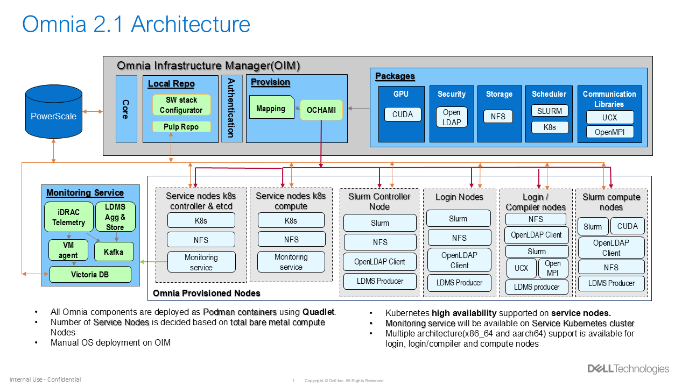
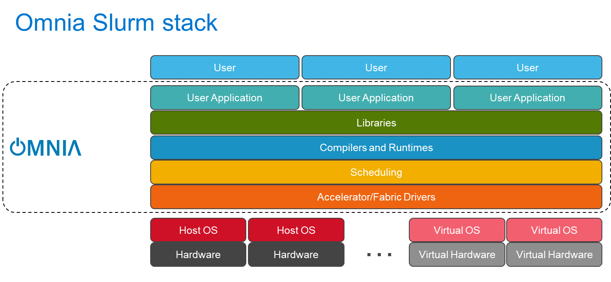
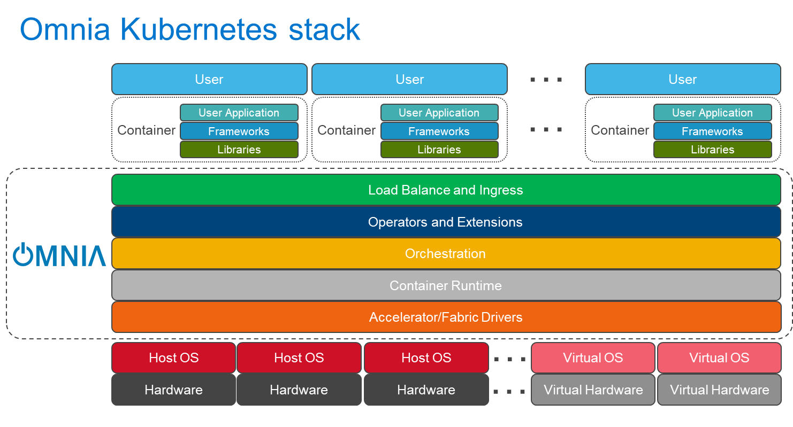

Architecture 

 "Share")

 * [ Home ](../index.md)

 Dell Omnia 

 * [ Home ](../index.md)

Overview 
 * Architecture [ Architecture ](architecture.md) Table of contents 
 * [ Why three cluster types? ](#why-three-cluster-types)

Get Started 
 * [ Prerequisites Checklist ](../GetStarted/prerequisites_checklist.md)

How-to Guides 
 * Setup Setup 
 * [ Prepare OIM ](../HowTo/Setup/prepare_oim.md)
 * Slurm Slurm 
 * [ Set Up Slurm ](../HowTo/Slurm/setup_slurm.md)
 * Kubernetes Kubernetes 
 * [ Set Up Kubernetes ](../HowTo/Kubernetes/setup_service_k8s.md)
 * Storage Storage 
 * [ Configure NFS ](../HowTo/Storage/configure_nfs.md)
 * Networking Networking 
 * [ Configure InfiniBand ](../HowTo/Networking/configure_infiniband.md)
 * Authentication Authentication 
 * [ Set Up OpenLDAP ](../HowTo/Authentication/setup_openldap.md)
 * Telemetry Telemetry 
 * [ Set Up Telemetry ](../HowTo/Telemetry/setup_telemetry.md)
 * Containers Containers 
 * [ Use Apptainer ](../HowTo/Containers/use_apptainer.md)
 * BuildStreaM BuildStreaM 
 * [ Deploy GitLab ](../HowTo/BuildStreaM/deploy_gitlab.md)

Reference 
 * Support Matrix Support Matrix 
 * [ Servers ](../Reference/SupportMatrix/servers.md)
 * Configuration Configuration 
 * [ Omnia Config ](../Reference/Configuration/omnia_config.md)
 * Sample Files Sample Files 
 * [ PXE Mapping File ](../Reference/SampleFiles/pxe_mapping_file.md)
 * Cluster Requirements Cluster Requirements 
 * [ Minimum Nodes ](../Reference/ClusterRequirements/minimum_nodes.md)
 * Playbooks Playbooks 
 * [ Playbook Reference ](../Reference/Playbooks/playbook_reference.md)
 * Metrics Metrics 
 * [ iDRAC Metrics ](../Reference/Metrics/idrac_metrics.md)
 * Appendices Appendices 
 * [ Hostname Requirements ](../Reference/Appendices/hostname_requirements.md)

Operations 
 * [ Add / Remove Nodes ](../Operations/add_remove_nodes.md)

Troubleshooting 
 * [ General ](../Troubleshooting/general.md)

Contributing 
 * [ Pull Requests ](../Contributing/pull_requests.md)

Table of contents 

 * [ Why three cluster types? ](#why-three-cluster-types)

 1. [ Home ](../index.md)
 2. [ Overview ](index.md)

# Architecture[¶](#architecture "Permanent link")

Omnia orchestrates the deployment of HPC and AI clusters by organizing servers into three distinct cluster types, each with a well-defined role. This page explains how those clusters relate to each other, what runs on the management node, and what the minimum requirements are for each tier.

## Why three cluster types?[¶](#why-three-cluster-types "Permanent link")

A production HPC/AI environment has fundamentally different workload profiles: management tasks (provisioning, scheduling, monitoring), compute tasks (parallel simulations, model training), and platform services (container orchestration, storage, authentication). Omnia separates these concerns into three clusters so that each can be scaled, secured, and maintained independently.

**Cluster types at a glance**

Cluster | Primary purpose | Key workloads 
---|---|--- 
**OIM** (Omnia Infrastructure Manager) | Management and provisioning | Ansible playbooks, OpenCHAMI, Pulp, telemetry ingestion 
**Slurm Cluster** | HPC compute | Batch jobs, MPI workloads, GPU-accelerated training 
**Kubernetes Cluster** | Platform services | Containerized services, storage, authentication, monitoring 
 
## OIM -- The management node[¶](#oim-the-management-node "Permanent link")

The Omnia Infrastructure Manager (OIM) is the single control point for the entire environment. It is a dedicated Dell PowerEdge server (or VM) that runs all management-plane components.

### What runs on the OIM[¶](#what-runs-on-the-oim "Permanent link")

The OIM hosts the `omnia_core` Podman container, which encapsulates the complete Ansible toolchain. All Omnia playbooks execute from inside this container, ensuring a reproducible and isolated control plane.

Beyond the Ansible engine, the OIM runs the following services:

**Provisioning stack**

 * **OpenCHAMI** \-- Composable Hierarchical Automated Management Infrastructure for node discovery and lifecycle management.
 * **ochami-cli** \-- Command-line interface for interacting with OpenCHAMI.
 * **SMD** (State Manager Daemon) -- Maintains hardware inventory and node state.
 * **BSS** (Boot Script Service) -- Generates per-node boot scripts for PXE and iPXE provisioning.
 * **CoreDHCP** \-- Lightweight DHCP server for IP assignment during provisioning.
 * **TFTP / iPXE** \-- Network boot services for bare-metal nodes.

**Container runtime**

 * **Podman** \-- Runs all OIM services as rootless containers (no Docker daemon required).

**Optional components**

 * **AWX** \-- Web-based UI and REST API for Ansible automation (optional; Omnia can run entirely from the CLI).

Note

All OIM services run as Podman containers, which simplifies upgrades and provides process isolation without the overhead of a full container orchestration layer.

### OIM minimum requirements[¶](#oim-minimum-requirements "Permanent link")

Resource | Minimum 
---|--- 
**Operating system** | RHEL 8.8 / 9.2 or later; Rocky Linux 8.x / 9.x 
**CPU** | 4 cores (Intel or AMD x86_64) 
**RAM** | 32 GB 
**Disk** | 256 GB (SSD recommended) 
**Network** | At least 2 NICs (admin + BMC; additional NICs for compute and public networks depending on topology) 
 
Tip

For clusters larger than 100 nodes, Dell recommends 8+ cores and 64 GB RAM on the OIM to accommodate Pulp repository synchronization and parallel Ansible execution.

## Slurm cluster[¶](#slurm-cluster "Permanent link")

The Slurm cluster handles all HPC and AI compute workloads. Omnia deploys and configures [Slurm](https://slurm.schedmd.com/) as the job scheduler across designated nodes.

### Node roles[¶](#node-roles "Permanent link")

**slurm_control_node** Runs `slurmctld` (the Slurm controller daemon). Manages job queues, scheduling policies, and resource accounting. Exactly one node per Slurm cluster holds this role.

**slurm_node** Runs `slurmd` (the Slurm compute daemon). Executes the jobs dispatched by the controller. This is where parallel simulations, training runs, and batch workloads execute.

**login_node** _(optional)_ Provides an interactive shell for users to compile code, submit jobs, and inspect results without consuming compute resources.

**auth_server** _(optional)_ Runs centralized authentication services (OpenLDAP) so that user credentials are consistent across all nodes.

**GPU nodes** _(optional)_ Standard `slurm_node` instances equipped with NVIDIA or AMD GPUs. Omnia automatically installs the appropriate GPU drivers (CUDA for NVIDIA, ROCm for AMD) and registers GPU resources with Slurm's GRES (Generic RESource) framework.

Note

A single physical server can hold multiple roles. For example, a small cluster might combine `slurm_control_node` and `login_node` on the same machine. See [Composable Roles](composable_roles.md) for details on how roles compose.

## Kubernetes cluster[¶](#kubernetes-cluster "Permanent link")

The Kubernetes (K8s) cluster hosts containerized platform services that support the broader HPC environment---monitoring dashboards, storage provisioners, authentication proxies, and user-facing web applications.

### Node roles[¶](#node-roles_1 "Permanent link")

**kube_control_plane** Runs the Kubernetes API server, etcd, scheduler, and controller-manager. For high availability, Omnia supports multiple control-plane nodes behind a virtual IP.

**kube_node** Worker nodes that run application pods. Omnia pre-configures each worker with the container runtime, kubelet, and kube-proxy.

### Pre-installed Kubernetes components[¶](#pre-installed-kubernetes-components "Permanent link")

Omnia deploys the following components automatically when the Kubernetes cluster is created:

Component | Purpose 
---|--- 
**MetalLB** | Bare-metal load balancer that assigns external IPs to Kubernetes `LoadBalancer` services without a cloud provider. 
**NFS CSI driver** | Container Storage Interface driver that provisions persistent volumes backed by an NFS share, enabling shared storage across pods. 
**Calico** | CNI (Container Network Interface) plugin that provides pod-to-pod networking and network policy enforcement. 
 
## How the clusters interact[¶](#how-the-clusters-interact "Permanent link")

The three clusters are not isolated islands; they share networks and collaborate through well-defined interfaces:

 1. **Provisioning flow** \-- The OIM discovers bare-metal nodes via BMC/iDRAC, PXE-boots them, installs the operating system, and assigns them to the Slurm or Kubernetes cluster based on the [Composable Roles](composable_roles.md) mapping file.

 2. **Authentication** \-- An `auth_server` node (typically in the Slurm cluster) runs OpenLDAP. Both Slurm and Kubernetes nodes can be configured to authenticate against this central directory.

 3. **Telemetry** \-- Metrics from all clusters flow into the [Telemetry Architecture](telemetry_architecture.md) pipeline, which may run on the Kubernetes cluster (Grafana, VictoriaMetrics) or on the OIM.

 4. **Storage** \-- NFS shares provisioned through the Kubernetes cluster can be mounted by Slurm compute nodes, providing a unified storage layer for job data.

## Design rationale[¶](#design-rationale "Permanent link")

**Single management node** \-- Omnia deliberately centralizes management on one OIM rather than distributing it. This reduces operational complexity: there is exactly one place to look for logs, one place to run playbooks, and one node to back up. For environments that require management-plane HA, the OIM itself can be deployed on a server with redundant power and RAID storage.

**Podman over Docker** \-- Omnia uses Podman because it runs containers without a persistent daemon, supports rootless execution, and is available in default RHEL and Rocky Linux repositories. This reduces the attack surface and avoids licensing considerations.

**Separation of Slurm and Kubernetes** \-- Keeping HPC compute (Slurm) and platform services (Kubernetes) on separate clusters prevents resource contention. A runaway Kubernetes pod cannot starve a Slurm batch job, and vice versa.

Info

 * [Components](components.md) \-- Deep dive into each software component.
 * [Composable Roles](composable_roles.md) \-- How servers are assigned to clusters and roles.
 * [Network Topologies](network_topologies.md) \-- Network design options that connect the three clusters.
