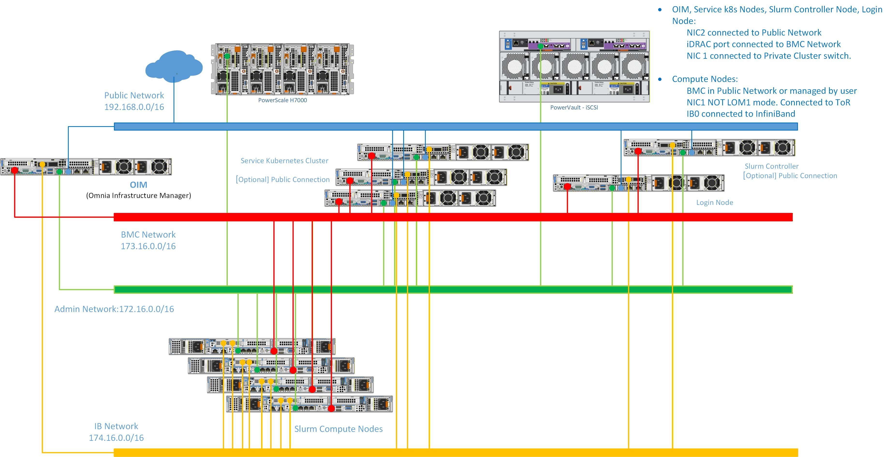
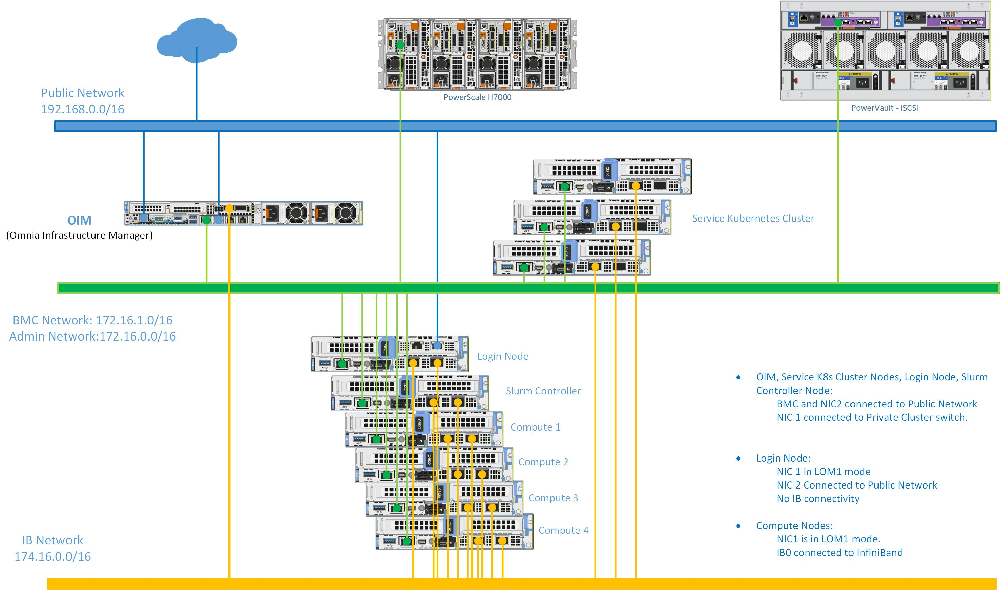
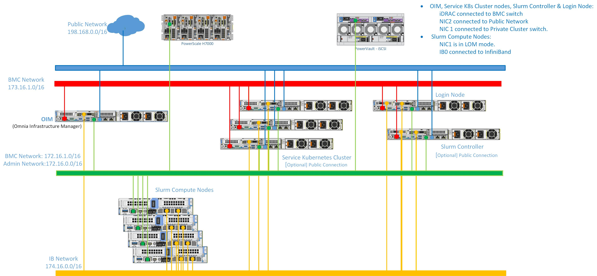

# Network Topologies[¶](#network-topologies "Permanent link")

Omnia supports three network topologies that accommodate different data center environments, cabling constraints, and security requirements. Choosing the right topology is one of the first decisions an administrator makes before deploying a cluster. This page explains each topology, the networks that compose it, and the trade-offs involved.

## Network segments[¶](#network-segments "Permanent link")

Regardless of which topology you choose, Omnia works with four logical network segments. Each segment carries a distinct type of traffic and has different security and bandwidth requirements.

**Network segments**

Network | Color code | Purpose 
---|---|--- 
**Public** | Blue | Connects the OIM to the internet (or campus network) for downloading packages, accessing external services, and administrator SSH access. In air-gapped environments, this network may be absent or limited to a bastion host. 
**BMC** | Red | Out-of-band management network connecting the OIM to each server's **iDRAC** (Baseboard Management Controller). Used for hardware discovery, power control, BIOS configuration, and firmware updates. Traffic on this network is Redfish/IPMI and should be isolated from user-accessible networks for security. 
**Admin** | Green | In-band provisioning and management network. Carries PXE boot traffic, OS image delivery, Ansible SSH connections, and Pulp repository access. This is the primary network over which the OIM manages cluster nodes. 
**InfiniBand** / High-speed | Yellow | Optional high-bandwidth, low-latency fabric for MPI communication, RDMA, and parallel filesystem traffic. Typically InfiniBand HDR/NDR or high-speed Ethernet (100/200/400 GbE). Not managed by Omnia directly but supported through InfiniBand configuration playbooks. 
 
Note

Omnia supports classless IP addressing (CIDR notation) across all network segments. You are not limited to traditional Class A, B, or C boundaries.

## Dedicated topology[¶](#dedicated-topology "Permanent link")

In the Dedicated topology, each network segment uses a **physically separate** NIC and switch infrastructure. This is the most common topology for production HPC clusters.

Note

The following diagram is for representational purposes only.

**Characteristics**

 * The BMC network is physically isolated---iDRAC ports connect to a dedicated management switch that only the OIM can reach.
 * The Admin network has its own switch fabric, ensuring that provisioning traffic (large OS images, package downloads) does not compete with BMC commands or user workloads.
 * InfiniBand (if present) uses a separate fabric with its own subnet manager.

**When to use Dedicated topology**

 * Security-sensitive environments where BMC traffic must be air-gapped from all other networks.
 * Large clusters (100+ nodes) where bandwidth isolation is important.
 * Environments with existing separate management and compute switch infrastructure.

**Trade-offs**

 * Requires more NICs per server (minimum 3, typically 4).
 * Requires more switches and cabling.
 * Provides the strongest isolation and the most predictable performance.

## Shared LOM topology[¶](#shared-lom-topology "Permanent link")

In the Shared LOM (LAN on Motherboard) topology, the **Admin and BMC networks share the same physical NIC and switch**. This is possible because many Dell PowerEdge servers can share the LOM port between the host OS and the iDRAC using a feature called _Shared LOM_ or _OS-BMC passthrough_.

Note

The following diagram is for representational purposes only.

**Characteristics**

 * A single physical network carries both iDRAC management traffic and OS-level provisioning traffic.
 * VLANs are typically used to logically separate BMC and Admin traffic on the shared medium, though this is not strictly required.
 * Reduces the number of required NICs and switch ports by approximately one per node.

**When to use Shared LOM topology**

 * Smaller clusters where cabling simplicity is valued over strict network isolation.
 * Environments where servers have limited NIC availability.
 * Lab or proof-of-concept deployments.

**Trade-offs**

 * BMC and Admin traffic share bandwidth, which can cause contention during large-scale provisioning operations.
 * Reduced security isolation---a compromised node could potentially sniff BMC traffic on the shared segment (mitigated by VLANs).
 * Simpler to cable and manage than the Dedicated topology.

Tip

Even with the Shared LOM topology, Dell recommends using VLANs to logically separate BMC and Admin traffic. This provides a layer of isolation without requiring additional physical infrastructure.

## Hybrid topology[¶](#hybrid-topology "Permanent link")

The Hybrid topology combines elements of both Dedicated and Shared LOM: the **Admin and BMC networks share a physical connection** (like Shared LOM), but the **compute / high-speed network is on a separate, dedicated fabric**.

Note

The following diagram is for representational purposes only.

**Characteristics**

 * Management traffic (BMC + Admin) is consolidated on shared ports, reducing management-side cabling.
 * Compute traffic (MPI, RDMA, parallel I/O) runs on a dedicated high-speed fabric, ensuring that management operations never impact job performance.
 * Balances cabling simplicity with performance isolation.

**When to use Hybrid topology**

 * Medium to large clusters that need high-speed compute fabric isolation but want to simplify management-network cabling.
 * Environments adding InfiniBand or high-speed Ethernet to an existing shared-LOM deployment.
 * Most common topology for AI/ML training clusters where GPU-to-GPU communication bandwidth is critical.

**Trade-offs**

 * Management traffic still shares a link (same trade-offs as Shared LOM for the management plane).
 * Compute traffic is fully isolated, providing deterministic performance for MPI and RDMA workloads.

## Choosing a topology[¶](#choosing-a-topology "Permanent link")

**Topology comparison**

Criterion | Dedicated | Shared LOM | Hybrid 
---|---|---|--- 
**NICs per node** | 3--4 | 2--3 | 2--3 
**Switches required** | 3--4 separate | 2 | 2--3 
**BMC isolation** | Physical | Logical (VLAN) | Logical (VLAN) 
**Compute isolation** | Physical | Shared | Physical 
**Cabling complexity** | High | Low | Medium 
**Best for** | Large production | Lab / small | AI/ML training 
 
Note

The network topology is configured during the OIM preparation phase via `network_spec.yml`. Changing the topology after provisioning requires re-running the network configuration playbooks and may require physical re-cabling.

## IP addressing and DHCP[¶](#ip-addressing-and-dhcp "Permanent link")

Omnia uses **CoreDHCP** on the OIM to assign IP addresses to nodes during PXE boot. Addresses can be assigned from:

 * **Static pools** \-- Defined in the mapping file, where each node receives a pre-assigned Admin IP and BMC IP based on its MAC address or service tag.
 * **Dynamic ranges** \-- CoreDHCP assigns addresses from a configured CIDR range on a first-come, first-served basis during initial discovery.

Static assignment is recommended for production clusters because it makes network troubleshooting and firewall rule management straightforward.

Info

 * [Architecture](architecture.md) \-- How the OIM connects to each network segment.
 * [Composable Roles](composable_roles.md) \-- How the mapping file associates nodes with IP addresses across network segments.
