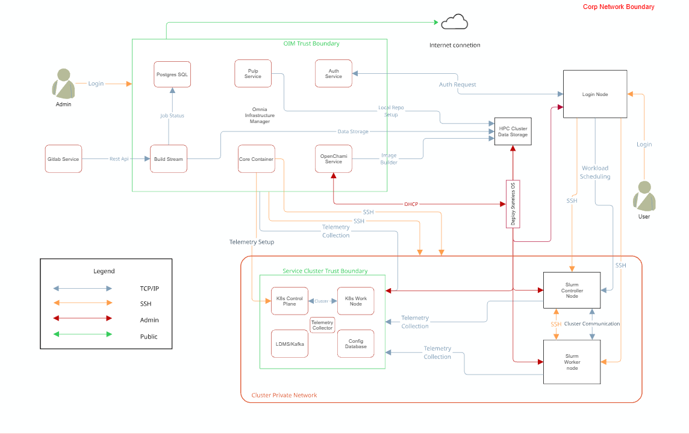

Security Model 

 "Share")

 * [ Home ](../index.md)

 Dell Omnia 

 * [ Home ](../index.md)

Overview 
 * [ Architecture ](architecture.md)
 * Security Model [ Security Model ](security_model.md) Table of contents 
 * [ Security profiles ](#security-profiles)

Get Started 
 * [ Prerequisites Checklist ](../GetStarted/prerequisites_checklist.md)

How-to Guides 
 * Setup Setup 
 * [ Prepare OIM ](../HowTo/Setup/prepare_oim.md)
 * Slurm Slurm 
 * [ Set Up Slurm ](../HowTo/Slurm/setup_slurm.md)
 * Kubernetes Kubernetes 
 * [ Set Up Kubernetes ](../HowTo/Kubernetes/setup_service_k8s.md)
 * Storage Storage 
 * [ Configure NFS ](../HowTo/Storage/configure_nfs.md)
 * Networking Networking 
 * [ Configure InfiniBand ](../HowTo/Networking/configure_infiniband.md)
 * Authentication Authentication 
 * [ Set Up OpenLDAP ](../HowTo/Authentication/setup_openldap.md)
 * Telemetry Telemetry 
 * [ Set Up Telemetry ](../HowTo/Telemetry/setup_telemetry.md)
 * Containers Containers 
 * [ Use Apptainer ](../HowTo/Containers/use_apptainer.md)
 * BuildStreaM BuildStreaM 
 * [ Deploy GitLab ](../HowTo/BuildStreaM/deploy_gitlab.md)

Reference 
 * Support Matrix Support Matrix 
 * [ Servers ](../Reference/SupportMatrix/servers.md)
 * Configuration Configuration 
 * [ Omnia Config ](../Reference/Configuration/omnia_config.md)
 * Sample Files Sample Files 
 * [ PXE Mapping File ](../Reference/SampleFiles/pxe_mapping_file.md)
 * Cluster Requirements Cluster Requirements 
 * [ Minimum Nodes ](../Reference/ClusterRequirements/minimum_nodes.md)
 * Playbooks Playbooks 
 * [ Playbook Reference ](../Reference/Playbooks/playbook_reference.md)
 * Metrics Metrics 
 * [ iDRAC Metrics ](../Reference/Metrics/idrac_metrics.md)
 * Appendices Appendices 
 * [ Hostname Requirements ](../Reference/Appendices/hostname_requirements.md)

Operations 
 * [ Add / Remove Nodes ](../Operations/add_remove_nodes.md)

Troubleshooting 
 * [ General ](../Troubleshooting/general.md)

Contributing 
 * [ Pull Requests ](../Contributing/pull_requests.md)

Table of contents 

 * [ Security profiles ](#security-profiles)

 1. [ Home ](../index.md)
 2. [ Overview ](index.md)

# Security Model[¶](#security-model "Permanent link")

Omnia implements a layered security model that protects credentials at rest, encrypts communication in transit, and centralizes identity management. This page explains each security layer, the technologies involved, and the design rationale behind Omnia's security architecture.

## Security profiles[¶](#security-profiles "Permanent link")

Omnia requires root privileges during installation because it provisions the operating system on bare metal servers.

## Security Controls Map[¶](#security-controls-map "Permanent link")

Omnia performs bare metal configuration to enable AI/HPC workloads. It uses Ansible playbooks to perform installations and configurations. iDRAC is supported for provisioning bare metal servers. Omnia enables provisioning of clusters via PXE using a mapping file **(Mandatory)** to dictate IP address/MAC mapping.

Omnia can be installed via CLI only. Slurm and Kubernetes are deployed and configured on the cluster. OpenLDAP is installed for providing authentication.

To perform these configurations and installations, a secure SSH channel is established between the management node and the following entities:

 * `slurm_control_node`
 * `slurm_node`
 * `login_node`
 * `service_kube_control_node`
 * `service_kube_node`

## Security principles[¶](#security-principles "Permanent link")

Omnia's security design follows four principles:

 1. **Defense in depth** \-- Multiple independent layers of protection ensure that a single compromise does not expose the entire cluster.
 2. **Least privilege** \-- Services and users receive only the permissions they need. Ansible uses `become` (sudo) selectively, and Podman containers run rootless by default.
 3. **Secrets never in plain text** \-- All credentials are encrypted at rest using AES-256, and sensitive values are never written to log files or terminal output.
 4. **Centralized identity** \-- A single authentication directory (OpenLDAP) provides consistent user and group identity across all cluster nodes.

## Credential encryption with Ansible Vault[¶](#credential-encryption-with-ansible-vault "Permanent link")

All sensitive data in Omnia---including passwords, API tokens, BMC credentials, and LDAP bind passwords---is encrypted using **Ansible Vault** with **AES-256** symmetric encryption.

### How it works[¶](#how-it-works "Permanent link")

 1. During initial setup, administrators run the **credential utility** (`credential_manager.py` or the equivalent playbook) to generate and encrypt all required credentials.
 2. The utility writes each credential to an Ansible Vault-encrypted YAML file. The vault password is either provided interactively or stored in a vault password file with restricted file permissions (`0600`).
 3. When Omnia playbooks execute, Ansible decrypts vault files in memory. Decrypted secrets are never written to disk or included in Ansible's output logs.

**What is encrypted:**

 * OIM administrative passwords
 * BMC / iDRAC credentials
 * LDAP bind password and admin password
 * Kubernetes secrets and tokens
 * Pulp administrative credentials
 * Telemetry service credentials (Kafka, VictoriaMetrics, Grafana)
 * Database passwords for internal services

### Login security settings[¶](#login-security-settings "Permanent link")

The following credentials are provided during cluster configuration. Omnia stores them in an encrypted Ansible Vault in `input/omnia_config_credentials.yml`, hidden from external visibility and access:

 1. iDRAC/BMC (Username / Password)
 2. Provisioning OS (Password)
 3. slurmdb_password (Password)
 4. DockerHub (Username / Password)
 5. OpenLDAP (`openldap_db_username`, `openldap_db_password`, `openldap_config_username`, `openldap_config_password`, `openldap_monitor_password`)
 6. Telemetry (`mysql_user`, `mysql_password`, `mysql_root_password`)
 7. Minio S3 bucket (Password)
 8. Pulp (Password)
 9. CSI PowerScale credentials (Username / Password)
 10. LDMS Sampler (Password)

Note

AES-256 is a FIPS 140-2 compliant encryption algorithm. The vault password itself should be treated with the same care as a root password---store it in a secure location and limit access to authorized administrators.

### Credential utility[¶](#credential-utility "Permanent link")

Omnia provides a dedicated credential management utility that simplifies the lifecycle of encrypted credentials:

 * **Generate** \-- Creates strong random passwords for all services and encrypts them with Ansible Vault.
 * **Rotate** \-- Regenerates specific credentials and updates all dependent configuration files.
 * **View** \-- Decrypts and displays a credential (requires the vault password).
 * **Rekey** \-- Changes the vault encryption password without modifying the underlying credentials.

Tip

Rotate credentials periodically, especially BMC and LDAP passwords. The credential utility makes this a single-command operation rather than a manual multi-file edit.

## Centralized authentication with OpenLDAP[¶](#centralized-authentication-with-openldap "Permanent link")

Omnia adheres to a subset of the specifications of **NIST 800-53** and **NIST 800-171** guidelines on the OIM and login node.

Omnia does not have its own authentication mechanism because bare metal installations and configurations take place using root privileges. Post the execution of Omnia, third-party tools are responsible for authentication to the respective tool.

Omnia deploys **OpenLDAP** as the central identity provider for the cluster. Running as a Podman container on the designated `auth_server` node, OpenLDAP stores user accounts, groups, SSH public keys, and POSIX attributes.

Note

Omnia does not configure OpenLDAP users or groups.

### SSSD integration[¶](#sssd-integration "Permanent link")

Every managed node in the cluster runs **SSSD** (System Security Services Daemon), which connects to the central OpenLDAP server. SSSD provides:

 * **Authentication** \-- Users log in with LDAP credentials on any node in the cluster. There is no need to create local accounts on each machine.
 * **Credential caching** \-- SSSD caches credentials locally so that users can still authenticate during brief LDAP outages.
 * **Consistent UIDs and GIDs** \-- LDAP ensures that user and group IDs are identical across all nodes, which is critical for NFS file ownership and Slurm job accounting.

### Configuration[¶](#configuration "Permanent link")

Authentication settings are managed through `security_config.yml`, which controls:

 * LDAP server URI and base DN.
 * TLS settings for LDAP connections (see below).
 * Password policies (minimum length, complexity, expiration).
 * User and group search bases.
 * SSSD cache timeout and offline authentication behavior.

## TLS certificate management[¶](#tls-certificate-management "Permanent link")

Omnia uses TLS (Transport Layer Security) to encrypt communication between cluster services. Certificates are managed by two components:

### step-ca -- Internal certificate authority[¶](#step-ca-internal-certificate-authority "Permanent link")

[step-ca](https://smallstep.com/docs/step-ca/) is a lightweight, open-source certificate authority (CA) that Omnia deploys on the OIM. step-ca issues X.509 TLS certificates to cluster services automatically.

**Key capabilities:**

 * **Automatic issuance** \-- Services request certificates from step-ca using the ACME (Automatic Certificate Management Environment) protocol---the same protocol used by Let's Encrypt.
 * **Short-lived certificates** \-- step-ca issues certificates with short validity periods (default: 24 hours) and automatically renews them. This limits the window of exposure if a certificate's private key is compromised.
 * **No manual management** \-- Administrators do not need to manually generate, distribute, or renew certificates. step-ca and ACME handle the entire lifecycle.

### ACME protocol[¶](#acme-protocol "Permanent link")

The **ACME protocol** enables services to automatically prove their identity to the CA and receive a certificate without human intervention. Omnia configures cluster services to act as ACME clients that:

 1. Generate a private key locally.
 2. Send a Certificate Signing Request (CSR) to step-ca.
 3. Complete an ACME challenge to prove control of the requested identity.
 4. Receive a signed certificate.
 5. Renew the certificate automatically before expiration.

**Services protected by TLS include:**

 * OpenCHAMI API endpoints (SMD, BSS)
 * Pulp repository API and content serving
 * Grafana web interface
 * VictoriaMetrics ingestion and query endpoints
 * Kafka broker-to-broker and client-to-broker communication
 * OpenLDAP (LDAPS)

## OAuth 2.0 and OIDC with Hydra[¶](#oauth-20-and-oidc-with-hydra "Permanent link")

[Ory Hydra](https://www.ory.sh/hydra/) provides **OAuth 2.0** and **OpenID Connect (OIDC)** services for token-based authentication and authorization between cluster services.

**Why OAuth 2.0 / OIDC?**

Service-to-service communication in a modern cluster requires more than username/password authentication. OAuth 2.0 provides:

 * **Access tokens** \-- Short-lived tokens that services present to authenticate API requests, avoiding the need to transmit credentials with every call.
 * **Scopes** \-- Fine-grained permission control. A monitoring service might receive a token that allows read access to metrics but not write access to configuration.
 * **Token revocation** \-- Compromised tokens can be revoked immediately without changing underlying credentials.

Hydra integrates with OpenLDAP as the identity backend, so users authenticate with their LDAP credentials and receive OAuth tokens for accessing web-based services.

## Security configuration reference[¶](#security-configuration-reference "Permanent link")

Omnia's security settings are controlled through the following configuration files:

**Security configuration files**

File | Purpose 
---|--- 
`security_config.yml` | Primary security configuration: LDAP settings, TLS preferences, password policies, SSSD behavior. 
`credentials/*.yml` | Ansible Vault-encrypted credential files for each service. 
`telemetry_config.yml` | TLS and authentication settings for telemetry services (Kafka, VictoriaMetrics, Grafana). 
`network_spec.yml` | Network-level security settings including firewall rules and network segment isolation. 
 
## Security best practices[¶](#security-best-practices "Permanent link")

Practice | Details 
---|--- 
**Protect the vault password** | Store the Ansible Vault password in a file with `0600` permissions, accessible only to the Omnia administrator. Do not commit it to version control. 
**Isolate the BMC network** | Use the [Dedicated topology](network_topologies.md) or VLANs to ensure that BMC/iDRAC traffic is not accessible from user-facing networks. 
**Rotate credentials** | Use the credential utility to rotate passwords periodically, especially after personnel changes. 
**Monitor certificate expiration** | Although step-ca auto-renews certificates, monitor the renewal process via Grafana dashboards or log alerts to catch failures early. 
**Limit OIM access** | The OIM has credentials for every node in the cluster. Restrict SSH access to the OIM to authorized administrators only. 
**Enable LDAPS** | Always use TLS-encrypted LDAP connections (LDAPS or StartTLS) to prevent credential interception on the network. 
 
Info

 * [Components](components.md) \-- Architecture of OpenLDAP, step-ca, and Hydra.
 * [Architecture](architecture.md) \-- Where security services run in the cluster.
 * [Telemetry Architecture](telemetry_architecture.md) \-- How telemetry traffic is secured.

## Authentication types and setup[¶](#authentication-types-and-setup "Permanent link")

### Key-based authentication[¶](#key-based-authentication "Permanent link")

**Use of SSH authorized_keys**

A password-less channel is created between the management station and compute nodes using SSH authorized keys. This is explained in the [Security Controls Map](#security-controls-map).

## Authentication to external systems[¶](#authentication-to-external-systems "Permanent link")

Third-party software installed by Omnia is responsible for supporting and maintaining manufactured-unique or installation-unique secrets.

## Network vulnerability scanning[¶](#network-vulnerability-scanning "Permanent link")

Omnia performs network and application security scans on all modules of the product. Omnia additionally performs **Blackduck** scans on the open-source software installed by Omnia at runtime. However, Omnia is not responsible for the third-party software installed using Omnia. Review all third-party software before using Omnia to install it.

## Ansible security[¶](#ansible-security "Permanent link")

For the security guidelines of Ansible modules, see [Developing Modules Best Practices: Module Security](https://docs.ansible.com/ansible/latest/dev_guide/developing_modules_best_practices.md#module-security).

Ansible Vault enables encryption of variables and files to protect sensitive content such as passwords or keys rather than leaving it visible as plaintext in playbooks or roles. For more information, see [Ansible Vault guidelines](https://docs.ansible.com/ansible/latest/vault_guide/index.md).

## Legal disclaimers[¶](#legal-disclaimers "Permanent link")

THE INFORMATION IN THIS PUBLICATION IS PROVIDED "AS-IS." DELL MAKES NO REPRESENTATIONS OR WARRANTIES OF ANY KIND WITH RESPECT TO THE INFORMATION IN THIS PUBLICATION, AND SPECIFICALLY DISCLAIMS IMPLIED WARRANTIES OF MERCHANTABILITY OR FITNESS FOR A PARTICULAR PURPOSE. In no event shall Dell Technologies, its affiliates or suppliers, be liable for any damages whatsoever arising from or related to the information contained herein or actions that you decide to take based thereon, including any direct, indirect, incidental, consequential, loss of business profits or special damages, even if Dell Technologies, its affiliates or suppliers have been advised of the possibility of such damages. The Security Configuration Guide intends to be a reference. The guidance is provided based on a diverse set of installed systems and may not represent the actual risk/guidance to your local installation and individual environment. It is recommended that all users determine the applicability of this information to their individual environments and take appropriate actions. All aspects of this Security Configuration Guide are subject to change without notice and on a case-by-case basis. Your use of the information contained in this document or materials linked herein is at your own risk. Dell reserves the right to change or update this document in its sole discretion and without notice at any time.

## Scope[¶](#scope "Permanent link")

This document covers the security features supported by Omnia 2.0.

## Document references[¶](#document-references "Permanent link")

In addition to this guide, more information on Omnia can be found using the following links:

 * [Omnia: Read Me](https://github.com/dell/omnia#readme)

## Reporting security vulnerabilities[¶](#reporting-security-vulnerabilities "Permanent link")

Dell takes reports of potential security vulnerabilities in our products very seriously. If you discover a security vulnerability, you are encouraged to report it to Dell immediately. For the latest instructions on how to report a security issue to Dell, see the [Dell Vulnerability Response Policy](https://www.dell.com/support/contents/en-in/article/product-support/self-support-knowledgebase/security-antivirus/alerts-vulnerabilities/dell-vulnerability-response-policy) on the Dell.com site.

Follow Dell Security on these sites:

 * [Security@Dell](https://www.dell.com/support/security/en-us)

To provide feedback on this solution, email us at [security@dell.com](mailto:security@dell.com).
