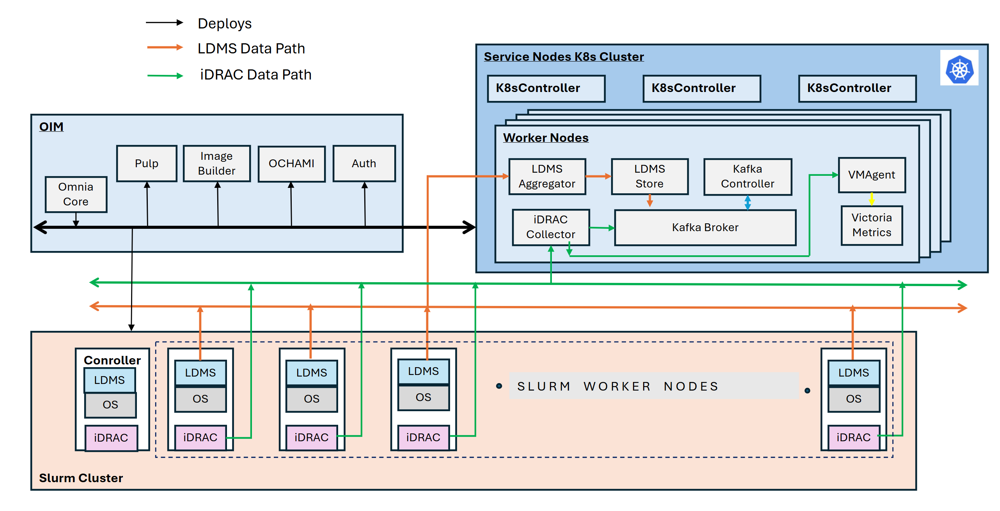

Telemetry Architecture 

 "Share")

 * [ Home ](../index.md)

 Dell Omnia 

 * [ Home ](../index.md)

Overview 
 * [ Architecture ](architecture.md)
 * Telemetry Architecture [ Telemetry Architecture ](telemetry_architecture.md) Table of contents 
 * [ Data collection ](#data-collection)

Get Started 
 * [ Prerequisites Checklist ](../GetStarted/prerequisites_checklist.md)

How-to Guides 
 * Setup Setup 
 * [ Prepare OIM ](../HowTo/Setup/prepare_oim.md)
 * Slurm Slurm 
 * [ Set Up Slurm ](../HowTo/Slurm/setup_slurm.md)
 * Kubernetes Kubernetes 
 * [ Set Up Kubernetes ](../HowTo/Kubernetes/setup_service_k8s.md)
 * Storage Storage 
 * [ Configure NFS ](../HowTo/Storage/configure_nfs.md)
 * Networking Networking 
 * [ Configure InfiniBand ](../HowTo/Networking/configure_infiniband.md)
 * Authentication Authentication 
 * [ Set Up OpenLDAP ](../HowTo/Authentication/setup_openldap.md)
 * Telemetry Telemetry 
 * [ Set Up Telemetry ](../HowTo/Telemetry/setup_telemetry.md)
 * Containers Containers 
 * [ Use Apptainer ](../HowTo/Containers/use_apptainer.md)
 * BuildStreaM BuildStreaM 
 * [ Deploy GitLab ](../HowTo/BuildStreaM/deploy_gitlab.md)

Reference 
 * Support Matrix Support Matrix 
 * [ Servers ](../Reference/SupportMatrix/servers.md)
 * Configuration Configuration 
 * [ Omnia Config ](../Reference/Configuration/omnia_config.md)
 * Sample Files Sample Files 
 * [ PXE Mapping File ](../Reference/SampleFiles/pxe_mapping_file.md)
 * Cluster Requirements Cluster Requirements 
 * [ Minimum Nodes ](../Reference/ClusterRequirements/minimum_nodes.md)
 * Playbooks Playbooks 
 * [ Playbook Reference ](../Reference/Playbooks/playbook_reference.md)
 * Metrics Metrics 
 * [ iDRAC Metrics ](../Reference/Metrics/idrac_metrics.md)
 * Appendices Appendices 
 * [ Hostname Requirements ](../Reference/Appendices/hostname_requirements.md)

Operations 
 * [ Add / Remove Nodes ](../Operations/add_remove_nodes.md)

Troubleshooting 
 * [ General ](../Troubleshooting/general.md)

Contributing 
 * [ Pull Requests ](../Contributing/pull_requests.md)

Table of contents 

 * [ Data collection ](#data-collection)

 1. [ Home ](../index.md)
 2. [ Overview ](index.md)

# Telemetry Architecture[¶](#telemetry-architecture "Permanent link")

Omnia provides a comprehensive telemetry pipeline that collects, transports, stores, and visualizes metrics from every server in the cluster. Telemetry data is essential for capacity planning, performance optimization, anomaly detection, and hardware health monitoring. This page explains the telemetry pipeline's architecture, each stage of the data flow, and the design decisions behind it.

Omnia's telemetry pipeline follows a standard _collect → transport → store → visualize_ pattern.

## Data collection[¶](#data-collection "Permanent link")

Omnia collects telemetry data through two complementary channels: **out-of-band metrics** from the server's BMC (iDRAC) and **in-band metrics** from the operating system. Together, they provide a complete picture of both hardware health and workload performance.

### iDRAC telemetry (out-of-band)[¶](#idrac-telemetry-out-of-band "Permanent link")

Dell PowerEdge servers include an **iDRAC** (integrated Dell Remote Access Controller) that monitors hardware health independently of the host operating system. Omnia configures iDRAC telemetry to stream the following metrics via the Redfish API:

**iDRAC metrics**

Category | Metrics 
---|--- 
**Power** | System power consumption (watts), PSU input/output voltage, PSU status, power cap utilization. 
**Thermal** | Inlet and exhaust air temperature, CPU temperature, GPU temperature, fan speed (RPM), thermal headroom. 
**Hardware health** | DIMM status, disk drive health (S.M.A.R.T. data), PCIe link status, NIC link state, firmware versions. 
**System events** | SEL (System Event Log) entries: hardware faults, correctable memory errors, predictive failure alerts. 
 
**How it works** : Omnia's telemetry playbook configures each iDRAC to push Redfish telemetry reports to a collector running on the OIM. The collector parses the Redfish JSON payloads and publishes them as structured messages to Kafka.

Note

iDRAC telemetry operates over the [BMC network](network_topologies.md), which is separate from compute traffic. Data collection continues even when the host OS is unresponsive, making it invaluable for diagnosing hardware failures and kernel panics.

### LDMS telemetry (in-band)[¶](#ldms-telemetry-in-band "Permanent link")

**LDMS** (Lightweight Distributed Metric Service) is a high-performance, low-overhead metric collection framework developed by Sandia National Laboratories for HPC environments. Omnia deploys LDMS agents on every compute node to collect OS-level and application-level metrics.

**LDMS metrics**

Category | Metrics 
---|--- 
**CPU** | Per-core utilization, instruction count, cache hit/miss rates, context switches, frequency scaling state. 
**Memory** | Total/used/available memory, page faults, swap usage, NUMA node allocation. 
**Network** | Per-interface bytes/packets in/out, error counts, InfiniBand port counters, RDMA operations. 
**I/O** | Block device throughput, IOPS, read/write latency, NFS client statistics. 
**GPU** _(when applicable)_ | GPU utilization, memory usage, temperature, ECC error counts (via NVML or ROCm-SMI). 
 
**How it works** : An LDMS sampler daemon runs on each compute node, collecting metrics at a configurable interval (default: 10 seconds). The sampler publishes metrics to an LDMS aggregator, which batches and forwards them to Kafka.

**Why LDMS?** \-- Traditional monitoring agents like Prometheus node_exporter or Telegraf are designed for cloud environments and introduce non-trivial overhead. LDMS was purpose-built for HPC: it uses shared memory for metric collection (avoiding context switches), supports thousands of metrics per node, and adds less than 1% CPU overhead.

## Message transport -- Apache Kafka[¶](#message-transport-apache-kafka "Permanent link")

All telemetry data---from both iDRAC and LDMS---flows through [Apache Kafka](https://kafka.apache.org/), a distributed event-streaming platform that acts as the central message broker.

**Why Kafka?**

 * **Decoupling** \-- Producers (iDRAC collectors, LDMS aggregators) and consumers (VictoriaMetrics ingestors, alerting systems) are independent. New consumers can be added without modifying producers.
 * **Buffering** \-- Kafka retains messages for a configurable period (default: 7 days). If VictoriaMetrics is temporarily unavailable for maintenance, no data is lost---it is replayed when the consumer reconnects.
 * **Scalability** \-- Kafka topics can be partitioned across multiple brokers for high-throughput environments. A 1,000-node cluster generating metrics every 10 seconds produces a high event rate that Kafka handles comfortably.

Omnia organizes telemetry data into Kafka **topics** :

 * `idrac.power` \-- iDRAC power metrics.
 * `idrac.thermal` \-- iDRAC thermal metrics.
 * `idrac.health` \-- iDRAC hardware health events.
 * `ldms.cpu` \-- LDMS CPU metrics.
 * `ldms.memory` \-- LDMS memory metrics.
 * `ldms.network` \-- LDMS network metrics.
 * `ldms.io` \-- LDMS I/O metrics.

### External Kafka integration[¶](#external-kafka-integration "Permanent link")

Organizations that already operate a Kafka cluster can configure Omnia to publish telemetry data to their existing brokers instead of deploying a dedicated Kafka instance. This is configured in `telemetry_config.yml` by specifying the external broker addresses and authentication credentials.

## Storage -- VictoriaMetrics[¶](#storage-victoriametrics "Permanent link")

[VictoriaMetrics](https://victoriametrics.com/) is a high-performance time-series database that stores all telemetry data consumed from Kafka.

**Why VictoriaMetrics?**

 * **Compression** \-- VictoriaMetrics achieves 10--15x compression compared to Prometheus TSDB, dramatically reducing disk requirements for long-term retention.
 * **Performance** \-- Ingestion rates of millions of samples per second on modest hardware, which is critical for large HPC clusters with dense metric collection.
 * **PromQL compatibility** \-- Supports PromQL (Prometheus Query Language) and MetricsQL (an extended superset), making it compatible with existing Grafana dashboards and alerting rules.
 * **Operational simplicity** \-- Runs as a single binary with no external dependencies (no ZooKeeper, no etcd).

**Retention** \-- VictoriaMetrics is configured with a default retention period that balances disk usage with historical analysis needs. Administrators can adjust retention via `telemetry_config.yml`.

### External VictoriaMetrics integration[¶](#external-victoriametrics-integration "Permanent link")

Like Kafka, VictoriaMetrics can be external. If your organization runs a centralized VictoriaMetrics cluster, Omnia can be configured to write telemetry data directly to it, eliminating the need for a local instance.

## Visualization -- Grafana[¶](#visualization-grafana "Permanent link")

[Grafana](https://grafana.com/) provides the visualization layer. Omnia deploys Grafana with pre-built dashboards tailored to HPC and AI cluster monitoring:

 * **Cluster overview** \-- Aggregate CPU utilization, memory usage, and power consumption across all nodes.
 * **Node detail** \-- Per-node hardware health (iDRAC) and OS metrics (LDMS) on a single pane.
 * **GPU monitoring** \-- GPU utilization, memory, temperature, and ECC errors for AI training workloads.
 * **Job performance** \-- Slurm job-level metrics showing resource utilization during job execution.
 * **Power and thermal** \-- Data center power trends, cooling efficiency, and thermal headroom analysis.

Grafana connects to VictoriaMetrics as a Prometheus-compatible data source. All dashboards use PromQL / MetricsQL queries and can be customized or extended by administrators.

## OME and SFM telemetry[¶](#ome-and-sfm-telemetry "Permanent link")

In addition to per-node telemetry, Omnia 2.1 supports collecting metrics from Dell infrastructure management tools:

 * **OpenManage Enterprise (OME)** \-- Aggregated fleet health, firmware compliance, and alert data from the Dell server management console.
 * **Smart Fabric Manager (SFM)** \-- Network fabric metrics including switch port utilization, link errors, and fabric health.

These metrics are ingested into the same Kafka → VictoriaMetrics → Grafana pipeline, providing a unified view of compute and network infrastructure.

## Air-gapped telemetry[¶](#air-gapped-telemetry "Permanent link")

Omnia's telemetry pipeline is fully functional in air-gapped environments. All components (Kafka, VictoriaMetrics, Grafana, LDMS, iDRAC collectors) run locally within the cluster. No external connectivity is required.

For air-gapped deployments:

 * Grafana dashboard definitions and plugins are included in the Pulp local repository.
 * VictoriaMetrics binaries are pre-packaged.
 * LDMS RPMs are mirrored in Pulp.

Tip

In air-gapped environments, ensure that the OIM has sufficient disk space for long-term telemetry retention, since offloading data to an external system may not be possible.

## Design rationale[¶](#design-rationale "Permanent link")

**Two-channel collection** \-- Combining iDRAC (out-of-band) and LDMS (in-band) provides complete observability. iDRAC continues reporting when the OS crashes; LDMS provides the fine-grained application-level metrics that iDRAC cannot see. Together, they eliminate blind spots.

**Kafka as the universal bus** \-- A message queue between collectors and storage provides resilience (no data loss during outages), flexibility (multiple consumers), and scalability (partitioned topics). It also enables future integrations---for example, connecting an alerting engine or a machine-learning anomaly detector as additional Kafka consumers.

**VictoriaMetrics over Prometheus** \-- While Prometheus is the de facto standard for cloud-native monitoring, its pull-based model and single-node architecture are not well suited to HPC clusters with thousands of nodes. VictoriaMetrics supports push-based ingestion (from Kafka), scales to higher cardinality, and compresses data more efficiently.

Info

 * [Architecture](architecture.md) \-- Where telemetry services run in the three-cluster model.
 * [Components](components.md) \-- Details on each software component, including Kafka and VictoriaMetrics.
 * [Security Model](security_model.md) \-- How telemetry traffic is encrypted and authenticated.
