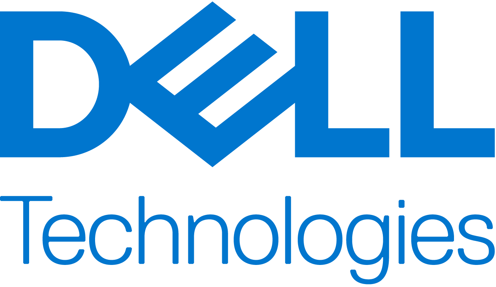

Home 

 "Share")

 * [ Home ](index.md)

 Dell Omnia 

 * Home [ Home ](index.md) Table of contents 
 * [ How This Documentation is Organized ](#how-this-documentation-is-organized)

Overview 
 * [ Architecture ](Overview/architecture.md)

Get Started 
 * [ Prerequisites Checklist ](GetStarted/prerequisites_checklist.md)

How-to Guides 
 * Setup Setup 
 * [ Prepare OIM ](HowTo/Setup/prepare_oim.md)
 * Slurm Slurm 
 * [ Set Up Slurm ](HowTo/Slurm/setup_slurm.md)
 * Kubernetes Kubernetes 
 * [ Set Up Kubernetes ](HowTo/Kubernetes/setup_service_k8s.md)
 * Storage Storage 
 * [ Configure NFS ](HowTo/Storage/configure_nfs.md)
 * Networking Networking 
 * [ Configure InfiniBand ](HowTo/Networking/configure_infiniband.md)
 * Authentication Authentication 
 * [ Set Up OpenLDAP ](HowTo/Authentication/setup_openldap.md)
 * Telemetry Telemetry 
 * [ Set Up Telemetry ](HowTo/Telemetry/setup_telemetry.md)
 * Containers Containers 
 * [ Use Apptainer ](HowTo/Containers/use_apptainer.md)
 * BuildStreaM BuildStreaM 
 * [ Deploy GitLab ](HowTo/BuildStreaM/deploy_gitlab.md)

Reference 
 * Support Matrix Support Matrix 
 * [ Servers ](Reference/SupportMatrix/servers.md)
 * Configuration Configuration 
 * [ Omnia Config ](Reference/Configuration/omnia_config.md)
 * Sample Files Sample Files 
 * [ PXE Mapping File ](Reference/SampleFiles/pxe_mapping_file.md)
 * Cluster Requirements Cluster Requirements 
 * [ Minimum Nodes ](Reference/ClusterRequirements/minimum_nodes.md)
 * Playbooks Playbooks 
 * [ Playbook Reference ](Reference/Playbooks/playbook_reference.md)
 * Metrics Metrics 
 * [ iDRAC Metrics ](Reference/Metrics/idrac_metrics.md)
 * Appendices Appendices 
 * [ Hostname Requirements ](Reference/Appendices/hostname_requirements.md)

Operations 
 * [ Add / Remove Nodes ](Operations/add_remove_nodes.md)

Troubleshooting 
 * [ General ](Troubleshooting/general.md)

Contributing 
 * [ Pull Requests ](Contributing/pull_requests.md)

Table of contents 

 * [ How This Documentation is Organized ](#how-this-documentation-is-organized)

# Omnia Documentation[¶](#omnia-documentation "Permanent link")

     

Omnia is an open-source, Ansible-based toolkit by Dell Technologies that automates the deployment and management of HPC, AI, and data analytics clusters on Dell PowerEdge servers. From bare-metal provisioning to job scheduling, telemetry, and storage configuration, Omnia turns a rack of servers into a production-ready cluster.

The project is hosted on [GitHub](https://github.com/dell/omnia), where you can:

 * Access the source code
 * Report issues
 * Ask questions
 * Contribute to development

## How This Documentation is Organized[¶](#how-this-documentation-is-organized "Permanent link")

 * **[Overview](Overview/index.md)**

* * *

Architecture, components, network topologies, and design concepts. Start here if you are new to Omnia.

 * **[Get Started](GetStarted/index.md)**

* * *

End-to-end tutorials that take you from a bare set of PowerEdge servers to a fully operational cluster. Choose from Slurm-only, full deployment, Kubernetes + telemetry, or BuildStreaM paths.

 * **[How-to Guides](HowTo/index.md)**

* * *

Task-oriented procedures for provisioning, configuring Slurm, Kubernetes, storage, networking, authentication, telemetry, and BuildStreaM.

 * **[Reference](Reference/index.md)**

* * *

Configuration parameters, support matrices, playbook references, API documentation, and network port listings.

 * **[Operations& Maintenance](Operations/index.md)**

* * *

Day-2 operations: adding and removing nodes, re-provisioning, OIM cleanup, log management, security hardening, and best practices.

 * **[Troubleshooting](Troubleshooting/index.md)**

* * *

Symptom-driven guides for diagnosing and resolving issues with provisioning, Slurm, Kubernetes, telemetry, authentication, and more.

## Quick Links[¶](#quick-links "Permanent link")

Resource | Description 
---|--- 
[Slurm Quickstart](GetStarted/slurm_quickstart.md) | Fastest path to a working Slurm cluster (~2 hours, 4 nodes). 
[Full Deployment](GetStarted/full_deployment.md) | Production deployment with Slurm, Kubernetes, telemetry, and LDAP. 
[Servers](Reference/SupportMatrix/servers.md) | Supported OS versions, hardware, firmware, and software combinations. 
[Provision Config](Reference/Configuration/provision_config.md) | Complete reference for all Omnia input configuration files. 
 
## Licensing[¶](#licensing "Permanent link")

Omnia is made available under the [Apache 2.0 license](https://opensource.org/licenses/Apache-2.0).

Note

Omnia playbooks are licensed under the Apache 2.0 license. Once an end-user initiates Omnia, that end-user will deploy other open-source and/or third-party software that is licensed separately by their respective developer communities and/or third parties. For a comprehensive list of software and their licenses, [click here](Reference/SupportMatrix/installed_software.md). Dell (or any other contributors) shall have no liability regarding (and no responsibility to provide support for) an end-user's use of any open-source and/or third-party software and Omnia users are solely responsible for ensuring that they are complying with all such licenses. Omnia is provided "as is" without any warranty, express or implied. Dell (or any other contributors) shall have no liability for any direct, indirect, incidental, punitive, special, or consequential damages for an end-user's use of Omnia.

## Previous Versions[¶](#previous-versions "Permanent link")

_For a better understanding of what Omnia does, check out the following:_

 * [1.x documentation](https://omnia-doc.readthedocs.io/en/latest/index.md): supports diskful provisioning.
 * [2.x documentation](https://omnia.readthedocs.io/en/latest/index.md): supports diskless provisioning and containerized deployment.

Note

Upgrade from Omnia 1.x to 2.x is not supported due to architectural changes.

## Omnia Community Members[¶](#omnia-community-members "Permanent link")

      

* * *

_If you have any feedback about Omnia documentation, please reach out at[omnia.readme@dell.com](mailto:omnia.readme@dell.com)._
